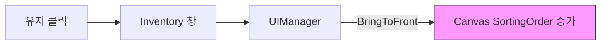

# ⚙️ Core 시스템 문서 (UI, Camera, Manager)

> **이 문서의 목표**: 게임을 지탱하는 기반 시스템(매니저, UI, 카메라)의 작동 원리를 이해합니다.
> **대상**: Unity 1개월차 개발자

---

## 📁 파일 한눈에 보기

```
01_Scripts/
├── 📂 04_Manager/           ← 싱글톤 매니저들
│   ├── 🟢 GameManager.cs    ← 게임 흐름 (시작/종료)
│   ├── 🟢 SoundManager.cs   ← 사운드 재생
│   └── 🔵 ObjectPool.cs     ← 성능 최적화 (풀링)
│
├── 📂 99_UI/                ← UI 시스템
│   ├── 🟢 UIManager.cs      ← 팝업/창 관리 (Sorting)
│   └── 🟢 InventoryUI.cs    ← 인벤토리 슬롯
│
├── 📂 05_Camera/            ← 카메라
│   └── 🟢 QuaterViewCamera.cs ← 탑다운 뷰 로직
│
└── 📂 06_Interface/         ← 공용 인터페이스
    ├── 🟢 IDamageable.cs    ← "맞을 수 있음"
    └── 🟢 IInteractable.cs  ← "상호작용 가능"
```

---

## 📺 UI 시스템 (UIManager)

### 창(Window) 관리 원리

Rabbit-Kov의 UI는 **"누르면 맨 앞으로"** 나오는 구조입니다.



- **SetPausePriority**: ESC 메뉴는 무조건 맨 위에 떠야 합니다. 그래서 `Order = 10000`으로 고정합니다.
- **Normal Priority**: 인벤토리, 스탯 창 등은 켤 때마다 `Order`가 1씩 올라가서 서로 겹칠 때 순서가 바뀝니다.

---

## 🎥 카메라 시스템 (QuaterView)

### Mouse Look (마우스 시야)

단순히 플레이어만 따라가는 게 아니라, **마우스가 있는 쪽으로 약간 더 치우쳐서** 보여줍니다.

```csharp
Vector3 targetPos = player.position;
Vector3 mouseOffset = (mousePos - player.position) * 0.3f; // 30%만큼 마우스 쪽으로

transform.position = targetPos + mouseOffset + cameraOffset;
```

> [!NOTE]
> 이 기능 덕분에 플레이어는 **진행 방향(적들이 오는 방향)**을 더 넓게 볼 수 있습니다. 슈팅 게임에서 매우 중요한 UX입니다!

---

## 🤝 인터페이스 (Interfaces)

이 게임은 **“너 누구야?”**라고 묻지 않고, **“너 이거 할 수 있어?”**라고 묻습니다.

### IDamageable (맞을 수 있는가?)

- **Player**: "네, HP 깎을게요."
- **Enemy**: "네, 사망 처리할게요."
- **Box**: "네, 부서질게요."

### IInteractable (상호작용 가능한가?)

- **Item**: "네, 인벤토리에 들어갈게요."
- **Door**: "네, 문 열게요."
- **Switch**: "네, 불 켤게요."

> **장점**: 코드가 서로 얽히지 않고 깔끔해집니다. `Player` 코드는 `Box` 클래스를 몰라도 박스를 부술 수 있습니다!

---

## 🚨 트러블슈팅

**1. 소리가 안 들려요**

- `SoundManager` 프리팹이 씬에 있는지 확인하세요.
- `DontDestroyOnLoad`가 적용되므로, 메인 메뉴 씬에서부터 시작해야 정상 작동할 수 있습니다.

**2. UI가 겹쳐서 안 눌려요**

- Canvas의 `Graphic Raycaster` 컴포넌트가 켜져 있는지 확인하세요.
- `UIManager`를 통하지 않고 직접 `SetActive`를 하면 Order가 꼬일 수 있습니다.
