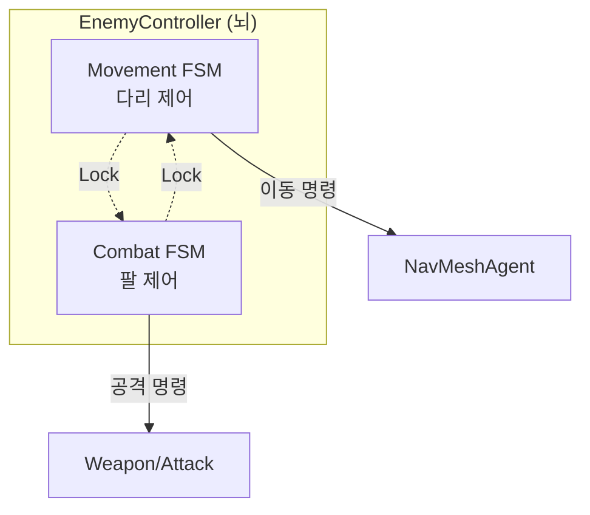
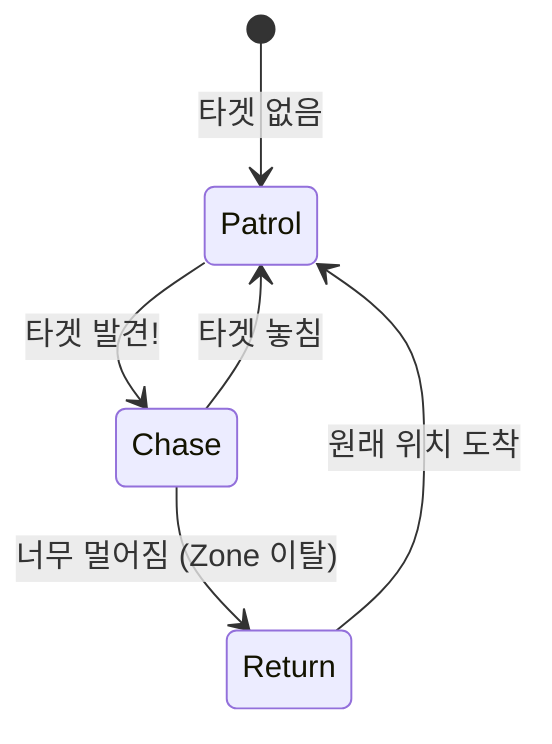
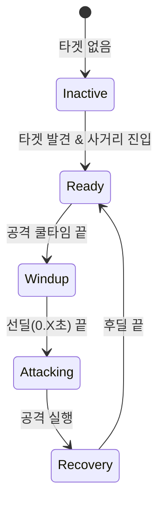

# 👾 Enemy 시스템 문서 (초보자용)

> **이 문서의 목표**: 복잡한 적 AI의 **이중 상태 머신(Dual FSM)** 구조를 이해하고, 새로운 적을 만드는 방법을 배웁니다.
> **대상**: Unity 1개월차 개발자

---

## 📁 파일 한눈에 보기

```
01_Scripts/02_Enemy/
│
├── 📂 Normal/                   ← 일반 몬스터 로직
│   ├── 🟢 EnemyController.cs    ← AI 총괄 (MovementFSM + CombatFSM)
│   ├── 🟢 EnemyStateMachine.cs  ← 상태 머신 기본 클래스
│   ├── 🟢 EnemyMovement.cs      ← NavMesh 이동 담당
│   ├── 🟢 EnemyCombat.cs        ← 공격 로직 담당
│   └── 📂 States/               ← 개별 상태 스크립트들
│       ├── Movement/ (Patrol, Chase...)
│       └── Combat/   (Attack, Ready...)
│
└── 📂 StateMachine/             ← FSM 인터페이스 정의
    ├── IEnemyState.cs
    ├── IMovementState.cs
    └── ICombatState.cs

🟢 = 핵심 파일
```

---

## 🧠 AI 아키텍처: 이중 FSM (Dual FSM)

Rabbit-Kov의 적은 **머리가 2개**입니다! 이동과 전투를 따로 생각합니다.



> [!IMPORTANT] > **왜 이렇게 나누었나요?**
> "도망치면서(Move) 총을 쏘는(Combat)" 적을 만들기 위해서입니다. 하나의 상태 머신으로는 `RunAndGun` 상태를 따로 만들어야 하지만, 둘로 나누면 `Run(Move)` + `Attack(Combat)` 상태가 동시에 돌아가기만 하면 됩니다.

---

## 📊 상태 전이 다이어그램 (State Diagram)

### 1. Movement FSM (이동)



### 2. Combat FSM (전투)



---

## 📜 핵심 코드 분석

### 1. EnemyController.cs (AI의 뇌)

```csharp
void Update()
{
    // 두 개의 두뇌가 동시에 돌아갑니다!
    _movementFSM.Update(this);
    _combatFSM.Update(this);
}
```

### 2. EnemyStateMachine.cs (상태 기계)

```csharp
public void ChangeState(IEnemyState newState, EnemyController enemy)
{
    // 1. 기존 상태 나가기
    _currentState?.Exit(enemy);

    // 2. 새 상태 교체
    _currentState = newState;

    // 3. 새 상태 진입
    _currentState?.Enter(enemy);
}
```

### 3. 공격 상태 (AttackingState.cs) 흐름

```csharp
public void Enter(EnemyController enemy)
{
    // 공격 시작!
    enemy.Combat.TryAttack();
}

public void Execute(EnemyController enemy)
{
    // 애니메이션이 끝났는지 체크
    if (AnimationEnded)
    {
        base.StateMachine.ChangeState(RecoveryState);
    }
}
```

---

## 🛠️ 실전 가이드: 새로운 적 만들기

### 1단계: 프리팹 준비

기존 `NormalEnemy` 프리팹을 **Variant**로 복제합니다. (Ctrl+D X, 우클릭 -> Create -> Prefab Variant O)

### 2단계: 스탯 설정

`EnemyStats` 컴포넌트에서 HP, Speed를 조절합니다.

- **Horde Type**: HP 낮음, Speed 높음
- **Tank Type**: HP 높음, Speed 낮음

### 3단계: 공격 설정

`EnemyCombat` 컴포넌트에서 공격 데이터를 연결합니다.

- `Attack Range`: 사거리 (근거리는 1~2, 원거리는 10+)
- `Damage`: 공격력

### 4단계: 상태(State) 조립

혹시 "도망만 다니는 적"을 만들고 싶다면?
`EnemyController` 코드를 수정할 필요 없이, 초기 상태를 `FleeState`로 설정하면 됩니다. (FleeState가 있다면)

---

## 🚨 자주하는 실수 (Troubleshooting)

**Q. 적이 플레이어를 보고도 가만히 있어요.**
A. `EnemySenses`의 `ViewAngle`이나 `ViewDistance`가 너무 작지 않나요? 또는 `LayerMask` 설정에서 Player 레이어가 제외되어 있지는 않나요? 디버그 기즈모(초록색 부채꼴)를 확인하세요.

**Q. 적이 공격을 안 해요.**
A. `CombatFSM`이 `Inactive`에서 `Ready`로 넘어가지 않는 것입니다. 사거리(`AttackRange`) 안에 플레이어가 들어왔는지, 그리고 `EnemyController`에 `Target`이 제대로 잡혔는지 확인하세요 (`SetTarget` 로그 확인).

**Q. 적이 벽을 뚫고 와요.**
A. `NavMesh`가 벽 너머까지 구워져 있거나, `NavMeshAgent`의 반지름(Radius)이 너무 작아서 벽 코너를 파고드는 것일 수 있습니다. `Bake` 설정을 다시 확인하세요.

---

## ⚖️ 밸런스 표준 (Balance Standards)

총기 DPS를 기준으로 설계된 Zone 1 몬스터 밸런싱입니다.

| 무기        | 타입  | Dmg  | FireRate | DPS (Burst) | Mag Dmg | 밸런스 영향 및 특징                             |
| :---------- | :---- | :--- | :------- | :---------- | :------ | :---------------------------------------------- |
| **Pistol**  | HG    | 12   | 5.0      | 60          | 144     | **기준점**. Normal 4방, Epic 3탄창 필요.        |
| **MP5**     | SMG   | 13   | 12.5     | 162         | 390     | Epic 1탄창 킬 가능 (High Tier)                  |
| **P90**     | SMG   | 12   | 14.2     | 171         | **600** | 지속 화력 갑. Epic 1탄창 여유롭게 킬.           |
| **Uzi**     | SMG   | 9    | **20.0** | 180         | 288     | **재장전 강요**. Epic(350HP)을 1탄창에 못 잡음. |
| **AK741**   | AR    | 24   | 8.3      | **200**     | 720     | 밸런스 파괴자. 모든 상황 대응 가능.             |
| **AK-12**   | AR    | 18   | 10.0     | 180         | 540     | AK741의 하위호환이나, 여전히 Epic 1탄창 킬.     |
| **SKS**     | SR    | 55   | 0.8      | 45          | 550     | **Normal 한방** (40 HP). 물량전 스페셜리스트.   |
| **Shotgun** | SG    | 10x8 | 1.2      | 100         | 640     | 근접 폭딜. 빗나가도 강력함.                     |
| **Axe**     | Melee | 40   | 1.2      | 50          | -       | **Normal 한방**. 하이 리스크 하이 리턴.         |
| **Knife**   | Melee | 15   | 3.3      | 45          | -       | Normal 3방. 최후의 수단.                        |

위 전체 무기 데이터를 기반으로 '재미있는 임계점'을 찾았습니다.

## ⚖️ 밸런스 표준 (World Balance)

총기 DPS를 기준으로 설계된 전체 게임 밸런스입니다.

| Zone                     | 구분   | HP       | 공격력 | 특징                                              |
| :----------------------- | :----- | :------- | :----- | :------------------------------------------------ |
| **Zone 1**<br>(Tutorial) | Normal | **40**   | 8      | Axe/SKS 한방. 권총으로도 충분.                    |
|                          | Epic   | **350**  | 25     | MP5/AK 필요. Uzi로는 재장전 필요.                 |
| **Zone 2**<br>(Mid)      | Normal | **80**   | 12     | **Pistol 효율 급감**. SMG/AR 권장.                |
|                          | Epic   | **700**  | 40     | AK로도 한 탄창에 잡기 힘듦. (Team fire / Grenade) |
| **Zone 3**<br>(End)      | Normal | **150**  | 16     | 잡몹이 Tanky함. P90/AK-12 필수.                   |
|                          | Epic   | **1200** | 50     | **레이드 몹**. 혼자 잡으려면 5-6초 프리딜 필요.   |

### 🌙 특수 몬스터

| 이름              | HP        | Speed   | Dmg   | 특징                                                              |
| :---------------- | :-------- | :------ | :---- | :---------------------------------------------------------------- |
| **Night Stalker** | 30        | **8.0** | 20    | **Glass Cannon**. 스치면 죽지만 엄청 빠름. 밤에만 등장.           |
| **Final Boss**    | **10000** | 3.0     | 40~80 | **AK 풀난사 50초**. 페이즈별 패턴 변화. (Ph1: Cleave, Ph2: Smash) |
