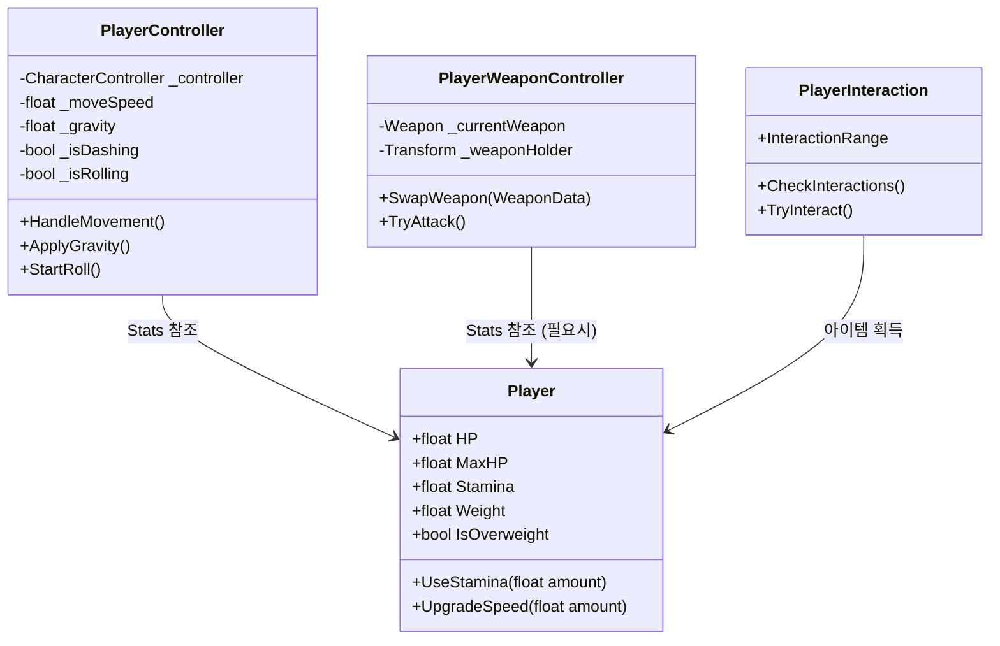

# 🏃 Player 시스템 문서 (초보자용)

> **이 문서의 목표**: 플레이어의 이동, 입력, 상태 관리가 어떻게 작동하는지 이해합니다.
> **대상**: Unity 1개월차 개발자

---

## 📁 파일 한눈에 보기

```
01_Scripts/00_Player/
│
├── 🟢 PlayerController.cs     ← 이동 및 물리 연산 (가장 중요!)
├── 🟢 Player.cs               ← 스탯 (HP, 스태미나, 무게) 관리
├── 🟢 PlayerWeaponController.cs ← 무기 장착 및 발사 관리
├── 🔵 PlayerInteraction.cs    ← 아이템 줍기/상호작용
├── 🔵 Inventory.cs            ← 인벤토리 데이터
└── 🔵 QuickSlotController.cs  ← 퀵슬롯 단축키 처리

🟢 = 핵심 파일
🔵 = 부가 파일
```

---

## 🔗 다른 시스템과 어떻게 연결되나요?

```
┌─────────────────────────────────────────────────────────────┐
│                        PLAYER                                │
│                                                             │
│   ┌──────────────┐     ┌──────────────┐                     │
│   │ PlayerInput  │────▶│PlayerController│   ◀─── Gravity    │
│   │ (키보드/마우스)│     │    (다리)    │                    │
│   └──────────────┘     └──────┬───────┘                     │
│           │                   │                             │
│           │ 스태미나 소모       │ 이동 속도 참조               │
│           ▼                   ▼                             │
│   ┌──────────────┐     ┌──────────────┐                     │
│   │ PlayerWeapon │────▶│    Player    │ ────▶ UI (HUD)      │
│   │    (팔)      │     │    (심장)    │                     │
│   └──────────────┘     └──────────────┘                     │
│                                                             │
└─────────────────────────────────────────────────────────────┘
```

### 연결 요약표

| 나는               | 하고 싶은 것       | 호출할 함수/이벤트                              |
| ------------------ | ------------------ | ----------------------------------------------- |
| **Input 담당**     | 캐릭터 움직이기    | `PlayerController.HandleMovement()` (매 프레임) |
| **UI 담당**        | 체력/스태미나 표시 | `Player.HP`, `Player.Stamina`                   |
| **Inventory 담당** | 무게 무거워짐      | `Player.UpdateWeight(newWeight)`                |
| **Combat 담당**    | 무기 쏘기          | `PlayerWeaponController.TryAttack()`            |

---

## 📊 Mermaid 다이어그램

### 클래스 다이어그램



### 입력 처리 플로우차트

```mermaid
flowchart TD
    Start[Update Loop] --> Input{입력 감지}

    Input -->|WASD| Move[이동 벡터 계산]
    Move --> Dash{Shift 누름?}
    Dash -->|Yes| Stamina{스태미나 > 0?}
    Stamina -->|Yes| Run[달리기 (속도 1.5배)]
    Stamina -->|No| Walk[걷기]
    Dash -->|No| Walk

    Input -->|Space| Roll{구르기 가능?}
    Roll -->|Yes| DoRoll[구르기 액션 (무적?)]

    Input -->|Mouse| Rot[회전 (LookAt Mouse)]

    Run --> Apply[CharacterController.Move]
    Walk --> Apply
    DoRoll --> Apply
    Rot --> ApplyRot[Transform.Rotation]
```

---

## 📜 PlayerController.cs 완전 분석

### 이 스크립트의 역할

> Unity의 `CharacterController` 컴포넌트를 사용하여 물리적인 이동, 중력, 회전을 직접 계산합니다.

### 핵심 로직 1: 중력 구현 (`ApplyGravity`)

```csharp
private void ApplyGravity()
{
    // 1. 땅에 서 있는가?
    if (_controller.isGrounded && _rayHitGround)
    {
        _verticalVelocity.y = -5f; // 바닥에 딱 붙여줌
    }
    else
    {
        // 2. 공중에 있다면 중력 가속
        _verticalVelocity.y += _gravity * Time.deltaTime;
    }
}
```

> [!TIP] > **왜 -5f를 주나요?** 0을 주면 미세한 턱이나 경사에서 `isGrounded`가 `false`로 튀는 현상이 발생할 수 있습니다. 바닥으로 계속 밀어주는 힘이 필요합니다.

### 핵심 로직 2: 경사면 미끄러짐 (`CalculateSlopeSlide`)

```csharp
private void CalculateSlopeSlide()
{
    // 발 밑으로 레이캐스트 발사!
    if (Physics.Raycast(..., out hit, ...))
    {
        // 경사 각도가 설정값(SlopeLimit)보다 가파르면?
        if (angle > _controller.slopeLimit)
        {
            // 미끄러지는 힘 적용
            _isSliding = true;
            _slideVelocity = slopeDir * _slideSpeed;
        }
    }
}
```

---

## 📜 Player.cs (Stats) 완전 분석

### 이 스크립트의 역할

> 플레이어의 체력, 스태미나, 무게 등 **수치 데이터**를 관리합니다.

### 무게 시스템 (Weight System)

이 게임은 무게에 따라 속도가 변합니다!

```csharp
public float GetMoveSpeedMultiplier()
{
    // 무게가 한계치를 넘었나요?
    if (IsOverweight)
    {
        return 0.5f; // 이동 속도 50% 반토막
    }
    return 1.0f; // 정상 속도
}
```

### 스태미나 시스템

```csharp
public void ConsumeStamina(float amount)
{
    _stamina -= amount;

    // 스태미나가 바닥나면 달리기가 잠김!
    if (_stamina <= 0)
    {
        _stamina = 0;
        _isRunLocked = true; // 회복될 때까지 못 뜀
    }
}
```

---

## 💡 자주 묻는 질문 (FAQ)

**Q. 캐릭터가 자꾸 공중에 떠요.**
A. `PlayerController` 인스펙터에서 `Ground Layer` 설정이 'Ground'나 'Default' 등 바닥 콜라이더의 레이어와 일치하는지 확인하세요. 레이캐스트가 바닥을 인식하지 못하면 중력이 계속 적용되거나 반대로 적용되지 않을 수 있습니다.

**Q. 구르기 거리를 늘리고 싶어요.**
A. `_rollDistance` 변수를 늘리세요. 단, `_rollDuration`(시간)을 그대로 두면 속도가 빨라지고, 같이 늘리면 속도는 그대로 유지되면서 더 오래 구릅니다.

**Q. 무기가 발사가 안 돼요.**
A. `PlayerWeaponController`에 등록된 `PlayerFirePoint`(총구 위치 Transform)가 제대로 연결되어 있는지 확인하세요. 없으면 총알이 (0,0,0)이나 엉뚱한 곳에서 나갈 수 있습니다.
