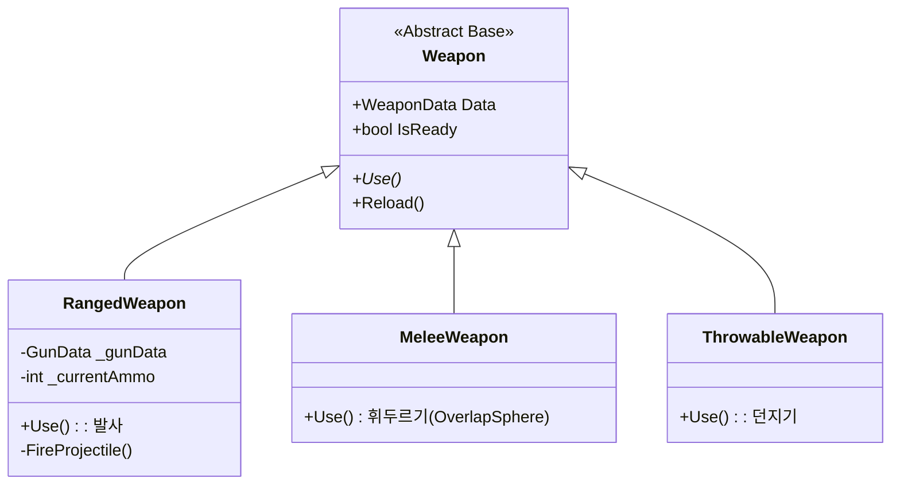
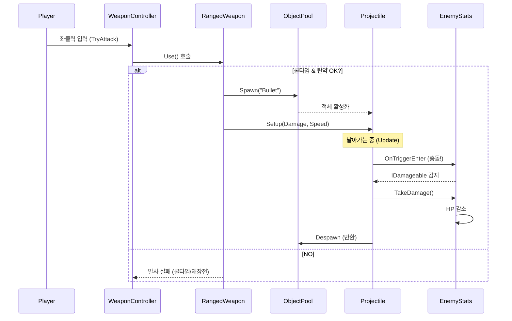

# 🔫 Weapon 시스템 문서 (초보자용)

> **이 문서의 목표**: 무기 데이터 생성부터 투사체 발사까지의 흐름을 이해합니다.
> **대상**: Unity 1개월차 개발자

---

## 📁 파일 한눈에 보기

```
01_Scripts/03_Item/
│
├── 📂 Weapon/                   ← 무기 로직
│   ├── 🟢 Weapon.cs             ← 무기 최상위 추상 클래스
│   ├── 🟢 RangedWeapon.cs       ← 원거리 무기 (총)
│   ├── 🟢 MeleeWeapon.cs        ← 근접 무기 (칼)
│   └── 🟢 Projectile.cs         ← 투사체 (총알)
│
└── 📂 Data/                     ← ScriptableObject 데이터
    ├── 🟢 WeaponData.cs         ← 무기 기본 정보 (이름, 쿨타임)
    └── 🟢 GunData.cs            ← 총기 전용 정보 (탄창, 재장전)
```

---

## 🧱 상속 구조 (Hierarchy)

모든 무기는 `Weapon` 클래스에서 파생됩니다.



---

## 📉 데이터 흐름: 발사부터 적중까지

총을 쐈을 때 데이터가 어떻게 흘러가는지 볼까요?



---

## 📜 핵심 코드 분석

### 1. RangedWeapon.Use (발사 로직)

```csharp
public override void Use()
{
    // 준비 안됨(쿨타임) or 탄약 없음 or 재장전 중
    if (!_isReady || _currentAmmo <= 0 || _isReloading) return;

    // 발사!
    FireProjectile();

    // 쿨타임 루틴 시작
    StartCoroutine(CoolTimeRoutine());
}
```

### 2. Projectile.cs (총알)

```csharp
private void OnTriggerEnter(Collider other)
{
    // 부딪힌 물체가 데미지를 입을 수 있는 녀석인가?
    IDamageable target = other.GetComponent<IDamageable>();

    if (target != null)
    {
        // 빵! 데미지 적용
        target.TakeDamage(_damage, transform.position, transform.forward);
        Destroyprojectile(); // 사라짐 (혹은 풀 반환)
    }
}
```

---

## 🛠️ 실전 가이드: 새 무기 만들기 (코딩 X)

1. **Project 창**에서 우클릭 -> `Create/Rabbit-Kov/Item/Weapon Data` 선택.
2. `Fire Rate` (연사 속도), `Damage` (공격력) 등을 입력합니다.
3. **Weapon Prefab** 칸에 `Rifle_Prefab` 등을 드래그해서 넣습니다.
4. 게임 실행 후 인벤토리에서 해당 무기를 장착하면 끝!

---

## 🚨 자주하는 실수

**Q. 총알이 플레이어를 맞춰요!**
A. `Projectile`의 `Layer Collision Matrix` 설정을 확인하세요. `PlayerProjectile` 레이어는 `Player` 레이어와 충돌하지 않도록 설정되어 있어야 합니다.

**Q. 데미지가 안 들어가요.**
A. 적 오브젝트에 `IDamageable`을 상속받은 `EnemyStats` 컴포넌트가 붙어있는지, 그리고 `Collider`와 `Rigidbody`가 적절히 설정되어 있는지(IsTrigger 등) 확인하세요.
