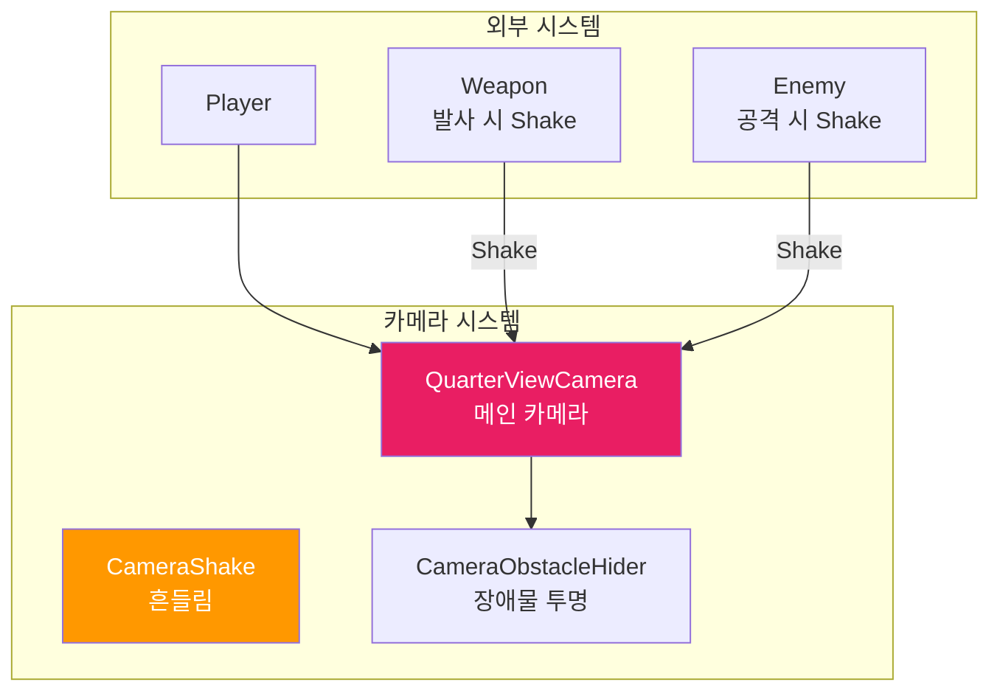
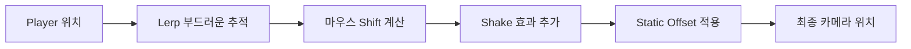
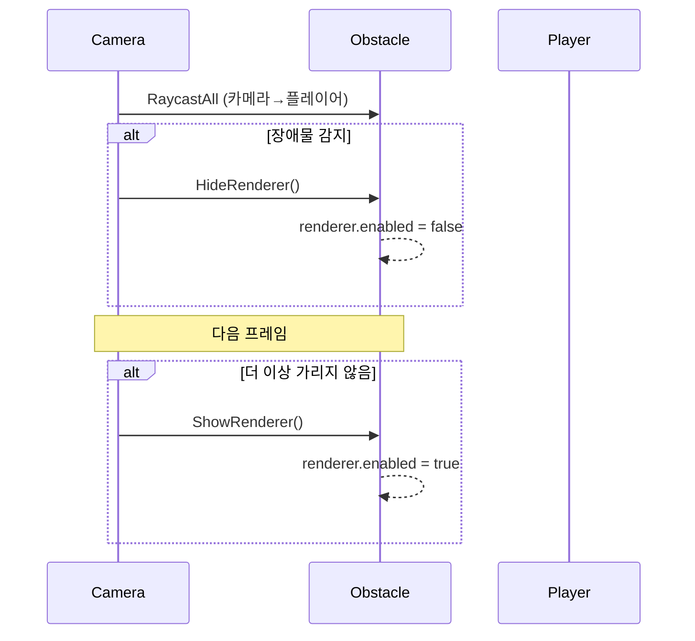

# 📷 Camera 시스템 문서 (초보자용)

> **이 문서의 목표**: 카메라 시스템을 이해하고 사용법을 배웁니다
> **대상**: Unity 1개월차 개발자

---

## 📁 파일 한눈에 보기

```
01_Scripts/05_Camera/
│
├── 🟢 QuarterViewCamera.cs     ← 메인 카메라 (쿼터뷰 + 마우스 추적)
├── 🟢 CameraShake.cs           ← 카메라 흔들림 효과
├── 🔵 FollowCamera.cs          ← 단순 팔로우 (탑다운)
├── 🔵 CameraObstacleHider.cs   ← 장애물 투명화
├── 🔵 MinimapFollow.cs         ← 미니맵 카메라
├── 🔵 MinimapLighting.cs       ← 미니맵 조명
└── 📂 SeeThrough/              ← 씨스루 효과

🟢 = 핵심 파일
🔵 = 부가 파일
```

---

## 🔗 시스템 연결도



---

## 📜 QuarterViewCamera.cs 분석

### 역할

> **쿼터뷰 카메라** - 플레이어를 따라가면서 마우스 방향으로 시점 이동

### 싱글톤 패턴

```csharp
public static QuarterViewCamera Instance { get; private set; }
```

### Inspector 설정

| 필드               | 타입      | 기본값 | 설명                   |
| ------------------ | --------- | :----: | ---------------------- |
| `target`           | Transform |   -    | 따라갈 대상 (플레이어) |
| `distance`         | float     |   40   | 카메라 거리            |
| `smoothSpeed`      | float     |   10   | 추적 속도              |
| `xAngle`           | float     |   55   | 수직 기울기 (0~90)     |
| `yAngle`           | float     |   45   | 수평 회전 (0~360)      |
| `baseShiftRatio`   | float     |  0.15  | 기본 마우스 이동 비율  |
| `aimShiftRatio`    | float     |  0.5   | 우클릭 시 이동 비율    |
| `maxShiftDistance` | float     |   15   | 최대 이동 거리         |
| `zoomedFov`        | float     |   40   | 우클릭 줌 FOV          |

### 함수 목록 (전체)

| 접근자  | 함수명                                   | 설명                        |
| :-----: | ---------------------------------------- | --------------------------- |
| public  | `Shake(float duration, float magnitude)` | 카메라 흔들림 시작          |
| private | `Awake()`                                | 싱글톤 초기화               |
| private | `Start()`                                | 타겟 자동 탐색, 오프셋 계산 |
| private | `LateUpdate()`                           | 카메라 위치/회전 갱신       |
| private | `GetMouseGroundPos()`                    | 마우스 월드 좌표 계산       |
| private | `CalculateStaticOffset()`                | 각도 기반 오프셋 계산       |
| private | `OnValidate()`                           | Inspector 변경 시 재계산    |

### 카메라 이동 흐름



### 사용 예시

```csharp
// 무기에서 발사 시 카메라 흔들기
public class RangedWeapon : Weapon
{
    public override void Use()
    {
        Fire();
        QuarterViewCamera.Instance?.Shake(0.1f, 0.3f);  // 0.1초, 0.3 강도
    }
}
```

---

## 📜 CameraShake.cs 분석

### 역할

> 카메라 흔들림 효과 (싱글톤) - 간단한 2D 흔들림

### 싱글톤 패턴

```csharp
public static CameraShake Instance;
```

### 함수 목록 (전체)

| 접근자  | 함수명                | 파라미터            | 설명                       |
| :-----: | --------------------- | ------------------- | -------------------------- |
| public  | `Shake(float, float)` | duration, magnitude | 흔들림 시작 (기존 중단 후) |
| private | `Awake()`             | -                   | 싱글톤 초기화              |
| private | `ShakeRoutine(...)`   | duration, magnitude | 코루틴으로 흔들림 실행     |

### 코드 분석

```csharp
private IEnumerator ShakeRoutine(float duration, float magnitude)
{
    Vector3 originalPos = transform.localPosition;  // 원래 위치 저장
    float elapsed = 0.0f;

    while (elapsed < duration)
    {
        // 랜덤 XY 위치로 흔들기
        float x = Random.Range(-1f, 1f) * magnitude;
        float y = Random.Range(-1f, 1f) * magnitude;
        transform.localPosition = new Vector3(originalPos.x + x, originalPos.y + y, originalPos.z);

        elapsed += Time.deltaTime;
        yield return null;
    }

    transform.localPosition = originalPos;  // 원래 위치로 복귀
}
```

---

## 📜 CameraObstacleHider.cs 분석

### 역할

> 플레이어를 가리는 장애물을 **자동으로 투명하게** 만듦

### Inspector 설정

| 필드               | 설명                              |
| ------------------ | --------------------------------- |
| `_playerTransform` | 플레이어 Transform                |
| `_obstacleLayer`   | 가릴 수 있는 레이어 (벽, 기둥 등) |

### 함수 목록 (전체)

| 접근자  | 함수명                   | 설명                     |
| :-----: | ------------------------ | ------------------------ |
| private | `Update()`               | 레이캐스트로 장애물 감지 |
| private | `HideRenderer(Renderer)` | 렌더러 비활성화          |
| private | `ShowRenderer(Renderer)` | 렌더러 활성화            |

### 동작 원리



---

## 📜 FollowCamera.cs 분석

### 역할

> **단순 탑다운 팔로우** - 플레이어 위에서 따라감

### 함수 목록

| 접근자  | 함수명         | 설명                      |
| :-----: | -------------- | ------------------------- |
| private | `LateUpdate()` | Slerp로 부드럽게 따라가기 |

### 코드

```csharp
private void LateUpdate()
{
    Vector3 targetPosition = player.position + Vector3.up * distance;

    transform.position = Vector3.Slerp(
        transform.position,
        targetPosition,
        Time.deltaTime * smoothSpeed
    );
}
```

---

## 💡 사용 팁

### 1. 카메라 흔들기 (어디서든)

```csharp
// QuarterViewCamera 사용 (권장)
QuarterViewCamera.Instance?.Shake(0.2f, 0.5f);

// 또는 CameraShake 사용
CameraShake.Instance?.Shake(0.2f, 0.5f);
```

### 2. null 체크는 필수

```csharp
// ✅ 안전한 호출
QuarterViewCamera.Instance?.Shake(0.1f, 0.3f);

// ❌ 위험 (Instance가 null이면 에러)
QuarterViewCamera.Instance.Shake(0.1f, 0.3f);
```

---

## ❓ 자주 묻는 질문

### Q: LateUpdate를 왜 써요?

**A**: 모든 오브젝트가 이동한 **후에** 카메라가 따라가야 떨림이 없습니다.

```
Update() → 플레이어 이동
LateUpdate() → 카메라가 플레이어 따라감
```

### Q: Lerp vs Slerp 차이?

**A**:

- `Lerp`: 직선 보간 (일반적)
- `Slerp`: 구면 보간 (부드러운 곡선)

---

> 📖 다음 문서: [PLAYER_SYSTEM.md](./PLAYER_SYSTEM.md) - Player 시스템 분석
