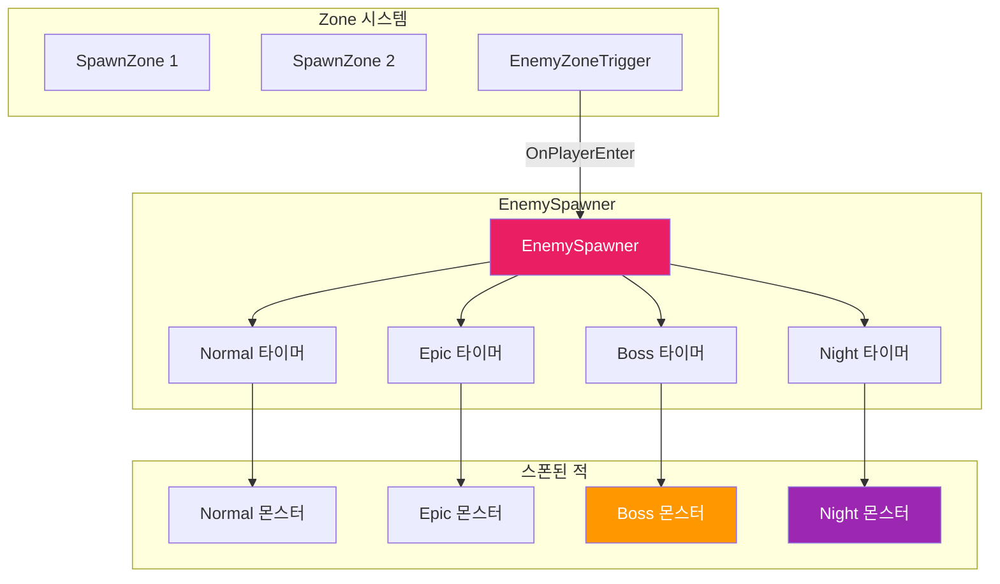
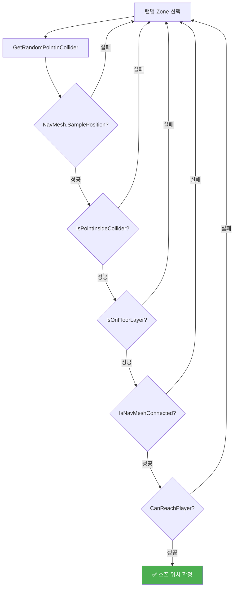
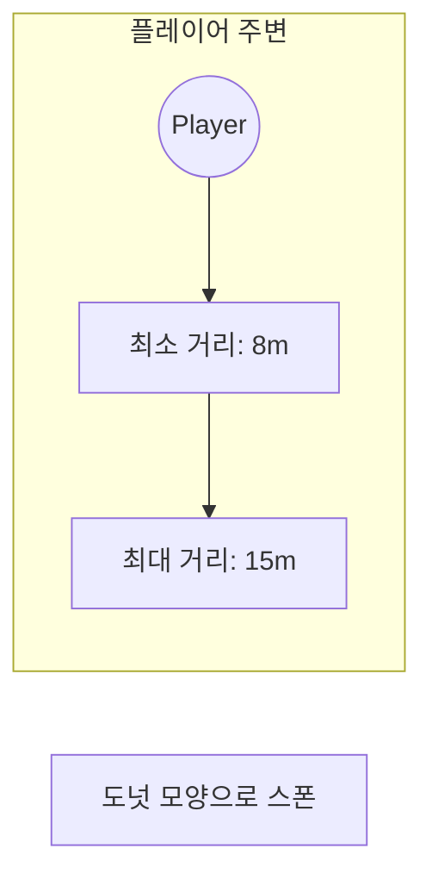
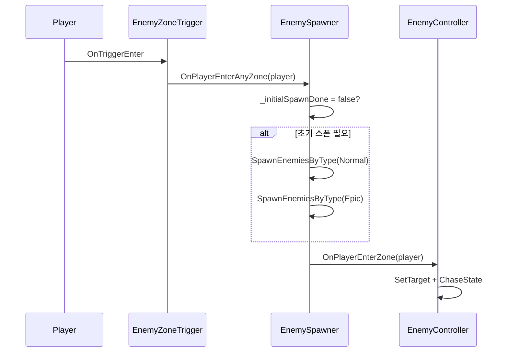

## 🎯 EnemySpawner.cs 완전 분석

### 이 스크립트의 역할

> Zone 기반 적 스폰 시스템 - 플레이어가 Zone에 진입하면 적을 생성하고 관리합니다.

### 스폰 시스템 아키텍처



### 티어별 스폰 설정

|  티어  | 프리팹               | 최대 수 | 초기 스폰 | 스폰 간격 | 특징                       |
| :----: | -------------------- | :-----: | :-------: | :-------: | -------------------------- |
| Normal | `_normalEnemyPrefab` |    5    |     3     |   10초    | 자유 이동, 즉시 추적       |
|  Epic  | `_epicEnemyPrefab`   |    2    |     1     |   30초    | Zone 내 제한, 감지 후 추적 |
|  Boss  | `_bossEnemyPrefab`   |    1    |     0     |   120초   | 한 번만 스폰               |
| Night  | `_nightEnemyPrefab`  |    3    |     2     |   15초    | 밤 시간대만, 플레이어 주변 |

### 함수 목록 (전체)

#### 🔵 Public 함수

| 함수명                                              | 설명                                                 |
| --------------------------------------------------- | ---------------------------------------------------- |
| `OnPlayerEnterAnyZone(Transform player)`            | 플레이어 Zone 진입 시 호출. 초기 스폰 및 타이머 시작 |
| `OnPlayerExitZone(Collider zone, Transform player)` | 플레이어 Zone 퇴장 시 호출. 지연된 퇴장 처리         |

#### 🟢 Private - 라이프사이클

| 함수명     | 설명                                                         |
| ---------- | ------------------------------------------------------------ |
| `Start()`  | Zone 초기화, NavMesh 최적화 설정, EnemyZoneTrigger 자동 추가 |
| `Update()` | 스폰 타이머 관리, 죽은 적 정리 (1초마다), 티어별 스폰 로직   |

#### 🟢 Private - 스폰 로직

| 함수명                                 | 파라미터                 | 설명                                                |
| -------------------------------------- | ------------------------ | --------------------------------------------------- |
| `SpawnEnemiesByType(...)`              | prefab, count, list, max | 티어별 적 생성, Zone 할당, 타겟 설정                |
| `SpawnNightEnemies(int count)`         | 스폰 수                  | 플레이어 주변 Night 몬스터 생성                     |
| `FindValidSpawnPos(out Collider zone)` | -                        | 유효한 스폰 위치 탐색 (NavMesh + Floor + 경로 검증) |
| `GetRandomPointInCollider(Collider)`   | 콜라이더                 | Box/Sphere/Capsule별 랜덤 포인트 생성               |
| `GetRandomPositionAroundPlayer()`      | -                        | 플레이어 주변 도넛 모양 랜덤 위치                   |

#### 🟢 Private - 검증 함수

| 함수명                                     | 반환 | 설명                                      |
| ------------------------------------------ | :--: | ----------------------------------------- |
| `IsPointInsideCollider(Collider, Vector3)` | bool | XZ 평면에서 콜라이더 내부 검증            |
| `IsOnFloorLayer(Vector3, float)`           | bool | Floor 레이어 위인지 Raycast 검증          |
| `IsNavMeshConnected(Vector3, Vector3)`     | bool | 두 지점 간 NavMesh 경로 연결 확인         |
| `CanReachPlayer(Vector3)`                  | bool | 스폰 위치에서 플레이어까지 경로 가능 여부 |
| `IsNightTime()`                            | bool | 현재 시간이 밤인지 (19시~6시)             |

#### 🟢 Private - 이벤트/정리

| 함수명                                   | 설명                                    |
| ---------------------------------------- | --------------------------------------- |
| `NotifyAllEnemiesEnter(Transform)`       | 모든 적에게 플레이어 진입 알림          |
| `NotifyAllEnemiesExit()`                 | 모든 적에게 플레이어 퇴장 알림          |
| `NotifyEnemyList(List, Transform, bool)` | 적 리스트에 Enter/Exit 이벤트 전파      |
| `CleanupDeadEnemies()`                   | 죽은 적(null) 목록에서 제거             |
| `DespawnNightEnemies()`                  | 낮이 되면 Night 몬스터 전부 삭제        |
| `DelayedExitCheck()`                     | 코루틴 - Zone 간 이동 시 즉시 퇴장 방지 |

### 스폰 검증 플로우



### Night 몬스터 스폰 범위



### 코드 예시: 스폰 위치 검증

```csharp
// 유효한 스폰 위치 탐색 (5단계 검증)
private Vector3 FindValidSpawnPos(out Collider selectedZone)
{
    for (int attempt = 0; attempt < 30; attempt++)
    {
        Collider zone = _spawnZones[Random.Range(0, _spawnZones.Length)];
        Vector3 randomPoint = GetRandomPointInCollider(zone);

        NavMeshHit hit;
        if (NavMesh.SamplePosition(randomPoint, out hit, 100f, NavMesh.AllAreas))
        {
            if (IsPointInsideCollider(zone, hit.position) &&  // 1. Zone 내부
                IsOnFloorLayer(hit.position) &&               // 2. Floor 위
                IsNavMeshConnected(hit.position, zone.center) && // 3. NavMesh 연결
                CanReachPlayer(hit.position))                 // 4. 플레이어 경로
            {
                selectedZone = zone;
                return hit.position;  // ✅ 유효한 위치!
            }
        }
    }
    return Vector3.zero;  // 실패
}
```

### 플레이어 진입 시퀀스


