# 👾 Enemy 시스템 문서 (초보자용)

> **이 문서의 목표**: Enemy AI 시스템을 이해하고 다른 시스템과 연동하는 방법을 배웁니다
> **대상**: Unity 1개월차 개발자

---

## 📁 파일 한눈에 보기

```
01_Scripts/02_Enemy/
│
├── 📂 Normal/                   ← 일반 몬스터
│   ├── 🟢 EnemyController.cs    ← AI 총괄 (가장 중요!)
│   ├── 🟢 EnemyStats.cs         ← HP, 데미지 처리
│   ├── 🟢 EnemyCombat.cs        ← 공격 로직
│   ├── 🟢 EnemyMovement.cs      ← 이동 로직
│   ├── 🔵 EnemySenses.cs        ← 시야/감지
│   ├── 🔵 EnemySpawner.cs       ← 스폰 관리
│   └── 📂 States/               ← AI 상태들
│       ├── Movement/            ← 이동 상태 (Patrol, Chase 등)
│       └── Combat/              ← 전투 상태 (Attack 등)
│
├── 📂 Boss/                     ← 보스 전용
│   ├── BossController.cs
│   └── BossPhaseManager.cs
│
└── 📂 Data/                     ← 데이터 설정
    ├── EnemyDataSO.cs           ← 적 스탯 설정
    └── EnemyAttackDataSO.cs     ← 공격 설정

🟢 = 핵심 파일
🔵 = 부가 파일
```

---

## 🔗 다른 시스템과 어떻게 연결되나요?

```
┌─────────────────────────────────────────────────────────────┐
│                        ENEMY                                 │
│                                                              │
│   ┌──────────────┐     ┌──────────────┐                     │
│   │ EnemyController│────│ EnemyMovement │   ◀─── NavMesh    │
│   │   (AI 두뇌)   │     │   (다리)     │                    │
│   └───────┬──────┘     └──────────────┘                     │
│           │                                                  │
│           ▼                                                  │
│   ┌──────────────┐     ┌──────────────┐                     │
│   │  EnemyCombat │────▶│  EnemyStats  │                     │
│   │   (주먹)     │     │   (심장)     │                     │
│   └──────────────┘     └──────────────┘                     │
│           │                    │                             │
│           │ 공격 ──────────▶  │ ◀──────────── 피격          │
│           ▼                    ▼                (Weapon에서) │
│   ┌──────────────┐     ┌──────────────┐                     │
│   │   Player     │     │  OnDeath     │ ────▶ 아이템 드롭   │
│   │  (데미지!)   │     │  OnHit       │ ────▶ 피격 이펙트   │
│   └──────────────┘     └──────────────┘                     │
│                                                              │
└─────────────────────────────────────────────────────────────┘
```

### 연결 요약표

| 나는            | 하고 싶은 것       | 호출할 함수/이벤트                                 |
| --------------- | ------------------ | -------------------------------------------------- |
| **Weapon 담당** | 적에게 데미지 주기 | `enemy.GetComponent<IDamageable>().TakeDamage(10)` |
| **Item 담당**   | 적 죽으면 드롭     | `enemyStats.OnDeath += DropItem` (이벤트)          |
| **VFX 담당**    | 피격 이펙트        | `enemyStats.OnHit += PlayHitEffect` (이벤트)       |
| **UI 담당**     | 적 HP 바           | `enemyStats.CurrentHealth`, `enemyStats.MaxHealth` |

---

## 📊 Mermaid 다이어그램

### 클래스 다이어그램

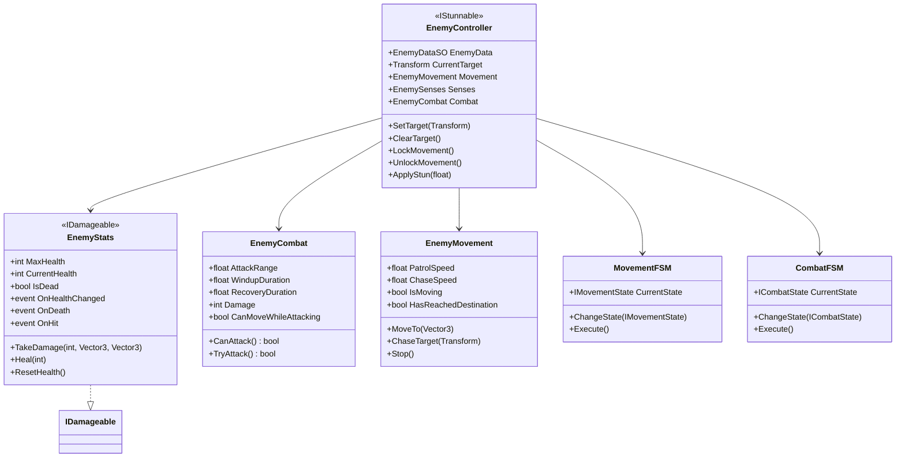

### 스크립트 연동 다이어그램

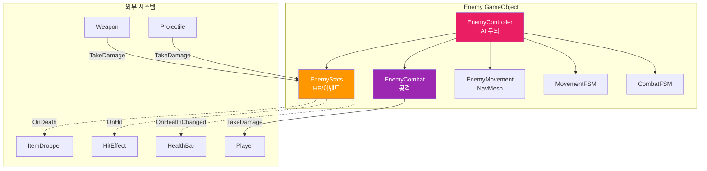

### MovementFSM 상태 전이 다이어그램

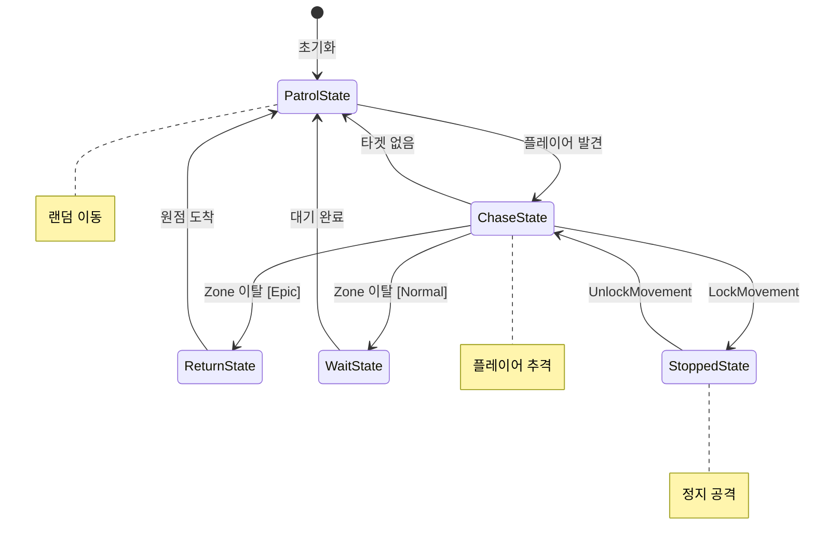

### CombatFSM 상태 전이 다이어그램

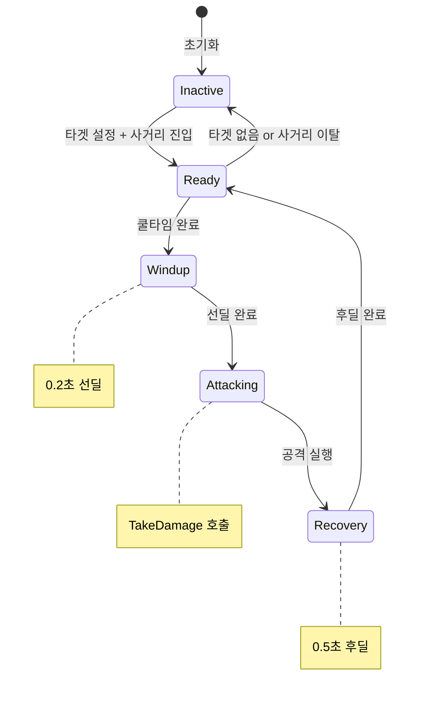

### 공격 사이클 플로우차트

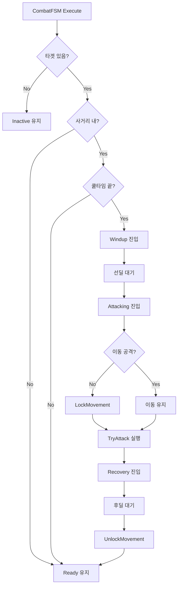

### 피격 데이터 흐름도

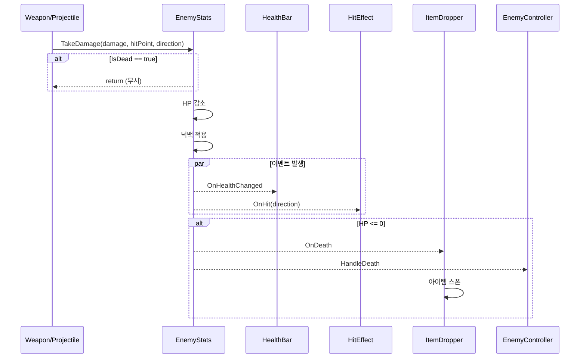

---

## 🧠 AI는 어떻게 작동하나요? (FSM 쉽게 이해하기)

### FSM이 뭐예요?

**비유**: FSM(상태 머신)은 **신호등**과 같습니다.

```
신호등 FSM:
  🔴 빨간불 (정지) ──▶ 🟢 초록불 (이동) ──▶ 🟡 노란불 (주의) ──▶ 🔴 빨간불...
```

적 AI도 마찬가지입니다:

```
Enemy AI FSM:
  😴 정찰 ──▶ 🏃 추격 ──▶ ⚔️ 공격 ──▶ 😴 정찰...
```

### 이 게임의 AI 특징: 병렬 FSM

**비유**: 사람은 **걸으면서 말**할 수 있죠? Enemy AI도 마찬가지입니다!

```
┌─────────────────────────────────────────┐
│            EnemyController              │
│                                         │
│   ┌─────────────┐  ┌─────────────┐     │
│   │ MovementFSM │  │  CombatFSM  │     │
│   │  (이동 AI)  │  │ (전투 AI)   │     │
│   └─────────────┘  └─────────────┘     │
│         │                 │             │
│         ▼                 ▼             │
│   "지금 추격 중"     "지금 공격 중"      │
│                                         │
└─────────────────────────────────────────┘

= 추격하면서 동시에 공격 가능!
```

### 병렬 FSM 동작 시각화 (Mermaid)

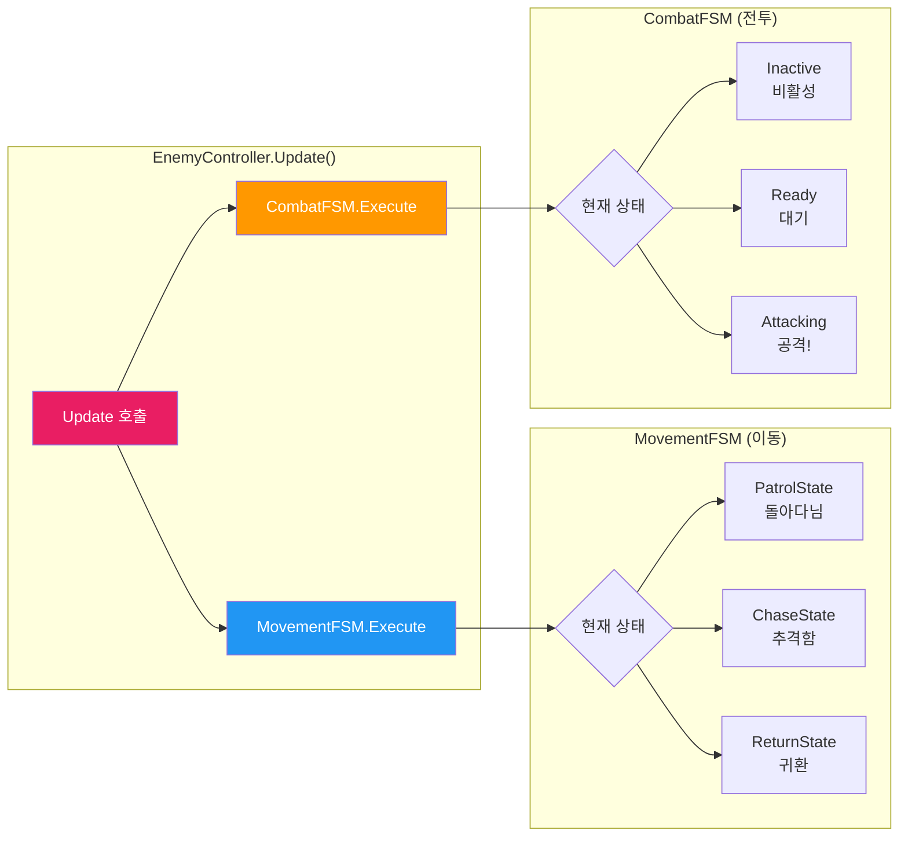

### 병렬 실행 타임라인 예시

```mermaid
gantt
    title 병렬 FSM 동작 타임라인 (1초 동안)
    dateFormat X
    axisFormat %Lms

    section MovementFSM
    PatrolState (정찰)      :a1, 0, 200
    ChaseState (추격 시작)  :active, a2, 200, 800
    ChaseState (계속 추격)  :active, a3, 800, 1000

    section CombatFSM
    Inactive (전투 안 함)   :b1, 0, 300
    Ready (공격 준비)       :b2, 300, 500
    Windup (선딜)           :crit, b3, 500, 600
    Attacking (공격!)       :crit, b4, 600, 650
    Recovery (후딜)         :b5, 650, 850
    Ready (다음 공격 대기)  :b6, 850, 1000
```

> [!IMPORTANT] > **핵심 포인트**: 두 FSM이 **동시에** 실행됩니다!
>
> - 200ms: 플레이어 발견 → Movement가 Chase로 전환
> - 300ms: 사거리 진입 → Combat이 Ready로 전환
> - 500-850ms: **추격하면서 공격** (두 FSM 동시 동작)

### 병렬 FSM 조합 시나리오

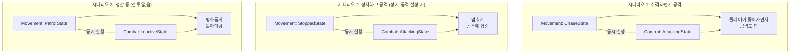

### 코드로 보는 병렬 실행

```csharp
// EnemyController.cs의 Update()
void Update()
{
    // 두 FSM이 같은 프레임에서 순차적으로 실행됨
    // = 실질적으로 "동시에" 동작하는 것처럼 보임

    _movementFSM.Execute();  // 1. 이동 상태 처리
    _combatFSM.Execute();    // 2. 전투 상태 처리

    // 예시: ChaseState + AttackingState 조합이면
    // → 추격하면서 + 공격하는 AI가 됨!
}
```

---

## 🚶 MovementFSM - 이동 상태

```
                    플레이어 발견!
       ┌────────────────────────────────┐
       │                                ▼
   ┌───────┐                      ┌───────┐
   │ Patrol │  ◀───타겟 없음────  │ Chase │
   │ (정찰) │                      │ (추격) │
   └───────┘                      └───┬───┘
       ▲                              │
       │                    플레이어가 Zone 벗어남
       │                              │
       │         ┌────────────────────┤
       │         ▼                    ▼
   ┌───────┐  ┌───────┐         ┌───────┐
   │ Wait  │  │Return │         │Stopped│
   │ (대기) │  │(귀환) │         │ (정지) │
   └───────┘  └───────┘         └───────┘
   Normal용    Epic용             공격 중
```

### 각 상태 설명

| 상태             | 언제?                  | 뭘 해요?             |
| ---------------- | ---------------------- | -------------------- |
| **PatrolState**  | 타겟 없음              | 랜덤 위치로 돌아다님 |
| **ChaseState**   | 플레이어 발견          | 플레이어 쫓아감      |
| **ReturnState**  | 플레이어 도망 (Epic)   | 원래 위치로 돌아감   |
| **WaitState**    | 플레이어 도망 (Normal) | 잠시 대기 후 정찰    |
| **StoppedState** | 공격 중                | 멈춰서 공격          |

---

## ⚔️ CombatFSM - 전투 상태

```
     타겟 없음                    타겟 설정 & 사거리 진입
         │                              │
         ▼                              ▼
   ┌──────────┐                  ┌──────────┐
   │ Inactive │  ────────────▶  │  Ready   │
   │ (비활성) │                  │  (준비)  │
   └──────────┘                  └────┬─────┘
                                      │ 쿨타임 끝
                                      ▼
                                ┌──────────┐
                                │  Windup  │  ← "공격 준비 모션"
                                │  (선딜)  │
                                └────┬─────┘
                                     │ 선딜 끝
                                     ▼
                                ┌──────────┐
                                │Attacking │  ← 실제 데미지!
                                │  (공격)  │
                                └────┬─────┘
                                     │ 공격 완료
                                     ▼
                                ┌──────────┐
                                │ Recovery │  ← "공격 후 경직"
                                │  (후딜)  │
                                └────┬─────┘
                                     │ 후딜 끝
                                     ▼
                              다시 Ready로!
```

### 각 상태 설명

| 상태          | 지속 시간 | 설명                                |
| ------------- | --------- | ----------------------------------- |
| **Inactive**  | -         | 전투 안 함 (타겟 없음)              |
| **Ready**     | -         | 공격 대기 (쿨타임 체크)             |
| **Windup**    | 0.2초     | 공격 모션 시작 (여기서 피하면 회피) |
| **Attacking** | 순간      | `TakeDamage()` 호출!                |
| **Recovery**  | 0.5초     | 공격 후 경직 (반격 찬스)            |

---

## 📜 EnemyStats.cs 완전 분석

### 이 스크립트의 역할

> 적의 HP를 관리하고, 피격/사망 이벤트를 발생시킵니다.

### 이벤트 (다른 시스템에서 구독)

```csharp
public event Action OnHealthChanged;  // 체력 바뀔 때
public event Action OnDeath;          // 죽을 때
public event Action<Vector3> OnHit;   // 맞을 때 (방향 포함)
```

**이벤트 사용 방법 (아이템 드롭 예시)**:

```csharp
// ItemDropper.cs
void Start()
{
    EnemyStats stats = GetComponent<EnemyStats>();
    stats.OnDeath += DropItems;  // "죽으면 DropItems 호출해줘!"
}

void OnDestroy()
{
    EnemyStats stats = GetComponent<EnemyStats>();
    stats.OnDeath -= DropItems;  // 구독 해제 (필수!)
}

void DropItems()
{
    // 아이템 드롭 로직
    Instantiate(itemPrefab, transform.position, Quaternion.identity);
}
```

### 핵심 프로퍼티

```csharp
public int MaxHealth => _maxHealth;       // 최대 HP
public int CurrentHealth => _currentHealth; // 현재 HP
public bool IsDead => _currentHealth <= 0; // 죽었는지
```

### TakeDamage - 피격 처리

```csharp
public void TakeDamage(int damage, Vector3 hitPoint, Vector3 attackDirection)
{
    // 1. 이미 죽었으면 무시
    if (IsDead) return;

    // 2. HP 감소
    _currentHealth -= damage;
    if (_currentHealth < 0) _currentHealth = 0;

    // 3. 이벤트 발생 (구독자들에게 알림)
    OnHealthChanged?.Invoke();           // UI 업데이트용
    OnHit?.Invoke(attackDirection);      // 피격 이펙트용

    // 4. 넉백 적용
    ApplyKnockback(attackDirection);

    // 5. 죽었으면 사망 이벤트
    if (IsDead)
    {
        OnDeath?.Invoke();  // 아이템 드롭, 경험치 등
    }
}
```

---

## 📜 EnemyCombat.cs 완전 분석

### 이 스크립트의 역할

> 공격 데이터를 관리하고 실제 데미지를 적용합니다.

### 핵심 프로퍼티

```csharp
public float AttackRange;          // 공격 사거리
public float WindupDuration;       // 선딜 시간
public float RecoveryDuration;     // 후딜 시간
public bool CanMoveWhileAttacking; // 이동 공격 가능?
public int Damage;                 // 공격력
```

### TryAttack - 공격 실행

```csharp
public bool TryAttack()
{
    // 1. 쿨타임 체크
    if (Time.time < _lastAttackTime + Cooldown) return false;

    // 2. 쿨타임 갱신
    _lastAttackTime = Time.time;

    // 3. 공격 범위 내 대상 찾기
    Collider[] hits = Physics.OverlapSphere(
        transform.position,
        AttackRange,
        targetLayer
    );

    // 4. 모든 대상에게 데미지
    foreach (var hit in hits)
    {
        IDamageable target = hit.GetComponent<IDamageable>();
        if (target != null)
        {
            Vector3 dir = (hit.transform.position - transform.position).normalized;
            target.TakeDamage(Damage, hit.transform.position, dir);
        }
    }

    return true;
}
```

---

## 💡 실전 연동 예제

### 예제 1: 무기로 적 공격하기 (Weapon → Enemy)

```csharp
// Projectile.cs (총알)
private int _damage = 10;

private void OnTriggerEnter(Collider other)
{
    // 1. IDamageable 인터페이스 찾기
    IDamageable target = other.GetComponent<IDamageable>();

    // 2. 데미지 주기
    if (target != null)
    {
        target.TakeDamage(_damage, transform.position, transform.forward);
        Debug.Log($"{other.name}에게 {_damage} 데미지!");
    }

    // 3. 총알 제거
    Destroy(gameObject);
}
```

### 예제 2: 적 사망 시 아이템 드롭

```csharp
// ItemDropper.cs (Enemy에 붙이기)
public class ItemDropper : MonoBehaviour
{
    [SerializeField] private GameObject[] _items;
    [SerializeField][Range(0, 100)] private int _dropChance = 30;

    private EnemyStats _stats;

    void Start()
    {
        _stats = GetComponent<EnemyStats>();
        _stats.OnDeath += OnEnemyDeath;
    }

    void OnDestroy()
    {
        // ⚠️ 반드시 해제! 안 하면 에러납니다
        if (_stats != null)
            _stats.OnDeath -= OnEnemyDeath;
    }

    void OnEnemyDeath()
    {
        // 확률 굴리기
        if (Random.Range(0, 100) < _dropChance)
        {
            // 랜덤 아이템 드롭
            int index = Random.Range(0, _items.Length);
            Instantiate(_items[index], transform.position, Quaternion.identity);
        }
    }
}
```

### 예제 3: 적 HP 바 UI

```csharp
// EnemyHealthBar.cs (Enemy에 붙이기)
public class EnemyHealthBar : MonoBehaviour
{
    [SerializeField] private Image _fillImage;  // HP 바 Fill

    private EnemyStats _stats;

    void Start()
    {
        _stats = GetComponent<EnemyStats>();
        _stats.OnHealthChanged += UpdateBar;
        UpdateBar();  // 초기값
    }

    void OnDestroy()
    {
        if (_stats != null)
            _stats.OnHealthChanged -= UpdateBar;
    }

    void UpdateBar()
    {
        float ratio = (float)_stats.CurrentHealth / _stats.MaxHealth;
        _fillImage.fillAmount = ratio;
    }
}
```

### 예제 4: 피격 이펙트

```csharp
// EnemyHitEffect.cs (Enemy에 붙이기)
public class EnemyHitEffect : MonoBehaviour
{
    [SerializeField] private GameObject _hitEffectPrefab;
    [SerializeField] private AudioClip _hitSound;

    private EnemyStats _stats;
    private AudioSource _audio;

    void Start()
    {
        _stats = GetComponent<EnemyStats>();
        _audio = GetComponent<AudioSource>();

        _stats.OnHit += OnHit;
    }

    void OnDestroy()
    {
        if (_stats != null)
            _stats.OnHit -= OnHit;
    }

    void OnHit(Vector3 attackDirection)
    {
        // 이펙트 (공격 반대 방향으로)
        Quaternion rotation = Quaternion.LookRotation(-attackDirection);
        Instantiate(_hitEffectPrefab, transform.position, rotation);

        // 사운드
        _audio.PlayOneShot(_hitSound);
    }
}
```

---

## 🐲 Boss 시스템 (신규)

### 이 시스템의 역할

> **보스 전용** 페이즈 시스템과 특수 공격 패턴을 관리합니다.

### 파일 구조

```
02_Enemy/Boss/
├── BossController.cs       ← 보스 AI 총괄 (EnemyController 상속)
├── BossPhaseManager.cs     ← 페이즈 전환 관리
├── BossZoneTrigger.cs      ← 보스전 시작 트리거
├── Attacks/                ← 보스 전용 공격 패턴
└── Data/                   ← 보스 데이터
```

### 핵심 컴포넌트: BossController

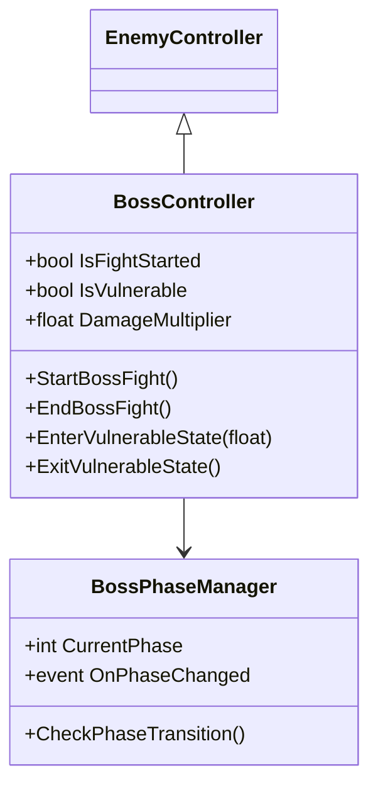

### 페이즈 시스템

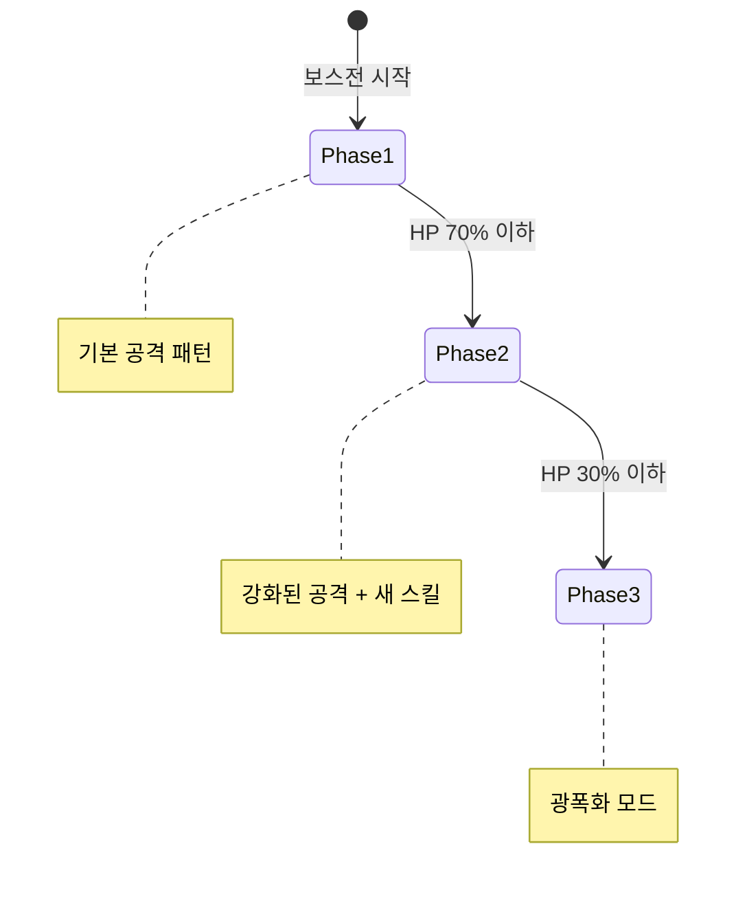

### 보스전 시작 흐름

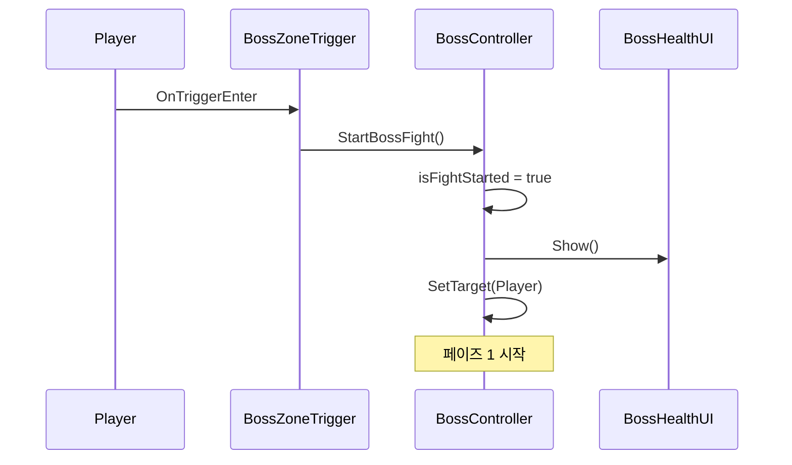

---

## 💥 취약 상태 시스템 (신규)

### 스턴 vs 취약 상태

| 항목          | 스턴 (Stun)    | 취약 (Vulnerable)      |
| ------------- | -------------- | ---------------------- |
| **대상**      | Epic/Boss      | Boss 전용              |
| **효과**      | 행동 완전 정지 | **데미지 배율 증가**   |
| **발동 조건** | 외부 공격      | 특수 패턴 후 자동 진입 |
| **이동**      | 불가           | 가능                   |

### 취약 상태 플로우

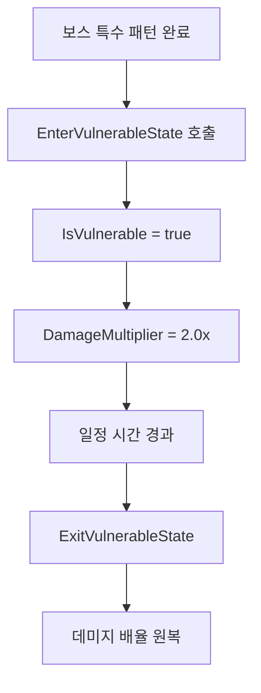

### EnemyStats의 취약 데미지 적용

```csharp
// EnemyStats.cs - TakeDamage() 내부
var bossController = GetComponent<BossController>();
if (bossController != null && bossController.IsVulnerable)
{
    int originalDamage = damage;
    damage = Mathf.RoundToInt(damage * bossController.DamageMultiplier);
    Debug.Log($"취약 데미지: {originalDamage} → {damage}");
}
```

---

## 📜 EnemyStats 확장 함수 (신규)

### SetMaxHealth - 최대 체력 설정

```csharp
// 보스 페이즈 전환 시 HP 조정
public void SetMaxHealth(int newMaxHealth)
{
    _maxHealth = newMaxHealth;
    _currentHealth = _maxHealth;
    OnHealthChanged?.Invoke();
}
```

**사용 예시 (페이즈 전환 시)**:

```csharp
// BossPhaseManager.cs
void OnPhaseChanged(int newPhase)
{
    if (newPhase == 3)  // 광폭화 페이즈
    {
        // 체력 리셋으로 긴장감 조성
        enemyStats.SetMaxHealth(10000);
    }
}
```

### Initialize - EnemyDataSO 기반 초기화

```csharp
public void Initialize(EnemyDataSO data)
{
    _maxHealth = data.FinalMaxHealth;       // DataSO에서 계산된 최종 HP
    _currentHealth = _maxHealth;
    _knockbackForce *= (1f - data.knockbackResistance);  // 저항 적용
}
```

---

## ❓ 자주 묻는 질문

### Q: NavMeshAgent가 뭐예요?

**A**: Unity의 자동 길찾기 시스템입니다. "저기로 가!" 하면 알아서 장애물 피해갑니다.

```csharp
NavMeshAgent agent = GetComponent<NavMeshAgent>();
agent.SetDestination(target.position);  // 이 한 줄로 알아서 감!
```

### Q: 적이 안 움직여요

**A**: 체크리스트:

1. ✅ NavMesh 베이크 했나요? (Window → AI → Navigation)
2. ✅ Enemy에 NavMeshAgent 있나요?
3. ✅ EnemyController가 활성화됐나요?

### Q: 이벤트 구독을 왜 OnDestroy에서 해제해요?

**A**: 안 하면 오브젝트가 죽어도 이벤트는 살아있어서, 다음에 호출될 때 **에러**가 납니다!

```csharp
// 나쁜 예: 구독 해제 안 함
void Start() { _stats.OnDeath += DoSomething; }

// 좋은 예: 구독 해제 함
void Start() { _stats.OnDeath += DoSomething; }
void OnDestroy() { _stats.OnDeath -= DoSomething; }
```

---

> 📖 다음 문서: [WEAPON_SYSTEM.md](./WEAPON_SYSTEM.md) - 무기 시스템 상세 분석
