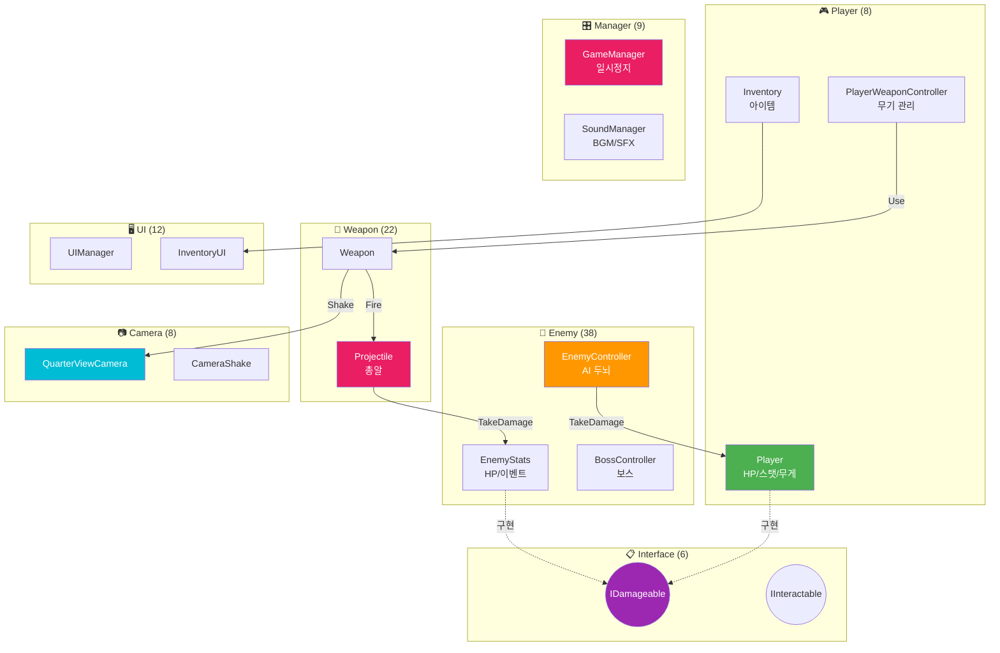
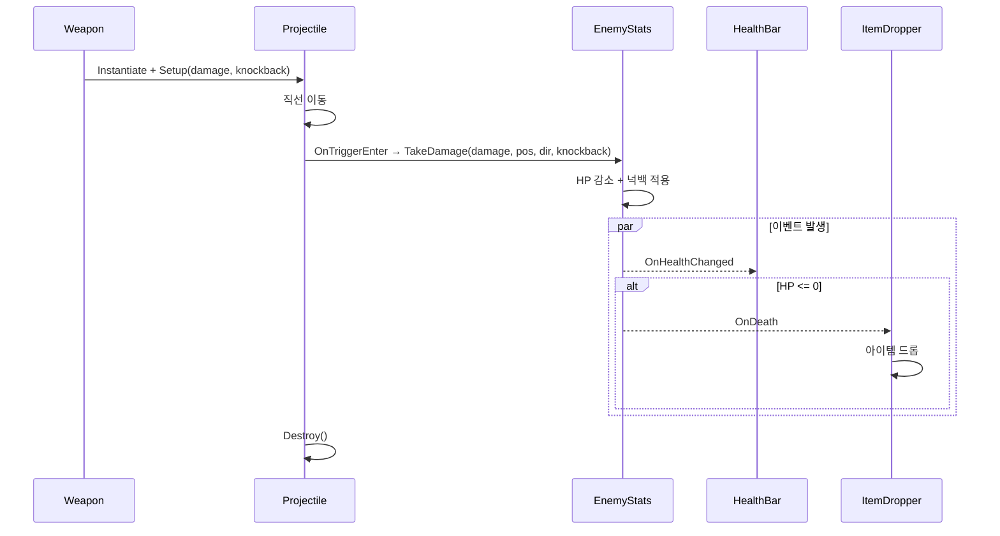

# 🎮 시스템 연동 가이드 (초보자용)

> **이 문서의 목표**: 다른 팀원의 코드를 이해하고 연동하는 방법을 배웁니다
> **대상**: Unity 1개월차 개발자

---

## 📖 시작하기 전에

### 인터페이스가 뭐예요?

**비유**: 인터페이스는 **콘센트**와 같습니다.

- 콘센트 모양이 같으면 어떤 가전제품이든 꽂을 수 있죠?
- `IDamageable` 인터페이스를 구현하면, 어떤 오브젝트든 **동일한 방법으로 데미지를 줄 수 있습니다**

```csharp
// ❌ 인터페이스 없이 (각각 다른 방법으로 호출해야 함)
enemy.TakeDamage(10);      // Enemy 방식
player.Hurt(10);           // Player 방식
barrel.Damage(10);         // Barrel 방식

// ✅ 인터페이스 사용 (모두 같은 방법!)
IDamageable target = hit.GetComponent<IDamageable>();
target.TakeDamage(10);     // Enemy든 Player든 Barrel이든 다 됨!
```

---

## 🗺️ 시스템 연결 지도 (104개 스크립트)



### 데미지 흐름 상세



---

## 📋 연동 시나리오별 가이드

---

## 1️⃣ 적에게 데미지 주기

### 상황

> "내가 만든 무기로 적을 때리고 싶어요!"

### 단계별 가이드

#### Step 1: 적이 맞을 수 있는지 확인

적(Enemy)이 데미지를 받으려면 `EnemyStats` 컴포넌트가 있어야 합니다.

```
Enemy 오브젝트
    └── EnemyStats (IDamageable 구현됨 ✅)
```

#### Step 2: 무기에서 데미지 주는 코드 작성

**방법 A: 총알이 적에게 닿았을 때 (OnTriggerEnter)**

```csharp
// Projectile.cs (총알 스크립트)
private int _damage = 10;
private float _knockback = 5f;  // ★ 넉백 강도

private void OnTriggerEnter(Collider other)
{
    // 1. 충돌한 오브젝트에서 IDamageable 찾기
    IDamageable target = other.GetComponent<IDamageable>();

    // 2. 찾았으면 데미지 + 넉백 주기
    if (target != null)
    {
        Vector3 hitPoint = transform.position;
        Vector3 direction = transform.forward;

        // ★ 넉백 포함 버전 사용
        target.TakeDamage(_damage, hitPoint, direction, _knockback);
    }

    Destroy(gameObject);
}
```

**방법 B: 근접 무기로 범위 공격 (OverlapSphere)**

```csharp
// MeleeWeapon.cs (근접 무기 스크립트)
private int _damage = 15;
private float _knockback = 8f;  // ★ 근접 무기는 넉백 강하게

private void Attack()
{
    Collider[] hits = Physics.OverlapSphere(transform.position, 2f);

    foreach (var hit in hits)
    {
        IDamageable target = hit.GetComponent<IDamageable>();
        if (target != null)
        {
            Vector3 hitPoint = hit.ClosestPoint(transform.position);
            Vector3 dir = (hit.transform.position - transform.position).normalized;

            // ★ 넉백 포함 버전
            target.TakeDamage(_damage, hitPoint, dir, _knockback);
        }
    }
}
```

### ⚠️ 자주 하는 실수

| 실수                 | 해결 방법                              |
| -------------------- | -------------------------------------- |
| 데미지가 안 들어가요 | 적에 `EnemyStats` 컴포넌트 있는지 확인 |
| 콜라이더가 안 잡혀요 | 적에 Collider 있는지, Layer 확인       |
| null 에러 나요       | `if (target != null)` 체크했는지 확인  |

---

## 2️⃣ 플레이어에게 데미지 주기

### 상황

> "적이 플레이어를 공격하게 하고 싶어요!"

### 단계별 가이드

#### Step 1: 플레이어 찾기

```csharp
// EnemyCombat.cs
private Transform _playerTarget;

void Start()
{
    // 방법 1: 태그로 찾기
    _playerTarget = GameObject.FindGameObjectWithTag("Player").transform;

    // 방법 2: EnemyController에서 받아오기 (권장)
    _playerTarget = GetComponent<EnemyController>().CurrentTarget;
}
```

#### Step 2: 공격 범위 체크 및 데미지

```csharp
// EnemyCombat.cs
public void ExecuteAttack()
{
    float attackRange = 1.5f;
    float distance = Vector3.Distance(transform.position, _playerTarget.position);

    // 범위 안에 있으면 공격
    if (distance <= attackRange)
    {
        IDamageable player = _playerTarget.GetComponent<IDamageable>();
        if (player != null)
        {
            Vector3 attackDir = (_playerTarget.position - transform.position).normalized;
            player.TakeDamage(10, _playerTarget.position, attackDir);
        }
    }
}
```

### 💡 팁: Player도 IDamageable!

`Player.cs`도 `IDamageable`을 구현하고 있어서, 적을 공격하는 코드와 **완전히 동일한 방식**으로 플레이어를 공격할 수 있습니다!

---

## 3️⃣ 무기 장착하기

### 상황

> "인벤토리에서 무기를 클릭하면 장착되게 하고 싶어요!"

### 단계별 가이드

#### Step 1: WeaponData (무기 데이터) 준비

```
1. Project 창에서 우클릭
2. Create → Duckov → Item → Weapon → Ranged
3. 이름 지정 (예: "Pistol_Data")
4. Inspector에서 데이터 입력:
   - damage: 10
   - coolTime: 0.5
   - weaponPrefab: (무기 프리팹 드래그)
   - maxAmmo: 30
```

#### Step 2: 장착 코드 작성

```csharp
// Inventory.cs 또는 QuickSlotController.cs
public class Inventory : MonoBehaviour
{
    // PlayerWeaponController 참조 (Inspector에서 연결)
    [SerializeField] private PlayerWeaponController _weaponController;

    // 무기 데이터 배열 (Inspector에서 할당)
    [SerializeField] private WeaponData[] _weaponSlots;

    // 슬롯 번호로 무기 장착
    public void EquipWeapon(int slotIndex)
    {
        if (slotIndex < 0 || slotIndex >= _weaponSlots.Length) return;

        WeaponData weaponData = _weaponSlots[slotIndex];
        if (weaponData != null)
        {
            _weaponController.EquipWeapon(weaponData);  // 이 한 줄이 핵심!
        }
    }
}
```

#### Step 3: UI 버튼 연결

```csharp
// QuickSlotButton.cs (각 슬롯 버튼에 붙이기)
public class QuickSlotButton : MonoBehaviour
{
    [SerializeField] private int _slotIndex;
    [SerializeField] private Inventory _inventory;

    public void OnClick()
    {
        _inventory.EquipWeapon(_slotIndex);
    }
}
```

---

## 4️⃣ 적 사망 시 아이템 드롭

### 상황

> "적이 죽으면 아이템이 나오게 하고 싶어요!"

### 핵심 개념: 이벤트 (Event)

**비유**: 이벤트는 **알람**과 같습니다.

- "적이 죽으면 알려줘!" 라고 등록해두면
- 적이 죽었을 때 자동으로 알림이 옵니다

### 단계별 가이드

#### Step 1: ItemDropper 스크립트 만들기

```csharp
// ItemDropper.cs (적 오브젝트에 붙이기)
public class ItemDropper : MonoBehaviour
{
    [Header("드롭할 아이템")]
    [SerializeField] private GameObject[] _dropItems;

    [Header("드롭 확률 (0~100)")]
    [SerializeField] private int _dropChance = 50;

    private EnemyStats _stats;

    void Start()
    {
        // 1. EnemyStats 찾기
        _stats = GetComponent<EnemyStats>();

        // 2. "죽으면 알려줘!" 등록 (이벤트 구독)
        _stats.OnDeath += HandleDeath;
    }

    void OnDestroy()
    {
        // 3. 구독 해제 (메모리 누수 방지 - 중요!)
        _stats.OnDeath -= HandleDeath;
    }

    // 4. 죽었을 때 호출되는 함수
    void HandleDeath()
    {
        // 확률 계산
        if (Random.Range(0, 100) < _dropChance)
        {
            // 랜덤 아이템 드롭
            int randomIndex = Random.Range(0, _dropItems.Length);
            Instantiate(_dropItems[randomIndex], transform.position, Quaternion.identity);
        }
    }
}
```

#### Step 2: 사용 가능한 이벤트 목록

| 이벤트            | 발생 시점      | 용도                   |
| ----------------- | -------------- | ---------------------- |
| `OnDeath`         | 적이 죽었을 때 | 아이템 드롭, 점수 증가 |
| `OnHit`           | 적이 맞았을 때 | 피격 이펙트, 사운드    |
| `OnHealthChanged` | 체력이 변할 때 | UI 업데이트            |

---

## 5️⃣ 경험치 주기

### 상황

> "적을 죽이면 플레이어가 경험치를 얻게 하고 싶어요!"

### 코드 예시

```csharp
// ExpGranter.cs (적 오브젝트에 붙이기)
public class ExpGranter : MonoBehaviour
{
    [SerializeField] private int _expAmount = 25;

    private EnemyStats _stats;

    void Start()
    {
        _stats = GetComponent<EnemyStats>();
        _stats.OnDeath += GiveExpToPlayer;
    }

    void OnDestroy()
    {
        _stats.OnDeath -= GiveExpToPlayer;
    }

    void GiveExpToPlayer()
    {
        // 플레이어 찾아서 경험치 주기
        Player player = FindObjectOfType<Player>();
        if (player != null)
        {
            player.GainExp(_expAmount);
        }
    }
}
```

---

## ❓ FAQ (자주 묻는 질문)

### Q1: GetComponent가 뭐예요?

**A**: 같은 오브젝트에 붙어있는 다른 스크립트를 가져오는 함수입니다.

```csharp
// 예: 이 오브젝트에서 EnemyStats 가져오기
EnemyStats stats = GetComponent<EnemyStats>();
```

### Q2: `?.` 이게 뭐예요?

**A**: "null이 아니면 실행해줘" 라는 뜻입니다.

```csharp
// 이 두 코드는 같은 의미
target?.TakeDamage(10);

if (target != null)
{
    target.TakeDamage(10);
}
```

### Q3: `+=`와 `-=`가 뭐예요?

**A**: 이벤트 구독/해제입니다.

```csharp
_stats.OnDeath += HandleDeath;  // "죽으면 HandleDeath 호출해줘" 등록
_stats.OnDeath -= HandleDeath;  // "더 이상 호출 안 해도 돼" 해제
```

### Q4: 왜 OnDestroy에서 `-=` 해야 해요?

**A**: 안 하면 **메모리 누수**가 생깁니다. 오브젝트가 사라져도 이벤트가 남아있어서 에러가 날 수 있어요.

---

## 📚 다음으로 볼 문서

| 문서                                     | 내용                  | 스크립트 수 |
| ---------------------------------------- | --------------------- | :---------: |
| [PLAYER_SYSTEM.md](./PLAYER_SYSTEM.md)   | Player 코드 상세 분석 |     8개     |
| [ENEMY_SYSTEM.md](./ENEMY_SYSTEM.md)     | Enemy AI 상세 분석    |    38개     |
| [WEAPON_SYSTEM.md](./WEAPON_SYSTEM.md)   | Weapon/Item 코드 분석 |    22개     |
| [MANAGER_SYSTEM.md](./MANAGER_SYSTEM.md) | Manager 시스템        |     9개     |
| [CAMERA_SYSTEM.md](./CAMERA_SYSTEM.md)   | Camera 시스템         |     8개     |
| [UI_SYSTEM.md](./UI_SYSTEM.md)           | UI 시스템             |    12개     |
| [ITEM_SYSTEM.md](./ITEM_SYSTEM.md)       | Item/Pickup 시스템    |    22개     |
| [INTERFACES.md](./INTERFACES.md)         | 공통 인터페이스       |     6개     |
