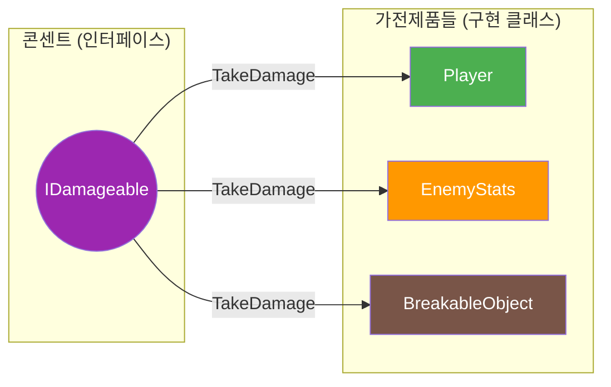
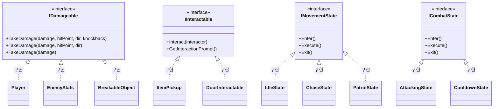

# 📋 공통 인터페이스 문서 (초보자용)

> **이 문서의 목표**: 인터페이스가 뭔지 이해하고, 우리 프로젝트의 인터페이스 사용법을 배웁니다
> **대상**: Unity 1개월차 개발자

---

## 🤔 인터페이스가 뭐예요?

### 쉬운 비유: 콘센트 🔌

집에 있는 **콘센트**를 생각해보세요:

- 어떤 가전제품이든 (TV, 냉장고, 충전기...)
- 플러그 모양만 맞으면 **전원을 받을 수 있습니다**



### 우리 게임에서는?

**IDamageable** 인터페이스가 있으면:

- Player든, Enemy든, 폭발 통이든
- **같은 방법**으로 데미지를 줄 수 있습니다!

### 인터페이스 구현 전체 구조



---

## 📌 IDamageable - 데미지 인터페이스

**위치**: `01_Scripts/06_Interface/IDamageable.cs`

### 이 인터페이스를 왜 쓰나요?

> "Weapon 담당자가 Enemy도 Player도 신경 안 쓰고 그냥 데미지만 주면 되게!"

### 인터페이스 코드

```csharp
public interface IDamageable
{
    // 완전 버전: 무기별 넉백 강도 지정 (총, 샷건, 검 등)
    void TakeDamage(int damage, Vector3 hitPoint, Vector3 attackDirection, float knockbackForce);

    // 상세 버전: 기본 넉백 적용 (위 함수의 기본값 버전)
    void TakeDamage(int damage, Vector3 hitPoint, Vector3 attackDirection);

    // 간단 버전: 그냥 데미지만 줄 때 (도트 데미지, 함정 등)
    void TakeDamage(int damage);
}
```

### 넉백 시스템 설명

> **신규**: 무기별로 다른 넉백 강도를 적용할 수 있습니다!

```
┌─────────────────┐       ┌─────────────────┐
│  RangedWeapon   │──────▶│   Projectile    │
│ knockback: 5.0  │       │ TakeDamage(..., │
└─────────────────┘       │ knockback: 5.0) │
                          └────────┬────────┘
                                   │
                                   ▼
                          ┌─────────────────┐
                          │   EnemyStats    │
                          │ resistance: 0.3 │
                          │ 최종 넉백: 3.5  │
                          └─────────────────┘
```

| 오버로드                                  | 언제 사용?       | 예시       |
| ----------------------------------------- | ---------------- | ---------- |
| `TakeDamage(damage, hit, dir, knockback)` | 무기별 넉백 지정 | 샷건, 검   |
| `TakeDamage(damage, hit, dir)`            | 기본 넉백 사용   | 일반 총알  |
| `TakeDamage(damage)`                      | 넉백 불필요      | 도트, 함정 |

### 이 인터페이스를 구현한 클래스들

| 클래스       | 위치                            | 설명               |
| ------------ | ------------------------------- | ------------------ |
| `Player`     | `00_Player/Player.cs`           | 플레이어 피격 처리 |
| `EnemyStats` | `02_Enemy/Normal/EnemyStats.cs` | 적 피격 처리       |

### 사용 방법 (Weapon 담당자용)

```csharp
// Projectile.cs (총알)
private void OnTriggerEnter(Collider other)
{
    // 1. IDamageable이 있는지 확인
    IDamageable target = other.GetComponent<IDamageable>();

    // 2. 있으면 데미지!
    if (target != null)
    {
        int damage = 10;
        Vector3 hitPoint = transform.position;
        Vector3 direction = transform.forward;

        target.TakeDamage(damage, hitPoint, direction);
    }
}
```

### 새로운 피격 가능 오브젝트 만들기

**예: 부술 수 있는 상자**

```csharp
// BreakableBox.cs
public class BreakableBox : MonoBehaviour, IDamageable  // ← 인터페이스 추가!
{
    [SerializeField] private int _health = 30;
    [SerializeField] private GameObject _debrisPrefab;

    // ═══════════════════════════════════════════════
    // IDamageable 구현 - 반드시 이 두 함수를 만들어야 함!
    // ═══════════════════════════════════════════════

    public void TakeDamage(int damage, Vector3 hitPoint, Vector3 attackDirection)
    {
        _health -= damage;

        // 이펙트 (피격 위치에 파편)
        Instantiate(_debrisPrefab, hitPoint, Quaternion.LookRotation(-attackDirection));

        if (_health <= 0)
        {
            Break();
        }
    }

    public void TakeDamage(int damage)
    {
        // 간단 버전 → 상세 버전으로 연결
        TakeDamage(damage, transform.position, Vector3.zero);
    }

    void Break()
    {
        // 부서지는 효과
        Destroy(gameObject);
    }
}
```

---

## 📌 IInteractable - 상호작용 인터페이스

**위치**: `01_Scripts/06_Interface/IInteractable.cs`

### 이 인터페이스를 왜 쓰나요?

> "E키 누르면 아이템이든, NPC든, 문이든 상호작용되게!"

### 인터페이스 코드

```csharp
public interface IInteractable
{
    void Interact(GameObject interactor);  // interactor = 상호작용한 사람 (보통 Player)
}
```

### 사용 방법 (Player 담당자용)

```csharp
// PlayerInteraction.cs
void Update()
{
    if (Input.GetKeyDown(KeyCode.E))
    {
        TryInteract();
    }
}

void TryInteract()
{
    // 1. 주변 오브젝트 찾기
    Collider[] hits = Physics.OverlapSphere(transform.position, 2f);

    // 2. IInteractable 찾아서 상호작용
    foreach (var hit in hits)
    {
        IInteractable interactable = hit.GetComponent<IInteractable>();
        if (interactable != null)
        {
            interactable.Interact(gameObject);  // 상호작용!
            return;
        }
    }
}
```

### 새로운 상호작용 오브젝트 만들기

**예: 줍는 아이템**

```csharp
// ItemPickup.cs
public class ItemPickup : MonoBehaviour, IInteractable  // ← 인터페이스 추가!
{
    [SerializeField] private ItemData _itemData;

    public void Interact(GameObject interactor)
    {
        // 1. 인벤토리 찾기
        Inventory inventory = interactor.GetComponent<Inventory>();
        if (inventory == null) return;

        // 2. 아이템 추가
        bool success = inventory.AddItem(_itemData);

        // 3. 성공하면 오브젝트 제거
        if (success)
        {
            Destroy(gameObject);
        }
    }
}
```

**예: 대화 NPC**

```csharp
// TalkableNPC.cs
public class TalkableNPC : MonoBehaviour, IInteractable
{
    [SerializeField] private string[] _dialogueLines;

    public void Interact(GameObject interactor)
    {
        // 대화창 열기
        DialogueManager.Instance.StartDialogue(_dialogueLines);
    }
}
```

---

## 🎯 Enemy FSM 인터페이스들 (Enemy 담당자용)

### IMovementState - 이동 상태 인터페이스

```csharp
public interface IMovementState
{
    void Enter(EnemyController controller);   // 상태 진입 시
    void Execute(EnemyController controller); // 매 프레임
    void Exit(EnemyController controller);    // 상태 종료 시
}
```

**구현 클래스들**: `PatrolState`, `ChaseState`, `ReturnState`, `WaitState`, `StoppedState`

### ICombatState - 전투 상태 인터페이스

```csharp
public interface ICombatState
{
    void Enter(EnemyController controller);
    void Execute(EnemyController controller);
    void Exit(EnemyController controller);
}
```

**구현 클래스들**: `CombatReadyState`, `CombatWindupState`, `CombatAttackingState`, `CombatRecoveryState`

### IStunnable - 스턴 가능 인터페이스

```csharp
public interface IStunnable
{
    void ApplyStun(float duration);  // 스턴 적용
    void ClearStun();                 // 스턴 해제
}
```

**구현 클래스**: `EnemyController` (Epic/Boss만)

---

## ❓ 자주 묻는 질문

### Q: 인터페이스 vs 상속, 뭐가 달라요?

| 구분 | 상속 (class A : B)  | 인터페이스 (class A : IB) |
| ---- | ------------------- | ------------------------- |
| 개수 | 하나만 가능         | 여러 개 가능              |
| 내용 | 코드 포함 가능      | 규칙만 정의               |
| 사용 | "A는 B의 한 종류다" | "A는 B 기능을 할 수 있다" |

```csharp
// 상속: "RangedWeapon은 Weapon의 한 종류다"
public class RangedWeapon : Weapon { }

// 인터페이스: "Player는 데미지를 받을 수 있다"
public class Player : MonoBehaviour, IDamageable { }
```

### Q: 왜 `GetComponent<IDamageable>()` 이렇게 써요?

**A**: 컴포넌트가 뭔지 몰라도 **인터페이스만 있으면 사용 가능**하기 때문입니다!

```csharp
// ❌ 안 좋은 방법: 타입을 알아야 함
EnemyStats enemy = other.GetComponent<EnemyStats>();
if (enemy != null) enemy.TakeDamage(10);

Player player = other.GetComponent<Player>();
if (player != null) player.TakeDamage(10);

// ✅ 좋은 방법: 인터페이스만 확인
IDamageable target = other.GetComponent<IDamageable>();
if (target != null) target.TakeDamage(10);  // 뭐든 OK!
```

### Q: `?.` 이게 뭐예요?

**A**: "null이 아니면 실행해줘"라는 뜻입니다.

```csharp
// 이 두 코드는 같은 의미!
target?.TakeDamage(10);

if (target != null)
{
    target.TakeDamage(10);
}
```

---

> 📖 다음 문서: [INTEGRATION_GUIDE.md](./INTEGRATION_GUIDE.md) - 실제 연동 방법
