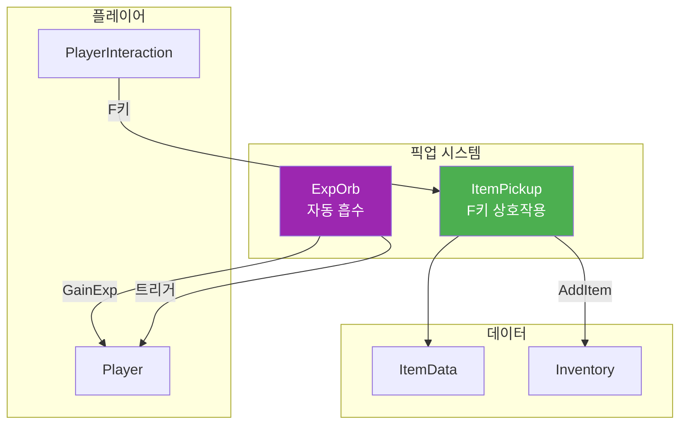
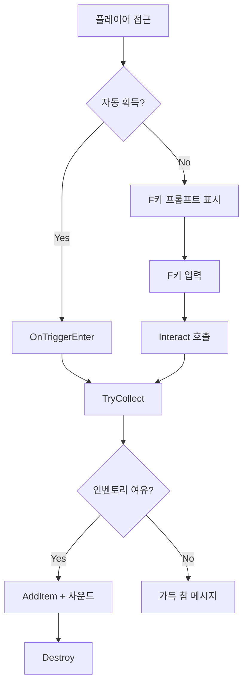
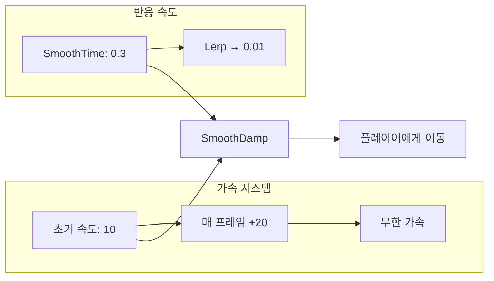

# 📦 Item 시스템 문서 (초보자용)

> **이 문서의 목표**: 아이템 픽업 및 필드 아이템 시스템을 이해합니다
> **대상**: Unity 1개월차 개발자

---

## 📁 파일 한눈에 보기

```
01_Scripts/03_Item/
│
├── 🟢 ItemPickup.cs           ← 기본 아이템 픽업 (IInteractable)
├── 🔵 AccessoryPickup.cs      ← 악세서리 픽업
├── 🔵 MagazinePickup.cs       ← 탄창 픽업
│
├── 📂 Field Item/             ← 자동 획득 오브
│   ├── 🟢 ExpOrb.cs           ← 경험치 오브
│   ├── 🔵 HealthOrb.cs        ← 체력 오브
│   └── 🔵 StaminaOrb.cs       ← 스태미나 오브
│
└── 📂 Data/
    ├── ItemData.cs            ← 기본 아이템 데이터
    └── ConsumableData.cs      ← 소모품 데이터

🟢 = 핵심 파일
🔵 = 부가 파일
```

---

## 🔗 시스템 연결도



---

## 📜 ItemPickup.cs 분석

### 역할

> 기본 아이템 픽업 - **F키 상호작용** 또는 **자동 획득** 모드 지원

### IInteractable 구현

```csharp
public class ItemPickup : MonoBehaviour, IInteractable
```

### Inspector 설정

| 필드               | 타입      | 설명                         |
| ------------------ | --------- | ---------------------------- |
| `itemData`         | ItemData  | 아이템 정보                  |
| `_isAutoCollect`   | bool      | 자동 획득 모드 (닿으면 획득) |
| `_pickupSound`     | AudioClip | 획득 사운드                  |
| `_pitchRandomness` | float     | 피치 랜덤 범위               |

### 함수 목록 (전체)

| 접근자  | 함수명                     | 설명                              |
| :-----: | -------------------------- | --------------------------------- |
| public  | `Interact(Player)`         | IInteractable 구현 - F키 상호작용 |
| public  | `GetInteractPrompt()`      | 프롬프트 텍스트 반환              |
| private | `OnTriggerEnter(Collider)` | 자동 획득 모드일 때만 동작        |
| private | `TryCollect(Player)`       | 인벤토리 추가 + 사운드 + Destroy  |

### 픽업 흐름



### 코드 분석

```csharp
private void TryCollect(Player player)
{
    if (itemData == null) return;

    Inventory inventory = player.GetComponent<Inventory>();
    if (inventory != null)
    {
        bool isAdded = inventory.AddItem(itemData);

        if (isAdded)
        {
            // 사운드 재생
            if (GlobalAudioManager.Instance != null && _pickupSound != null)
            {
                GlobalAudioManager.Instance.PlaySFX(_pickupSound, _pitchRandomness);
            }
            Destroy(gameObject);
        }
    }
}
```

---

## 📜 ExpOrb.cs 분석

### 역할

> 경험치 오브 - 플레이어 감지 시 **자동으로 빨려 들어감** (마그넷 효과)

### Inspector 설정

| 필드                 | 타입  | 기본값 | 설명           |
| -------------------- | ----- | :----: | -------------- |
| `_expAmount`         | int   |   10   | 경험치량       |
| `_detectRange`       | float |   10   | 감지 범위      |
| `_initialSmoothTime` | float |  0.3   | 초기 반응 속도 |
| `_finalSmoothTime`   | float |  0.01  | 최종 반응 속도 |
| `_initialMaxSpeed`   | float |   10   | 초기 최대 속도 |
| `_acceleration`      | float |   20   | 초당 가속도    |

### 함수 목록 (전체)

| 접근자  | 함수명                     | 설명                             |
| :-----: | -------------------------- | -------------------------------- |
| private | `Start()`                  | 플레이어 찾기, 변수 초기화       |
| private | `Update()`                 | 감지 → 추적 → 이동 로직          |
| private | `StartFollowing()`         | 추적 시작, 하이라이터 끄기       |
| private | `MoveTowardsPlayer()`      | SmoothDamp + 가속도로 이동       |
| public  | `ActivateMagnet()`         | 자석 아이템에서 호출 - 강제 흡수 |
| private | `OnTriggerEnter(Collider)` | 플레이어와 충돌 시 획득          |
| private | `Collect(GameObject)`      | 경험치 지급 + 사운드 + Destroy   |

### 흡수 물리 시스템



### 코드 분석: 가속 흡수

```csharp
private void MoveTowardsPlayer()
{
    // 매 프레임 최대 속도 증가 (도망쳐도 결국 따라잡음)
    _currentMaxSpeed += _acceleration * Time.deltaTime;

    // 반응 속도를 점점 줄임 (더 즉각적으로 따라붙음)
    _currentSmoothTime = Mathf.Lerp(_currentSmoothTime, _finalSmoothTime, Time.deltaTime);

    Vector3 targetPos = _playerTransform.position + Vector3.up * 1.0f;

    transform.position = Vector3.SmoothDamp(
        transform.position,
        targetPos,
        ref _currentVelocity,
        _currentSmoothTime,
        _currentMaxSpeed
    );
}
```

### 마그넷 아이템 연동

```csharp
// MagnetItem.cs에서 호출
public void ActivateMagnet()
{
    _isMagnetMode = true;
    if (!_isFollowing)
    {
        StartFollowing();
    }
}
```

---

## 📜 HealthOrb / StaminaOrb 분석

### 역할

> ExpOrb와 동일한 흡수 시스템, 다른 효과

### 차이점

| 스크립트        | 효과          | 호출 함수                       |
| --------------- | ------------- | ------------------------------- |
| `ExpOrb.cs`     | 경험치 지급   | `player.GainExp(amount)`        |
| `HealthOrb.cs`  | HP 회복       | `player.Heal(amount)`           |
| `StaminaOrb.cs` | 스태미나 회복 | `player.RestoreStamina(amount)` |

---

## 💡 아이템 사용 팁

### 1. 자동 vs 수동 픽업

```csharp
// Inspector에서 설정
[SerializeField] private bool _isAutoCollect = false;

// 경험치, 코인: true (자동)
// 무기, 장비: false (F키)
```

### 2. 사운드 피치 랜덤화

```csharp
// 연속 획득 시 똑같은 소리가 나면 기계적으로 느껴짐
GlobalAudioManager.Instance.PlaySFX(clip, 0.2f);  // ±0.2 피치 변화
```

---

## ❓ 자주 묻는 질문

### Q: SmoothDamp가 뭐예요?

**A**: 목표 지점으로 **부드럽게 가속/감속**하며 이동하는 함수입니다.

```csharp
Vector3.SmoothDamp(현재위치, 목표위치, ref 속도, 반응시간, 최대속도);
```

### Q: IInteractable을 왜 써요?

**A**: PlayerInteraction이 **어떤 아이템이든 같은 방법**으로 상호작용할 수 있게 합니다.

```csharp
// PlayerInteraction에서
IInteractable interactable = other.GetComponent<IInteractable>();
interactable.Interact(player);  // ItemPickup이든 DoorInteractable이든!
```

---

> 📖 다음 문서: [WEAPON_SYSTEM.md](./WEAPON_SYSTEM.md) - 무기 시스템 분석
