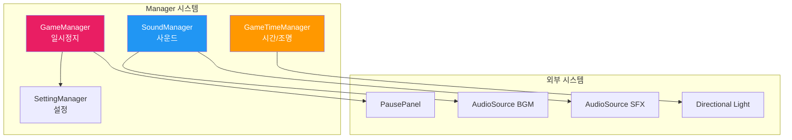
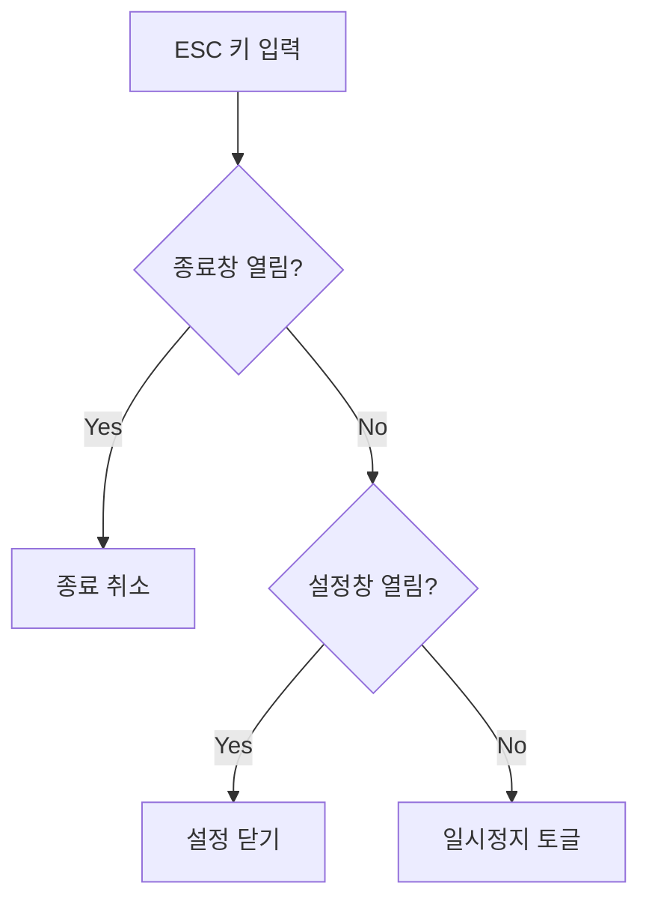
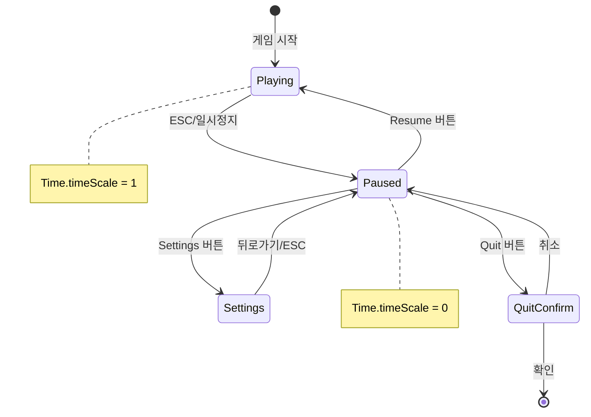
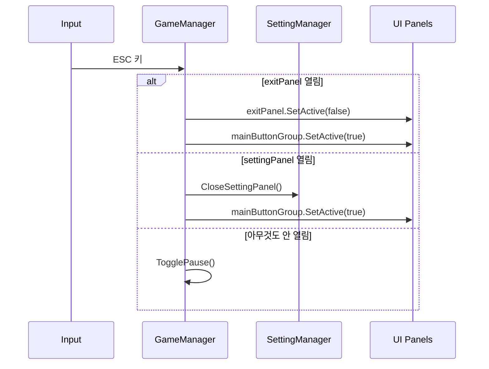
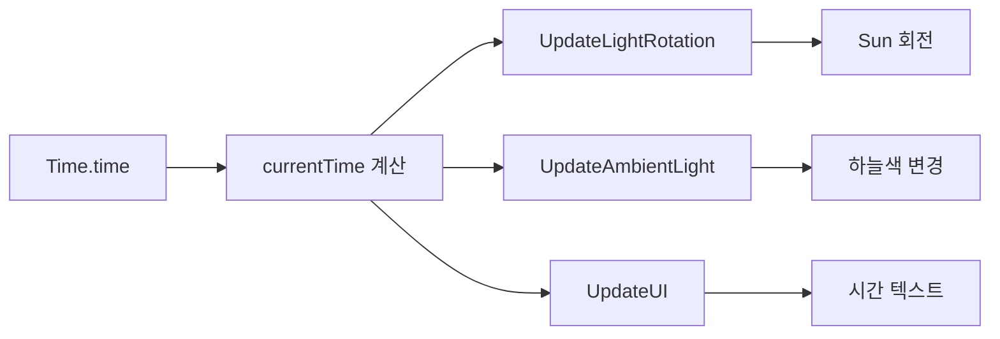
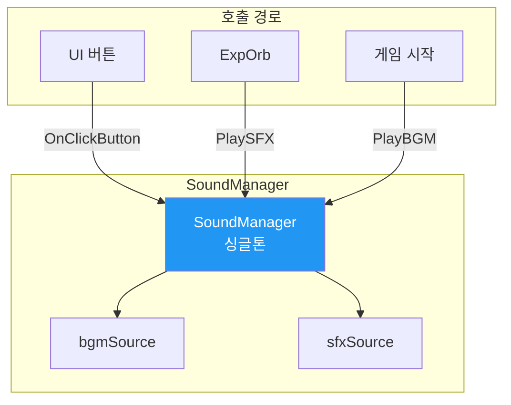
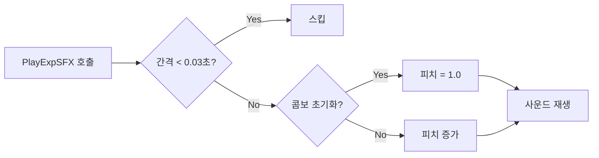

# 🎮 Manager 시스템 문서 (초보자용)

> **이 문서의 목표**: 게임 전반을 관리하는 Manager 클래스들을 이해합니다
> **대상**: Unity 1개월차 개발자

---

## 📁 파일 한눈에 보기

```
01_Scripts/04_Manager/
│
├── 🟢 GameManager.cs      ← 게임 일시정지/설정/종료
├── 🟢 SoundManager.cs     ← BGM/SFX 재생
├── 🟢 GameTimeManager.cs  ← 낮/밤 주기
├── 🔵 GameSceneManager.cs ← 씬 전환
├── 🔵 SettingManager.cs   ← 설정 저장/불러오기
└── 🔵 GlobalAudioManager.cs ← 전역 오디오

🟢 = 핵심 파일
🔵 = 부가 파일
```

---

## 🔗 시스템 연결도



---

## 📜 GameManager.cs 분석

### 역할

> 게임 **일시정지**, **설정 창**, **종료 확인** UI를 관리합니다.

### 싱글톤 패턴

```csharp
public static GameManager Instance;

private void Awake()
{
    if (Instance == null) Instance = this;
}
```

**사용법**:

```csharp
// 어디서든 호출 가능
GameManager.Instance.TogglePause();
```

### 함수 목록 (전체)

| 접근자  | 함수명              | 설명             |
| :-----: | ------------------- | ---------------- |
| private | `Awake()`           | 싱글톤 초기화    |
| private | `Start()`           | UI 패널 초기화   |
| private | `Update()`          | ESC 키 처리      |
| public  | `TogglePause()`     | 일시정지 토글    |
| public  | `OnClickResume()`   | 재개 버튼        |
| public  | `OnClickSettings()` | 설정 창 열기     |
| public  | `OnCloseSettings()` | 설정 창 닫기     |
| public  | `OnClickQuit()`     | 종료 확인창 열기 |
| public  | `OnCancelQuit()`    | 종료 취소        |
| public  | `OnConfirmQuit()`   | 게임 종료 실행   |

### ESC 키 처리 흐름



### GameManager 상태 전이



### 함수 목록 (전체)

#### 🔵 Public 함수 - 일시정지

| 함수명            | 설명                          |
| ----------------- | ----------------------------- |
| `TogglePause()`   | 일시정지 토글 (timeScale 0/1) |
| `OnClickResume()` | Resume 버튼 → TogglePause()   |

#### 🔵 Public 함수 - 설정

| 함수명              | 설명                           |
| ------------------- | ------------------------------ |
| `OnClickSettings()` | 설정창 열기 + 메인 버튼 숨기기 |
| `OnCloseSettings()` | 설정창 닫기 + 메인 버튼 복구   |

#### 🔵 Public 함수 - 종료

| 함수명            | 설명                         |
| ----------------- | ---------------------------- |
| `OnClickQuit()`   | 종료 확인창 표시             |
| `OnCancelQuit()`  | 종료 취소 → 메인 복귀        |
| `OnConfirmQuit()` | 게임 종료 (Application.Quit) |

#### 🟢 Private 함수

| 함수명     | 설명                       |
| ---------- | -------------------------- |
| `Awake()`  | 싱글톤 초기화              |
| `Start()`  | 패널 기본 상태 설정        |
| `Update()` | ESC 입력 → 우선순위별 처리 |

### ESC 키 처리 시퀀스



## 📜 SoundManager.cs 분석

### 역할

> **BGM**(배경음악)과 **SFX**(효과음)를 **전역에서** 재생합니다.

### 싱글톤 패턴

```csharp
public static SoundManager instance;
```

### 핵심 함수

```csharp
// BGM 재생 (루프)
public void PlayBGM(AudioClip clip)
{
    bgmSource.clip = clip;
    bgmSource.loop = true;
    bgmSource.Play();
}

// SFX 재생 (1회)
public void PlaySFX(AudioClip clip)
{
    sfxSource.PlayOneShot(clip);
}
```

### 사용 예시

```csharp
// ExpOrb.cs에서 경험치 획득 사운드 재생
public class ExpOrb : MonoBehaviour
{
    [SerializeField] private AudioClip _pickupSound;

    void OnTriggerEnter(Collider other)
    {
        if (other.CompareTag("Player"))
        {
            SoundManager.instance.PlaySFX(_pickupSound);
            // ...
        }
    }
}
```

---

## 📜 GameTimeManager.cs 분석

### 역할

> 게임 내 **시간 흐름**과 **낮/밤 주기**를 관리합니다.

### Inspector 설정

```csharp
[Header("Settings")]
public float dayDurationInSeconds = 120f;  // 하루 = 120초
[Range(0, 24)]
public float startHour = 12f;              // 시작 시간 (정오)
```

### 핵심 기능

| 기능      | 설명                               |
| --------- | ---------------------------------- |
| 시간 흐름 | 120초마다 24시간 사이클            |
| 태양 회전 | 시간에 따라 Directional Light 회전 |
| 조명 변화 | 시간대별 Ambient Light 색상 변경   |
| UI 표시   | 현재 시간 텍스트 + 해/달 아이콘    |

### 시간 → 조명 흐름



### Gradient 설정 팁

```
ambientSkyColor:
  0:00 (밤) = 어두운 파랑
  6:00 (새벽) = 주황
  12:00 (낮) = 밝은 파랑
  18:00 (저녁) = 주황
  24:00 (밤) = 어두운 파랑
```

---

## 🎯 SoundManager.cs 완전 분석

### 역할

> 게임 내 **BGM과 SFX 재생**을 담당하는 싱글톤

### 시스템 아키텍처



### Inspector 설정

| 필드          | 타입        | 설명                    |
| ------------- | ----------- | ----------------------- |
| `bgmSource`   | AudioSource | 배경음악 재생용         |
| `sfxSource`   | AudioSource | 효과음 재생용           |
| `mainBgm`     | AudioClip   | 게임 시작 시 재생될 BGM |
| `buttonClick` | AudioClip   | 버튼 클릭 효과음        |

### 함수 목록 (전체)

#### 🔵 Public 함수

| 함수명               | 파라미터   | 설명             |
| -------------------- | ---------- | ---------------- |
| `instance`           | (Property) | 싱글톤 인스턴스  |
| `PlayBGM(AudioClip)` | 클립       | BGM 루프 재생    |
| `PlaySFX(AudioClip)` | 클립       | SFX 원샷 재생    |
| `OnClickButton()`    | -          | 버튼 클릭 사운드 |

#### 🟢 Private 함수

| 함수명    | 설명              |
| --------- | ----------------- |
| `Awake()` | 싱글톤 초기화     |
| `Start()` | mainBgm 자동 재생 |

### 코드 분석

```csharp
// BGM 재생 (루프)
public void PlayBGM(AudioClip clip)
{
    bgmSource.clip = clip;
    bgmSource.loop = true;
    bgmSource.Play();
}

// SFX 재생 (원샷)
public void PlaySFX(AudioClip clip)
{
    sfxSource.PlayOneShot(clip);
}
```

### 사용 예시

```csharp
// ExpOrb에서 획득 사운드
SoundManager.instance.PlaySFX(collectSound);

// UI에서 버튼 클릭
SoundManager.instance.OnClickButton();
```

---

## 📜 GlobalAudioManager.cs 분석

### 역할

> **DontDestroyOnLoad** 전역 오디오 관리자 - 씬 전환 시에도 유지되는 싱글톤

### 함수 목록 (전체)

| 접근자  | 함수명                      | 설명                                 |
| :-----: | --------------------------- | ------------------------------------ |
| private | `Awake()`                   | 싱글톤 초기화 + DontDestroyOnLoad    |
| public  | `PlaySFX(AudioClip, float)` | 일반 효과음 (랜덤 피치)              |
| public  | `PlayExpSFX(AudioClip)`     | 경험치 전용 (스로틀링 + 라이징 피치) |

### 경험치 사운드 최적화



---

## �💡 Manager 사용 팁

### 1. 싱글톤 접근

```csharp
// ✅ 올바른 사용법
GameManager.Instance.TogglePause();
SoundManager.instance.PlaySFX(clip);

// ❌ 잘못된 사용법 (매번 찾으면 느림)
FindObjectOfType<GameManager>().TogglePause();
```

### 2. null 체크

```csharp
// 안전한 호출
if (SoundManager.instance != null)
{
    SoundManager.instance.PlaySFX(clip);
}

// 또는 null 조건 연산자
SoundManager.instance?.PlaySFX(clip);
```

---

## ❓ 자주 묻는 질문

### Q: 싱글톤이 뭐예요?

**A**: "이 클래스는 게임에 딱 하나만 있어야 해!" 라는 패턴입니다.

```csharp
// 어디서든 GameManager.Instance로 접근 가능
public static GameManager Instance;
```

### Q: Time.timeScale = 0이 뭐예요?

**A**: 게임 시간을 멈추는 것입니다.

```csharp
Time.timeScale = 0f;  // 일시정지 (Update는 돌지만 시간 안 흐름)
Time.timeScale = 1f;  // 정상 속도
Time.timeScale = 2f;  // 2배속
```

### Q: PlayOneShot vs Play 차이?

**A**:

- `Play()`: 이전 사운드를 멈추고 새로 재생
- `PlayOneShot()`: 이전 사운드와 **동시에** 재생 (효과음용)

---

> 📖 다음 문서: [PLAYER_SYSTEM.md](./PLAYER_SYSTEM.md) - Player 시스템 분석
