# 🎮 Player 시스템 문서 (초보자용)

> **이 문서의 목표**: Player 시스템을 이해하고 다른 시스템과 연동하는 방법을 배웁니다
> **대상**: Unity 1개월차 개발자

---

## 📁 파일 한눈에 보기

```
01_Scripts/00_Player/
│
├── 🟢 Player.cs                  ← HP, 스태미나, 경험치, 코인 관리
├── 🟢 PlayerController.cs        ← WASD 이동, 구르기, 중력
├── 🟢 PlayerWeaponController.cs  ← 무기 장착/발사
├── 🔵 PlayerInteraction.cs       ← F키 상호작용 프롬프트
├── 🔵 Inventory.cs               ← 인벤토리 데이터 관리
├── 🔵 QuickSlotController.cs     ← 1~4번 퀵슬롯
├── 🔵 BagItemPickup.cs           ← 가방 아이템 획득 (무게 확장)
└── 🔵 KillZone.cs                ← 사망 영역 트리거

🟢 = 핵심 파일 (8개 스크립트)
🔵 = 부가 파일
```

---

## 🔗 시스템 연결도

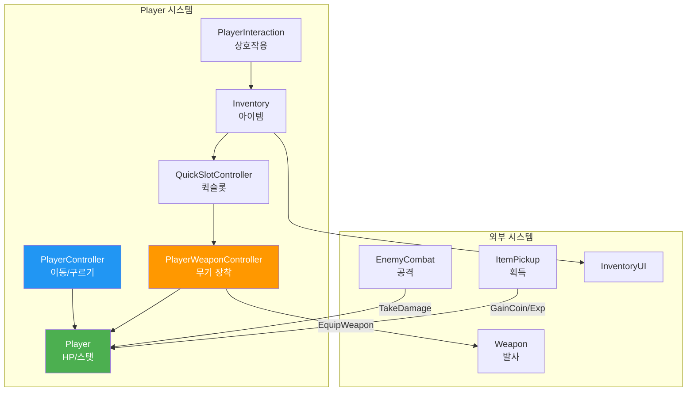

### 연결 요약표

| 나는            | 하고 싶은 것         | 호출할 함수                                         |
| --------------- | -------------------- | --------------------------------------------------- |
| **Weapon 담당** | 플레이어 무기 장착   | `playerWeaponController.EquipWeapon(weaponData)`    |
| **Enemy 담당**  | 플레이어 공격        | `player.GetComponent<IDamageable>().TakeDamage(10)` |
| **Item 담당**   | 플레이어 경험치 증가 | `player.GainExp(25)`                                |
| **Item 담당**   | 플레이어 코인 증가   | `player.GainCoin(100)`                              |
| **UI 담당**     | 플레이어 HP 확인     | `player.Hp` (읽기 전용)                             |

---

## � Mermaid 다이어그램

### 클래스 다이어그램

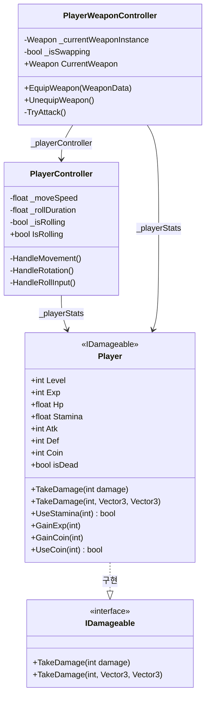

### 스크립트 연동 다이어그램

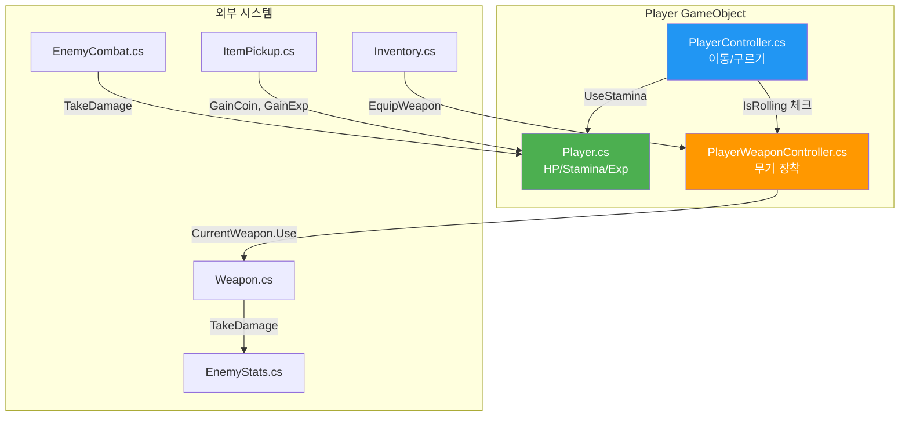

### 데이터 흐름도 (피격 시)

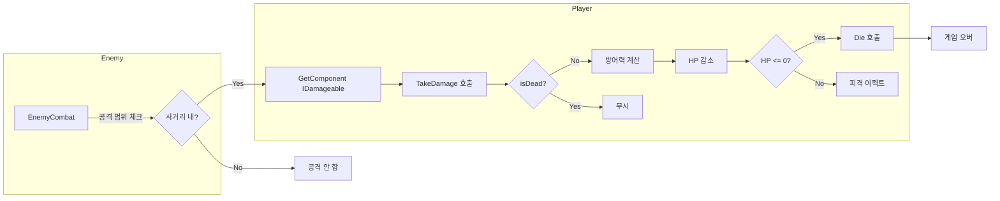

### Update 루프 플로우차트 (PlayerController)

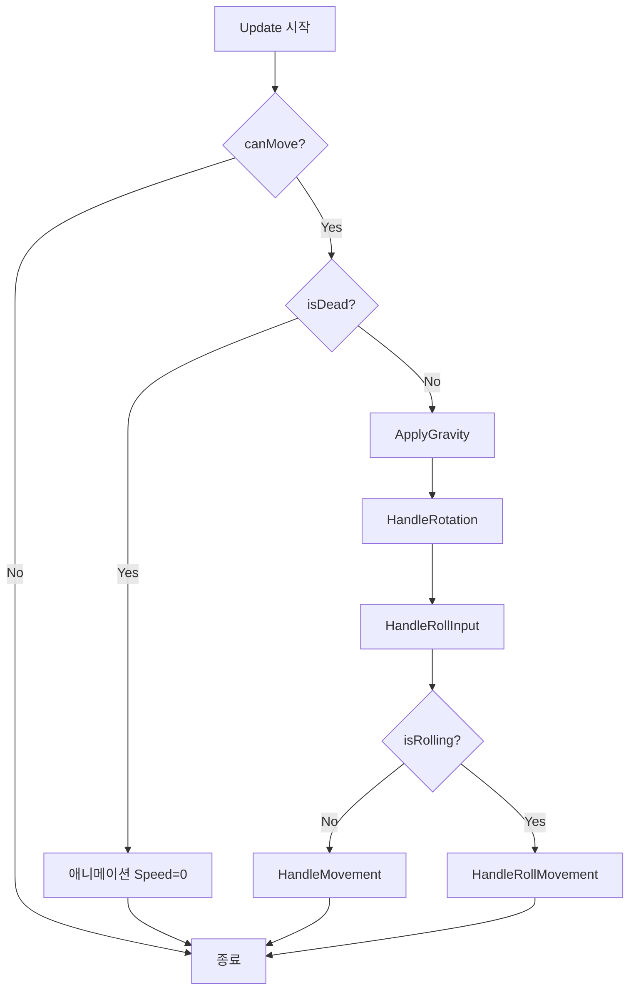

### 무기 장착 시퀀스 다이어그램

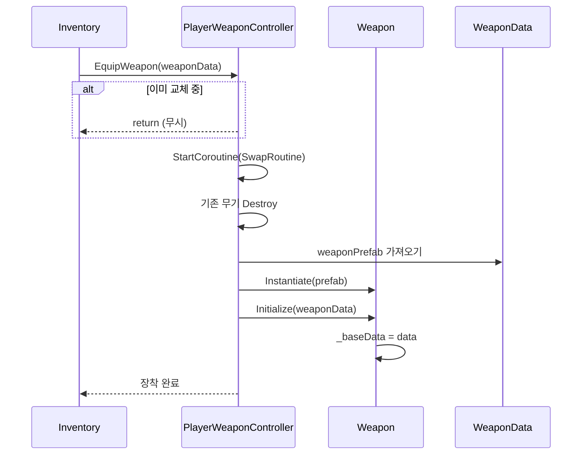

---

## �📜 Player.cs 완전 분석

### 이 스크립트의 역할

> 플레이어의 **모든 스탯**(HP, 스태미나, 경험치, 코인)을 관리합니다.
> 피격당하면 여기서 HP가 줄어듭니다.

### 클래스 선언 해석

```csharp
public class Player : MonoBehaviour, IDamageable
//                                   ↑
//                                   이 부분이 중요!
```

**`IDamageable`이 붙어있다는 뜻**:

- 이 플레이어는 데미지를 받을 수 있습니다
- `TakeDamage()` 함수가 반드시 있습니다
- Enemy에서 `GetComponent<IDamageable>().TakeDamage(10)` 으로 공격 가능!

---

### 변수(프로퍼티) 설명

#### 레벨/경험치 관련

```csharp
public int Level => level;     // 현재 레벨 (읽기 전용)
public int Exp => exp;         // 현재 경험치
public int MaxExp => maxExp;   // 레벨업에 필요한 경험치
```

📍 **사용 예시**: `if (player.Level >= 10) { /* 10레벨 달성! */ }`

#### HP/스태미나 관련

```csharp
public float MaxHp { get; private set; } = 100f;      // 최대 HP
public float Hp { get; set; }                          // 현재 HP
public float MaxStamina { get; private set; } = 100f; // 최대 스태미나
public float Stamina { get; set; }                     // 현재 스태미나
```

📍 **사용 예시**: `healthBar.fillAmount = player.Hp / player.MaxHp;`

#### 전투 관련

```csharp
public int Atk => atk;   // 공격력
public int Def => def;   // 방어력 (받는 데미지 감소)
public int Shield => shield; // 방패
```

#### 상태 관련

```csharp
public bool isDead { get; }  // 죽었는지 확인
```

📍 **사용 예시**: `if (player.isDead) { ShowGameOverScreen(); }`

#### 재화 관련

```csharp
public int Coin => coin;  // 보유 코인
```

---

### 함수 목록 (전체)

#### 🔵 Public 함수 - IDamageable 구현

| 함수명                                     | 파라미터                         | 설명                  |
| ------------------------------------------ | -------------------------------- | --------------------- |
| `TakeDamage(int, Vector3, Vector3, float)` | damage, hitPoint, dir, knockback | 상세 피격 (넉백 무시) |
| `TakeDamage(int, Vector3, Vector3)`        | damage, hitPoint, dir            | 중간 피격             |
| `TakeDamage(int)`                          | damage                           | 간단 피격             |

#### 🔵 Public 함수 - 체력/스태미나

| 함수명                  | 파라미터 | 설명                      |
| ----------------------- | -------- | ------------------------- |
| `Heal(float)`           | amount   | HP 회복                   |
| `RestoreStamina(float)` | amount   | 스태미나 회복             |
| `ConsumeStamina(float)` | amount   | 스태미나 소모 (void)      |
| `UseStamina(int)`       | amount   | 스태미나 사용 (bool 반환) |

#### 🔵 Public 함수 - 재화/성장

| 함수명          | 반환 | 설명                       |
| --------------- | :--: | -------------------------- |
| `GainCoin(int)` | void | 코인 획득                  |
| `UseCoin(int)`  | bool | 코인 사용 (부족시 false)   |
| `GainExp(int)`  | void | 경험치 획득 → 자동 LevelUp |

#### 🔵 Public 함수 - 스탯 업그레이드 (UI 버튼)

| 함수명                | StatPoint 소모 | 설명               |
| --------------------- | :------------: | ------------------ |
| `TryUpgradeAtk()`     |       1        | 공격력 +5          |
| `TryUpgradeHp()`      |       1        | 최대HP +20         |
| `TryUpgradeStamina()` |       1        | 최대스태미나 +15   |
| `TryUpgradeSpeed()`   |       1        | 이동속도 +0.5      |
| `UpgradeAtk(int)`     |       0        | 직접 공격력 증가   |
| `UpgradeHp(int)`      |       0        | 직접 HP 증가       |
| `UpgradeStamina(int)` |       0        | 직접 스태미나 증가 |

#### 🔵 Public 함수 - 무게 시스템

| 함수명                     | 설명                                  |
| -------------------------- | ------------------------------------- |
| `GetMoveSpeedMultiplier()` | 무게 기반 이동속도 배율 (0.5~1.0)     |
| `UpdateWeight(float)`      | Inventory에서 호출 → 과적재 상태 갱신 |
| `ExpandMaxWeight(float)`   | BagItemPickup에서 최대 무게 증가      |

#### 🔵 Public 함수 - 특수

| 함수명                  | 설명                           |
| ----------------------- | ------------------------------ |
| `AcquireVerticalGrip()` | 수직 손잡이 획득 (탄퍼짐 감소) |

#### 🟢 Private 함수 - 라이프사이클

| 함수명       | 설명                         |
| ------------ | ---------------------------- |
| `Awake()`    | HP/Stamina 초기화, 무게 상태 |
| `Update()`   | 스태미나 자동 회복           |
| `UpdateUI()` | HP/Stamina/Exp 바 갱신       |

#### 🟢 Private 함수 - 내부 로직

| 함수명                  | 설명                              |
| ----------------------- | --------------------------------- |
| `Die()`                 | 사망 처리 (isDead=true)           |
| `LevelUp()`             | 레벨업 → StatPoint+1, MaxExp\*1.5 |
| `PlayLevelUpEffect()`   | VFX + 사운드 재생                 |
| `ApplyMovementDebuff()` | 과적재 시 이동속도 디버프         |

### 데미지 처리 흐름

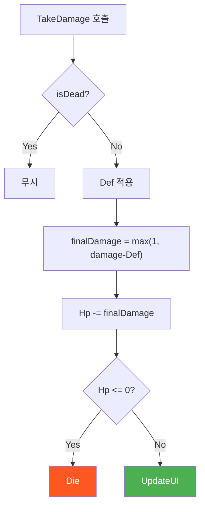

### 레벨업 시퀀스

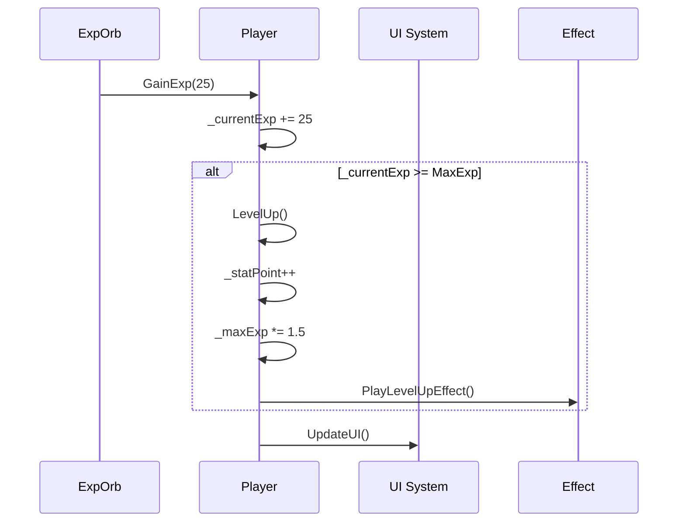

### 핵심 함수 설명

#### 1. TakeDamage - 피격 처리 (가장 중요!)

```csharp
// 간단 버전 - 그냥 데미지만 줄 때
public void TakeDamage(int damage)
{
    if (isDead) return;  // 이미 죽었으면 무시

    // 방어력 적용 (최소 1 데미지는 들어감)
    int finalDamage = Mathf.Max(1, damage - Def);

    Hp -= finalDamage;   // HP 감소
}
```

**이 함수가 호출되면 일어나는 일**:

1. 플레이어가 이미 죽었으면 → 아무 일도 안 함
2. 방어력만큼 데미지 감소 (최소 1)
3. HP 감소
4. HP가 0 이하가 되면 → `Die()` 자동 호출

**Enemy 담당자가 사용하는 방법**:

```csharp
// EnemyCombat.cs에서
void AttackPlayer()
{
    IDamageable target = player.GetComponent<IDamageable>();
    target.TakeDamage(10);  // 10 데미지
}
```

---

#### 2. UseStamina - 스태미나 사용

```csharp
public bool UseStamina(int amount)
{
    if (Stamina >= amount)  // 충분하면
    {
        Stamina -= amount;   // 사용
        return true;         // 성공
    }
    return false;            // 부족하면 실패
}
```

**사용 예시**:

```csharp
// 구르기 할 때
if (player.UseStamina(25))  // 25 스태미나 필요
{
    StartRoll();  // 구르기 실행
}
else
{
    Debug.Log("스태미나 부족!");
}
```

---

#### 3. GainExp - 경험치 획득

```csharp
public void GainExp(int amount)
{
    exp += amount;
    while (exp >= maxExp) LevelUp();  // 경험치 초과하면 레벨업
    UpdateUI();
}
```

**Item/Enemy 담당자가 사용하는 방법**:

```csharp
// 적 사망 시
void OnEnemyDeath()
{
    Player player = FindObjectOfType<Player>();
    player.GainExp(25);  // 25 경험치 지급
}
```

---

#### 4. GainCoin / UseCoin - 코인 관리

```csharp
public void GainCoin(int amount)
{
    coin += amount;
    UpdateUI();
}

public bool UseCoin(int amount)
{
    if (coin >= amount)
    {
        coin -= amount;
        UpdateUI();
        return true;   // 구매 성공
    }
    return false;      // 돈 부족
}
```

**사용 예시**:

```csharp
// 상점에서 아이템 구매
if (player.UseCoin(100))
{
    GiveItemToPlayer(item);
}
else
{
    ShowMessage("코인이 부족합니다!");
}
```

---

## 🎯 PlayerController.cs 완전 분석

### 역할

> WASD 이동, 마우스 방향 회전, **구르기(회피)** + 중력/경사면 처리

### 시스템 아키텍처

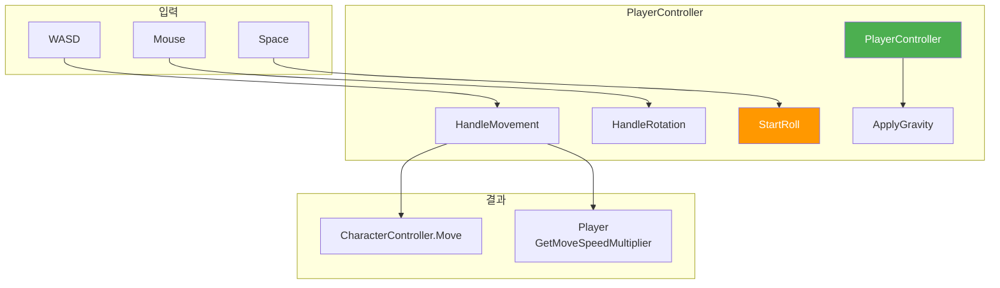

### 함수 목록 (전체)

#### 🔵 Public 함수

| 함수명                | 설명                     |
| --------------------- | ------------------------ |
| `UpgradeSpeed(float)` | 이동속도 업그레이드      |
| `GetMoveSpeed()`      | 현재 이동속도 반환       |
| `IsRolling`           | (Property) 구르기 중인지 |

#### 🟢 Private - 라이프사이클

| 함수명     | 설명                             |
| ---------- | -------------------------------- |
| `Awake()`  | CharacterController, Player 캐싱 |
| `Update()` | 중력→이동→회전→구르기 순차 처리  |

#### 🟢 Private - 이동 로직

| 함수명                  | 설명                           |
| ----------------------- | ------------------------------ |
| `HandleMovement()`      | WASD 입력 → 방향 계산 → Move() |
| `ApplyGravity()`        | 접지 확인 → 중력/점프 적용     |
| `CalculateSlopeSlide()` | 경사면 미끄러짐 벡터 계산      |

#### 🟢 Private - 회전 로직

| 함수명             | 설명                             |
| ------------------ | -------------------------------- |
| `HandleRotation()` | 마우스 위치 → 바라보는 방향 회전 |

#### 🟢 Private - 구르기 로직

| 함수명                 | 설명                              |
| ---------------------- | --------------------------------- |
| `HandleRollInput()`    | Space키 입력 감지                 |
| `StartRoll()`          | 구르기 시작 (무적, 스태미나 소모) |
| `HandleRollMovement()` | 구르기 중 이동                    |
| `EndRollRoutine()`     | 코루틴 - 구르기 종료, 무적 해제   |

### 이동 처리 흐름

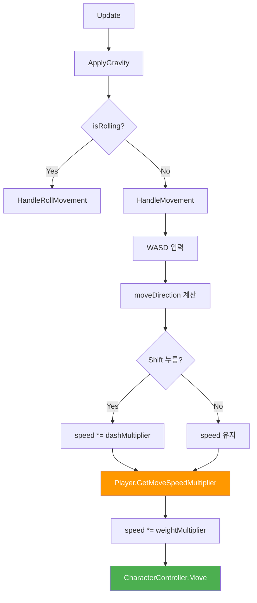

### 구르기 시퀀스

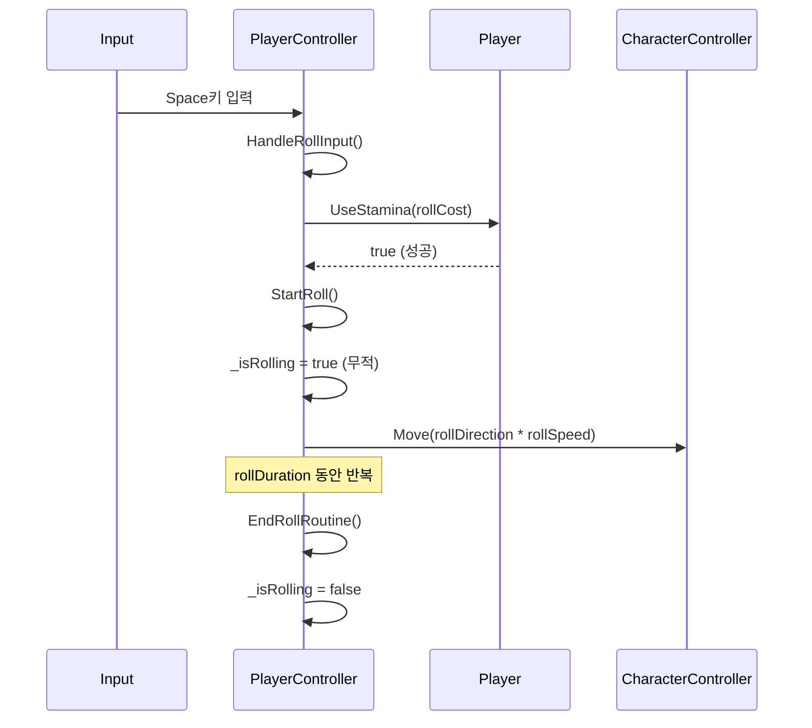

### 핵심 변수 (Inspector 설정)

```csharp
[Header("Movement Settings")]
[SerializeField] private float _moveSpeed = 16f;       // 이동 속도
[SerializeField] private float _dashMultiplier = 1.5f; // 달리기 배율
[SerializeField] private float _rotationSpeed = 720f;  // 회전 속도 (도/초)

[Header("Roll Settings")]
[SerializeField] private KeyCode _rollKey = KeyCode.Space; // 구르기 키
[SerializeField] private float _rollDuration = 0.5f;       // 구르기 시간
[SerializeField] private float _rollDistance = 12f;        // 구르기 거리
[SerializeField] private int _rollStaminaCost = 25;        // 스태미나 소모
```

### 다른 시스템에서 사용하는 프로퍼티

```csharp
public bool IsRolling => _isRolling;  // 구르기 중인지 확인
```

**Weapon에서 사용하는 방법**:

```csharp
// PlayerWeaponController.cs에서
void Update()
{
    // 구르기 중이면 공격 불가
    if (_playerController.IsRolling) return;

    // 공격 처리...
}
```

---

## 🎯 PlayerWeaponController.cs 완전 분석

### 역할

> 플레이어 무기 장착/교체/공격 입력을 처리하고, **무기 캐싱 시스템**으로 성능 최적화

### 시스템 아키텍처

```mermaid
flowchart TB
    subgraph "입력 시스템"
        F1[Fire1 - 공격]
        R[R키 - 재장전]
    end

    subgraph "PlayerWeaponController"
        PWC[PlayerWeaponController]
        CACHE["_weaponCache\n(Dictionary)"]
        SWAP[SwapRoutine\n(Coroutine)]
    end

    subgraph "무기 인스턴스"
        RW[RangedWeapon]
        MW[MeleeWeapon]
    end

    subgraph "외부 시스템"
        ANIM[Animator]
        QS[QuickSlotController]
        INV[Inventory]
    end

    F1 --> PWC
    R --> PWC
    PWC --> CACHE
    CACHE --> RW & MW
    QS -->|EquipWeapon| PWC
    INV -->|EquipWeapon| PWC
    PWC --> ANIM
    SWAP --> CACHE

    style PWC fill:#4CAF50,color:#fff
    style CACHE fill:#FF9800,color:#fff
```

### Inspector 설정

| 필드               | 타입           | 설명                    |
| ------------------ | -------------- | ----------------------- |
| `testWeapon`       | WeaponData     | 테스트용 시작 무기      |
| `_weaponHolder`    | Transform      | 무기 생성 부모 (오른손) |
| `_playerFirePoint` | Transform      | 발사체 시작 위치        |
| `_muzzleFlash`     | ParticleSystem | 총구 화염 이펙트        |
| `_animator`        | Animator       | 공격 애니메이션         |

### 함수 목록 (전체)

#### 🔵 Public 함수

| 함수명                    | 파라미터    | 설명                              |
| ------------------------- | ----------- | --------------------------------- |
| `EquipWeapon(WeaponData)` | 무기 데이터 | 무기 장착 요청 → SwapRoutine 시작 |
| `UnequipWeapon()`         | -           | 현재 무기 해제 (캐시에 보관)      |
| `CurrentWeapon`           | Property    | 현재 장착 중인 무기 인스턴스 반환 |

#### 🟢 Private - 라이프사이클

| 함수명     | 설명                                             |
| ---------- | ------------------------------------------------ |
| `Awake()`  | Animator, Player, PlayerController 컴포넌트 캐싱 |
| `Start()`  | testWeapon이 있으면 자동 장착                    |
| `Update()` | Fire1/R키 입력 감지, 구르기/UI 클릭 중 무시      |

#### 🟢 Private - 공격 로직

| 함수명                    | 설명                                                   |
| ------------------------- | ------------------------------------------------------ |
| `TryAttack()`             | 무기 준비 상태 확인 → 타입별 체크 → 애니메이션 → Use() |
| `SwapRoutine(WeaponData)` | 코루틴 - 무기 교체 (캐시 확인 → 생성/재사용)           |

### 무기 캐싱 시스템

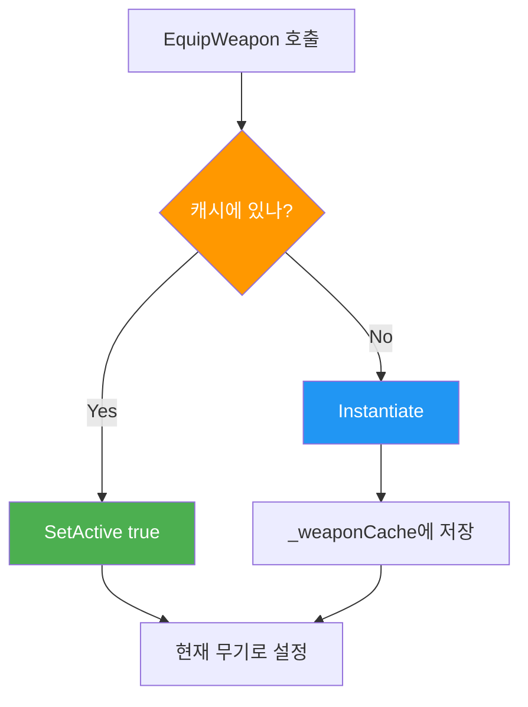

### 코드 분석: TryAttack

```csharp
private void TryAttack()
{
    // 1. 무기 준비 상태 확인
    if (!_currentWeaponInstance.IsReady) return;

    // 2. 타입별 체크
    if (_currentWeaponInstance is MeleeWeapon)
    {
        if (_playerStats.Stamina < 10) return;  // 스태미나 부족
    }
    else if (_currentWeaponInstance is RangedWeapon ranged)
    {
        if (!ranged.HasAmmo) return;  // 탄약 부족
    }

    // 3. 애니메이션 실행
    if (_currentWeaponInstance is RangedWeapon)
        _animator.SetTrigger("DoShot");
    else
        _animator.SetTrigger("DoSwing");

    // 4. 실제 무기 사용
    _currentWeaponInstance.Use();
}
```

### 호출 시퀀스

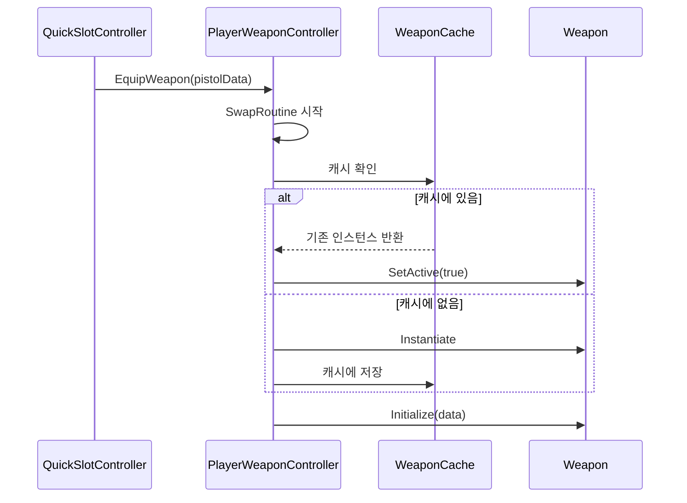

---

## 🎯 Inventory.cs 완전 분석

### 역할

> 플레이어 인벤토리 관리 - 아이템 추가/제거, **무게 시스템** 연동, UI 이벤트 발송

### 시스템 아키텍처

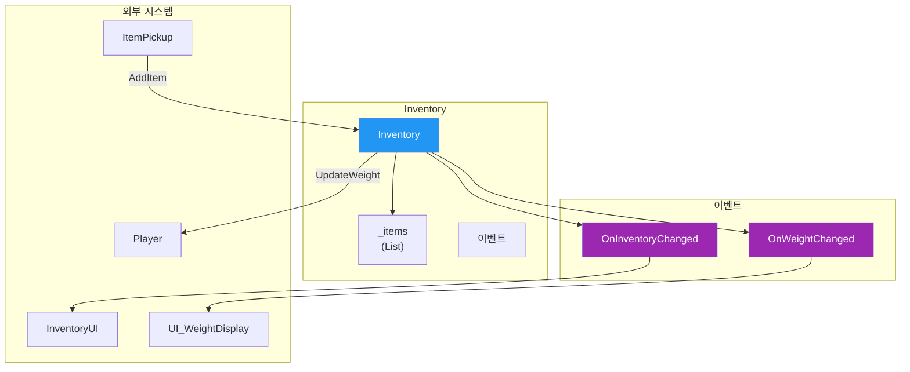

### Inspector 설정

| 필드        | 타입   | 기본값 | 설명                      |
| ----------- | ------ | :----: | ------------------------- |
| `_capacity` | int    |   20   | 인벤토리 최대 칸 수       |
| `_player`   | Player |   -    | 무게 전달용 플레이어 참조 |

### 이벤트 목록

| 이벤트명             | 파라미터 | 발생 시점                  |
| -------------------- | -------- | -------------------------- |
| `OnInventoryChanged` | -        | 아이템 추가/제거 시        |
| `OnWeightChanged`    | float    | 무게 변경 시 (totalWeight) |

### 함수 목록 (전체)

#### 🔵 Public 함수

| 함수명                 |   반환   | 설명                                   |
| ---------------------- | :------: | -------------------------------------- |
| `AddItem(ItemData)`    |   bool   | 인벤토리에 아이템 추가 (capacity 체크) |
| `RemoveItem(ItemData)` |   bool   | 인벤토리에서 아이템 제거               |
| `Items`                | Property | 아이템 리스트 읽기 전용                |

#### 🟢 Private 함수

| 함수명                   | 설명                                     |
| ------------------------ | ---------------------------------------- |
| `Awake()`                | Player 컴포넌트 자동 탐색                |
| `CalculateTotalWeight()` | 총 무게 계산 → Player 전달 → 이벤트 발송 |

### 아이템 추가 흐름

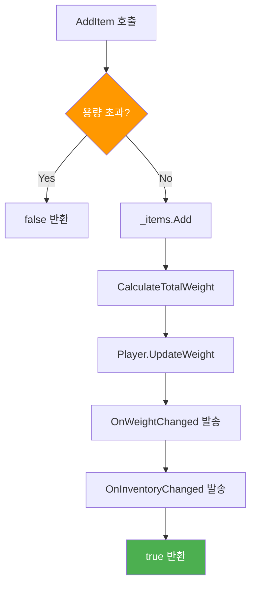

### 코드 분석: 무게 계산

```csharp
private void CalculateTotalWeight()
{
    if (_player == null) return;

    float totalWeight = 0f;
    foreach (var item in _items)
    {
        if (item != null)
            totalWeight += item.weight;
    }

    // 1. 플레이어 데이터 갱신
    _player.UpdateWeight(totalWeight);

    // 2. UI에 이벤트 발송
    OnWeightChanged?.Invoke(totalWeight);
}
```

## 💡 실전 연동 예제

### 예제 1: 적이 플레이어 공격하기

```csharp
// EnemyCombat.cs
public class EnemyCombat : MonoBehaviour
{
    [SerializeField] private int _damage = 10;
    [SerializeField] private float _attackRange = 1.5f;

    private Transform _playerTarget;

    void Start()
    {
        // 플레이어 찾기
        _playerTarget = GameObject.FindGameObjectWithTag("Player").transform;
    }

    public void Attack()
    {
        // 1. 거리 체크
        float distance = Vector3.Distance(transform.position, _playerTarget.position);
        if (distance > _attackRange) return;

        // 2. IDamageable로 데미지 주기
        IDamageable target = _playerTarget.GetComponent<IDamageable>();
        if (target != null)
        {
            target.TakeDamage(_damage);
            Debug.Log($"플레이어에게 {_damage} 데미지!");
        }
    }
}
```

### 예제 2: 아이템 먹으면 코인/경험치 증가

```csharp
// CoinPickup.cs
public class CoinPickup : MonoBehaviour
{
    [SerializeField] private int _coinAmount = 50;
    [SerializeField] private int _expAmount = 10;

    private void OnTriggerEnter(Collider other)
    {
        if (other.CompareTag("Player"))
        {
            Player player = other.GetComponent<Player>();
            if (player != null)
            {
                player.GainCoin(_coinAmount);  // 코인 지급
                player.GainExp(_expAmount);     // 경험치 지급
                Destroy(gameObject);            // 아이템 제거
            }
        }
    }
}
```

---

## 🎒 Weight 시스템 (신규)

### 이 시스템의 역할

> 인벤토리 무게가 초과되면 **이동 속도가 감소**합니다.

### 작동 원리

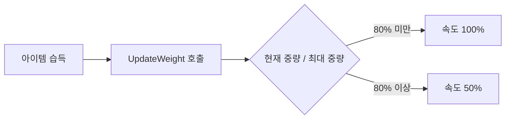

### 핵심 함수

```csharp
// Player.cs
public float GetMoveSpeedMultiplier()
{
    // 설정된 퍼센트(_overweightThreshold) 이상이면 속도 50% 반환
    float ratio = currentWeight / maxWeight;
    if (ratio >= _overweightThreshold)
        return 0.5f;  // 과적재 패널티
    return 1.0f;      // 정상
}

public void UpdateWeight()
{
    // 인벤토리에서 총 무게 계산 후 UI 업데이트
}

public void ExpandMaxWeight(float amount)
{
    // 가방 업그레이드로 최대 중량 증가
}
```

### UI 연동 (UI_WeightDisplay)

```csharp
// UI_WeightDisplay.cs
void UpdateDisplay()
{
    float ratio = player.CurrentWeight / player.MaxWeight;
    weightText.text = $"{player.CurrentWeight} / {player.MaxWeight}";

    // 과적재 시 빨간색으로 표시
    weightText.color = ratio >= 0.8f ? Color.red : Color.white;
}
```

---

## ⬆️ 업그레이드 시스템 (최신)

### 이 시스템의 역할

> 게임 내 재화(코인)로 플레이어 스탯을 **영구 강화**합니다.

### 업그레이드 가능 항목

| 함수                  | 효과          |   기본 비용    |
| --------------------- | ------------- | :------------: |
| `TryUpgradeAtk()`     | 공격력 +5     | Inspector 설정 |
| `TryUpgradeHp()`      | 최대 HP +20   | Inspector 설정 |
| `TryUpgradeStamina()` | 스태미나 +10  | Inspector 설정 |
| `TryUpgradeSpeed()`   | 이동속도 +0.5 | Inspector 설정 |

> ⚠️ **변경**: 기존 `UpgradeAtk()` → `TryUpgradeAtk()`로 패턴 변경 (코인 차감 내장)

### Try 패턴 설명

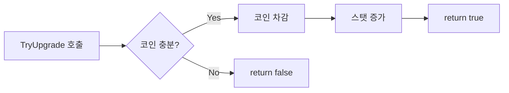

### 코드 예시

```csharp
// Player.cs - 코인 차감이 내장된 업그레이드 함수
public bool TryUpgradeAtk()
{
    if (!UseCoin(_upgradeCost.atkCost)) return false;  // 코인 부족

    atk += _upgradeAmount.atkAmount;  // 스탯 증가
    UpdateUI();
    return true;  // 성공
}

public bool TryUpgradeSpeed()
{
    if (!UseCoin(_upgradeCost.speedCost)) return false;

    // PlayerController의 이동속도 직접 증가
    GetComponent<PlayerController>()?.UpgradeSpeed(_upgradeAmount.speedAmount);
    return true;
}
```

### StatUpgradeUI 연동 (간소화됨)

```csharp
// StatUpgradeUI.cs - Try 패턴 사용 시 코드 간소화
public void OnUpgradeAtkButton()
{
    if (player.TryUpgradeAtk())  // 코인 차감 + 업그레이드 + 성공 여부
    {
        UpdateUI();
        PlayUpgradeSound();
    }
    else
    {
        ShowNotEnoughCoinMessage();
    }
}
```

---

## 🎯 PlayerInteraction.cs 분석

### 역할

> 플레이어가 **IInteractable** 오브젝트에 다가가면 **[F] 상호작용** 프롬프트를 표시하고 처리

### Inspector 설정

| 필드              | 타입       | 설명                   |
| ----------------- | ---------- | ---------------------- |
| `_interactLayer`  | LayerMask  | 상호작용 가능한 레이어 |
| `_uiPanel`        | GameObject | 프롬프트 패널 (배경)   |
| `_promptText`     | TMP_Text   | 프롬프트 텍스트        |
| `_uiHeightOffset` | float      | UI 높이 오프셋         |

### 함수 목록 (전체)

| 접근자  | 함수명                     | 설명                                       |
| :-----: | -------------------------- | ------------------------------------------ |
| private | `Awake()`                  | Player 참조, 카메라 참조, UI 초기화        |
| private | `Update()`                 | F키 입력 처리, 프롬프트 위치 갱신          |
| private | `UpdatePromptPosition()`   | 월드→스크린 좌표 변환으로 UI 이동          |
| private | `OnTriggerEnter(Collider)` | 상호작용 가능 오브젝트 감지, 프롬프트 표시 |
| private | `OnTriggerExit(Collider)`  | 범위 이탈 시 프롬프트 숨김                 |
| private | `ClearInteractable()`      | 상호작용 대상 초기화, UI 끄기              |
| private | `CheckLayerMask(int)`      | 레이어 마스크 검증                         |

### 상호작용 흐름

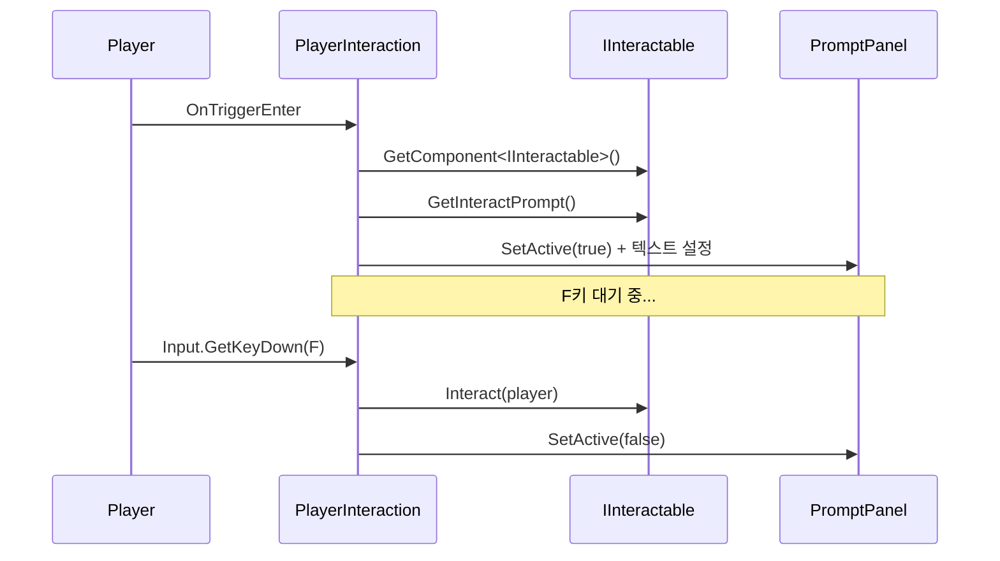

### 코드 분석

```csharp
private void OnTriggerEnter(Collider other)
{
    // 손에 든 무기는 무시
    if (other.transform.IsChildOf(transform)) return;

    IInteractable interactable = other.GetComponent<IInteractable>();
    if (interactable != null && CheckLayerMask(other.gameObject.layer))
    {
        _promptText.text = interactable.GetInteractPrompt() + " [F]";
        _uiPanel.SetActive(true);
        _currentInteractable = interactable;
    }
}
```

---

## 🎯 QuickSlotController.cs 분석

### 역할

> **1~4 키**로 무기/아이템을 빠르게 장착/사용하는 **퀵슬롯** 시스템

### Inspector 설정

| 필드                | 타입                   | 설명                 |
| ------------------- | ---------------------- | -------------------- |
| `_slotCount`        | int                    | 퀵슬롯 개수 (기본 4) |
| `_weaponController` | PlayerWeaponController | 무기 장착 담당       |
| `_inventory`        | Inventory              | 인벤토리 참조        |

### 이벤트

| 이벤트명             | 파라미터      | 설명                               |
| -------------------- | ------------- | ---------------------------------- |
| `OnQuickSlotChanged` | int, ItemData | 슬롯 등록 시 발생                  |
| `OnSlotUsed`         | int           | 슬롯 사용/해제 시 발생 (-1 = 해제) |

### 함수 목록 (전체)

| 접근자  | 함수명                        | 파라미터       | 설명                            |
| :-----: | ----------------------------- | -------------- | ------------------------------- |
| private | `Awake()`                     | -              | 배열 초기화, 참조 자동 탐색     |
| private | `Update()`                    | -              | 1~4 키 입력 감지                |
| private | `HandleInput(int index)`      | 슬롯 인덱스    | 등록 또는 사용 분기             |
| public  | `RegisterItem(int, ItemData)` | 인덱스, 아이템 | 퀵슬롯에 아이템 등록            |
| private | `UseSlot(int index)`          | 슬롯 인덱스    | 무기 장착/소모품 사용/토글 해제 |

### 퀵슬롯 로직 흐름

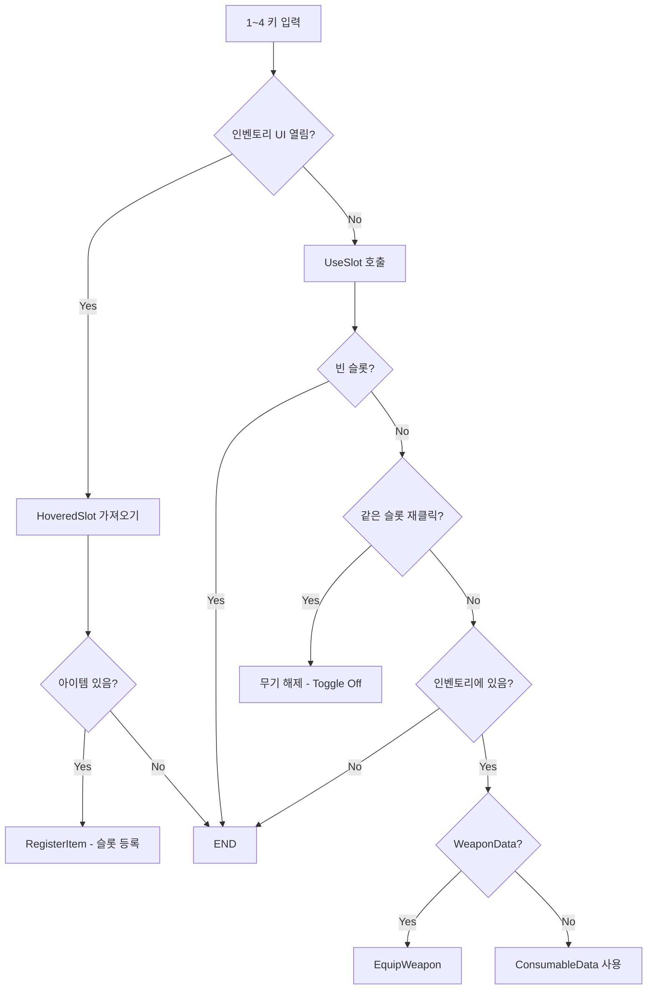

### 코드 분석: 토글 기능

```csharp
private void UseSlot(int index)
{
    ItemData item = _quickSlots[index];
    if (item == null) return;  // 빈 슬롯 무시

    // ★ 같은 슬롯 재클릭 = 장착 해제 (Toggle)
    if (_currentSlotIndex == index)
    {
        _weaponController.UnequipWeapon();
        _currentSlotIndex = -1;
        OnSlotUsed?.Invoke(-1);  // UI에게 해제 알림
        return;
    }

    // 인벤토리 검증 후 장착
    if (!_inventory.Items.Contains(item)) return;

    if (item is WeaponData weaponData)
    {
        _weaponController.EquipWeapon(weaponData);
        _currentSlotIndex = index;
        OnSlotUsed?.Invoke(index);
    }
}
```

---

## ❓ 자주 묻는 질문

### Q: `FindObjectOfType` vs `GetComponent` 뭐가 달라요?

| 함수                    | 찾는 범위       | 사용 상황                      |
| ----------------------- | --------------- | ------------------------------ |
| `GetComponent<T>()`     | 같은 오브젝트만 | 한 오브젝트 안의 다른 스크립트 |
| `FindObjectOfType<T>()` | 씬 전체         | 다른 오브젝트의 스크립트       |

```csharp
// 같은 오브젝트에서 찾기
Player player = GetComponent<Player>();

// 씬 전체에서 찾기 (느림 - Start에서만 사용!)
Player player = FindObjectOfType<Player>();
```

### Q: `=>` 이게 뭐예요?

```csharp
// 이 두 코드는 완전히 같은 의미입니다
public int Coin => coin;           // 한 줄 버전

public int Coin                    // 풀어쓴 버전
{
    get { return coin; }
}
```

### Q: `[SerializeField]`가 뭐예요?

```csharp
[SerializeField] private float _speed = 5f;
```

- **private**: 다른 스크립트에서 접근 불가
- **[SerializeField]**: 하지만 Inspector에서는 보임!
- 결론: **코드에서는 숨기고, Inspector에서만 수정** 가능

---

> 📖 다음 문서: [ENEMY_SYSTEM.md](./ENEMY_SYSTEM.md) - 적 AI 상세 분석
