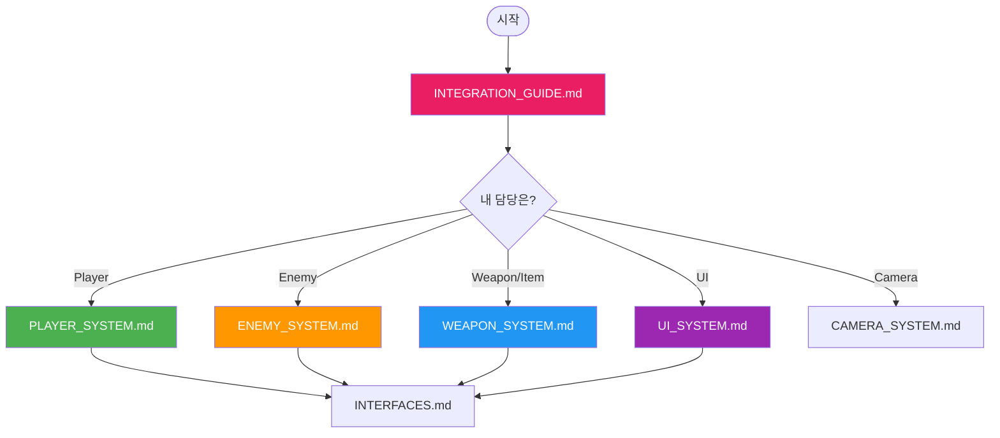
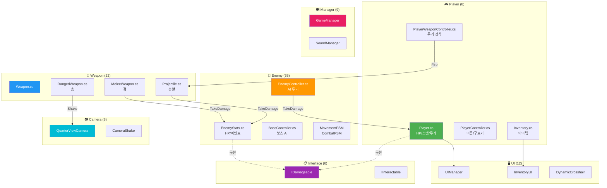

# 🐰 Rabbit-Kov Documentation

> **Rabbit Protocol** - 탈출 슈터 + 호드 서바이벌 게임
> **대상**: Unity 1개월차 개발자
> **스크립트**: 104개 | **문서**: 9개

---

## 👋 시작하기

이 문서들은 **Enemy, Player, Weapon, UI 담당자**가 서로의 코드를 이해하고 연동할 수 있도록 작성되었습니다.

### 📖 어떤 문서를 먼저 봐야 하나요?



---

## 🏗️ 시스템 아키텍처



---

## 📁 프로젝트 폴더 구조

```
Assets/Game/01_Scripts/          📊 총 104개 스크립트
│
├── 00_Player/     🎮 플레이어 관련 (8개 스크립트)
│   ├── Player.cs              ← HP, 경험치, 코인, 무게
│   ├── PlayerController.cs    ← 이동, 구르기, 중력
│   └── PlayerWeaponController.cs ← 무기 장착/발사
│
├── 02_Enemy/      👾 적 AI 관련 (38개 스크립트)
│   ├── Normal/               ← EnemyController, Stats, Combat, Movement
│   │   └── States/           ← FSM 상태들 (Patrol, Chase, Attack 등)
│   ├── Boss/                 ← BossController, PhaseManager, Attacks
│   ├── StateMachine/         ← MovementFSM, CombatFSM
│   └── Data/                 ← EnemyDataSO, EnemyAttackDataSO
│
├── 03_Item/       🔫 아이템/무기 관련 (22개 스크립트)
│   ├── Weapon/               ← Ranged/Melee/Throwable + Projectile
│   ├── Field Item/           ← ExpOrb, HealthOrb, StaminaOrb
│   └── Data/                 ← ItemData, WeaponData (ScriptableObject)
│
├── 04_Manager/    🎛️ 매니저 (9개 스크립트)
│   ├── GameManager.cs        ← 일시정지/설정/종료
│   ├── SoundManager.cs       ← BGM/SFX
│   ├── GameTimeManager.cs    ← 낮/밤 주기
│   └── GlobalAudioManager.cs ← DontDestroyOnLoad 오디오
│
├── 05_Camera/     📷 카메라 (8개 스크립트)
│   ├── QuarterViewCamera.cs  ← 쿼터뷰 + 마우스 추적
│   └── CameraShake.cs        ← 흔들림 효과
│
├── 06_Interface/  📋 인터페이스 (6개 스크립트)
│   ├── IDamageable.cs        ← 데미지 처리
│   └── IInteractable.cs      ← 상호작용
│
├── 99_UI/         🖥️ UI (9개 스크립트)
│   ├── UIManager.cs          ← Canvas 정렬
│   └── InventoryUI.cs        ← 인벤토리 UI
│
└── 99_Cursor/     🎯 커서 (3개 스크립트)
    └── DynamicCrosshair.cs   ← 동적 조준점
```

---

## 📚 문서 목록

| 순서 | 문서                                           | 내용                 | 누가 봐야 하나요?   |
| :--: | ---------------------------------------------- | -------------------- | ------------------- |
|  1️⃣  | [INTEGRATION_GUIDE.md](./INTEGRATION_GUIDE.md) | **시스템 연동 방법** | 모든 담당자 (필수!) |
|  2️⃣  | [INTERFACES.md](./INTERFACES.md)               | 공통 인터페이스 설명 | 모든 담당자         |
|  3️⃣  | [PLAYER_SYSTEM.md](./PLAYER_SYSTEM.md)         | Player 코드 분석     | Player 담당자       |
|  4️⃣  | [ENEMY_SYSTEM.md](./ENEMY_SYSTEM.md)           | Enemy AI 분석        | Enemy 담당자        |
|  5️⃣  | [WEAPON_SYSTEM.md](./WEAPON_SYSTEM.md)         | Weapon 코드 분석     | Weapon 담당자       |
|  6️⃣  | [MANAGER_SYSTEM.md](./MANAGER_SYSTEM.md)       | Manager 시스템       | 모든 담당자         |
|  7️⃣  | [CAMERA_SYSTEM.md](./CAMERA_SYSTEM.md)         | Camera 시스템        | 모든 담당자         |
|  8️⃣  | [UI_SYSTEM.md](./UI_SYSTEM.md)                 | UI 시스템            | UI 담당자           |
|  9️⃣  | [ITEM_SYSTEM.md](./ITEM_SYSTEM.md)             | Item 시스템          | Item 담당자         |

---

## ⚡ 초스피드 가이드 (3분 요약)

### 적에게 데미지 주려면?

```csharp
IDamageable target = enemy.GetComponent<IDamageable>();
target.TakeDamage(10);
```

### 플레이어에게 데미지 주려면?

```csharp
IDamageable target = player.GetComponent<IDamageable>();
target.TakeDamage(10);
```

### 무기 장착하려면?

```csharp
PlayerWeaponController pwc = player.GetComponent<PlayerWeaponController>();
pwc.EquipWeapon(weaponData);
```

### 적 죽었을 때 뭔가 하려면?

```csharp
EnemyStats stats = enemy.GetComponent<EnemyStats>();
stats.OnDeath += HandleEnemyDeath;
```

---

## ❓ 도움이 필요하면?

1. 먼저 해당 시스템 문서의 **FAQ** 섹션 확인
2. [INTEGRATION_GUIDE.md](./INTEGRATION_GUIDE.md)에서 비슷한 예제 찾기
3. 팀 리더에게 질문!

---

> 📌 **Tip**: 각 문서에는 **복사해서 바로 쓸 수 있는 코드 예제**가 있습니다!
