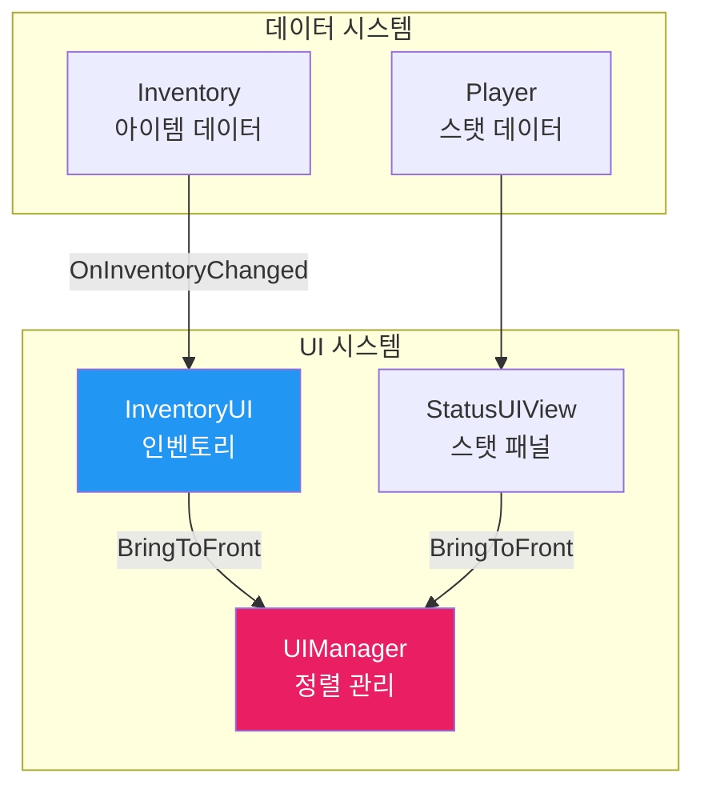
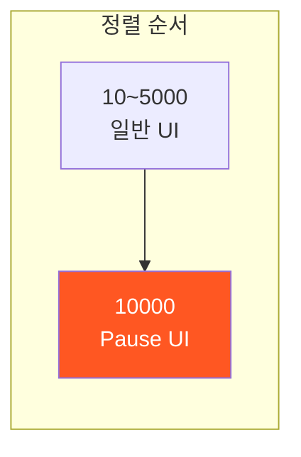
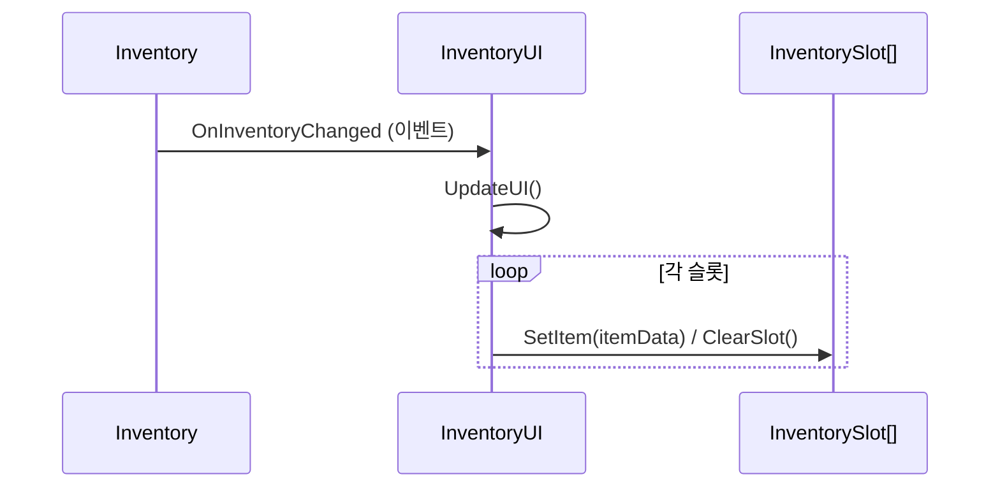
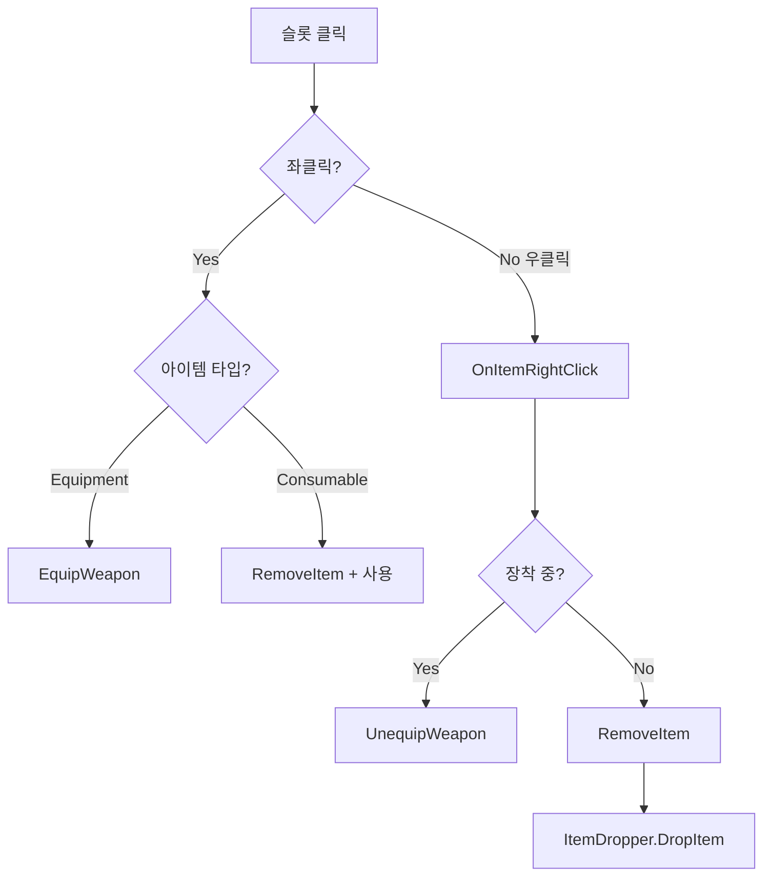
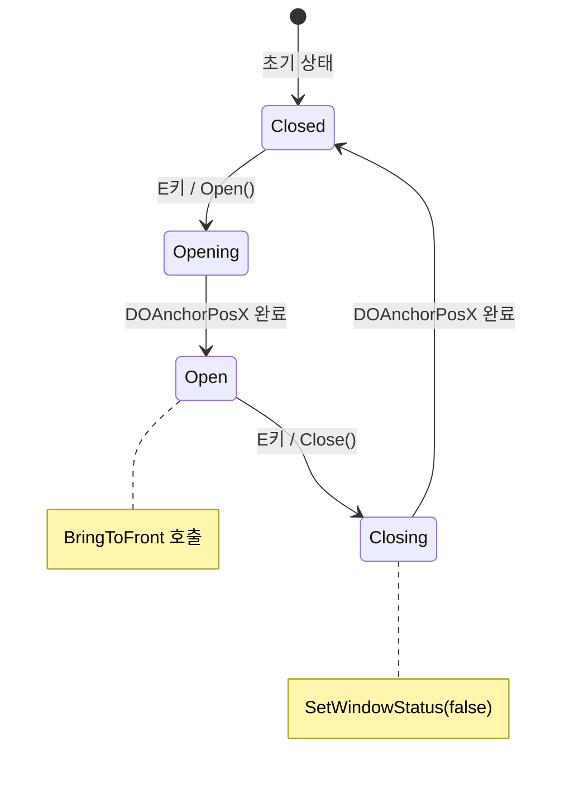
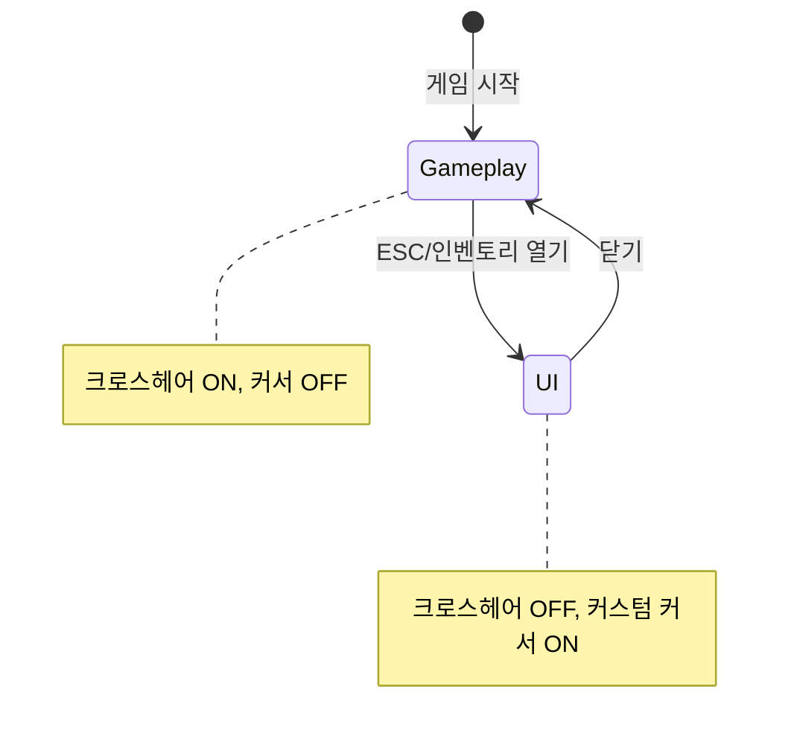

# 🖥️ UI 시스템 문서 (초보자용)

> **이 문서의 목표**: UI 시스템을 이해하고 사용법을 배웁니다
> **대상**: Unity 1개월차 개발자

---

## 📁 파일 한눈에 보기

```
01_Scripts/99_UI/
│
├── 🟢 UIManager.cs             ← UI 정렬/우선순위 관리
├── 📂 Inventory/               ← 인벤토리 UI (3개)
│   ├── 🟢 InventoryUI.cs       ← 인벤토리 UI 컨트롤러
│   ├── 🔵 InventoryUIView.cs   ← 인벤토리 뷰
│   └── 🔵 InventorySlot.cs     ← 슬롯 개별 처리
├── 📂 Status/
│   └── 🟢 StatusUIView.cs      ← 스탯 패널 (슬라이드 애니메이션)
├── 📂 Slot/
│   ├── WeaponHUD.cs            ← 무기 HUD
│   └── WeaponPreviewSlot.cs    ← 무기 미리보기
└── 📂 Health/
    └── HealthModelPresenter.cs ← HP 바 프레젠터

01_Scripts/99_Cursor/           ← 커서/조준점 (3개)
├── 🟢 DynamicCrosshair.cs      ← 동적 조준점 (게임/UI 모드 전환)
├── 🔵 CustomCursor.cs          ← 시스템 커서 제어
└── 🔵 CursorHoverEffect.cs     ← 호버 이펙트

🟢 = 핵심 파일 (12개 스크립트)
🔵 = 부가 파일
```

---

## 🔗 시스템 연결도



---

## 📜 UIManager.cs 분석

### 역할

> Canvas **정렬 순서** 관리 - UI가 겹칠 때 누가 위에 보이는지 결정

### 싱글톤 패턴

```csharp
public static UIManager Instance;
```

### 상수

| 상수               |  값   | 설명                   |
| ------------------ | :---: | ---------------------- |
| `MAX_NORMAL_ORDER` | 5000  | 일반 UI 최대 정렬 순서 |
| `PAUSE_UI_ORDER`   | 10000 | 일시정지 UI 정렬 순서  |

### 함수 목록 (전체)

| 접근자  | 함수명                     | 설명                                 |
| :-----: | -------------------------- | ------------------------------------ |
| private | `Awake()`                  | 싱글톤 초기화                        |
| public  | `SetPausePriority(Canvas)` | 일시정지 UI를 최상위로 설정          |
| public  | `BringToFront(Canvas)`     | 일반 UI를 맨 위로 올림 (호출마다 +1) |
| public  | `SetWindowStatus(bool)`    | 창 열림 상태 추적                    |

### 정렬 순서 다이어그램



### 사용 예시

```csharp
// UI 패널 열 때 맨 위로 올리기
public void Open()
{
    UIManager.Instance.BringToFront(myCanvas);
    UIManager.Instance.SetWindowStatus(true);
}
```

---

## 📜 InventoryUI.cs 분석

### 역할

> **인벤토리 UI** 관리 - 슬롯 갱신, 아이템 클릭/우클릭 처리

### 싱글톤 패턴

```csharp
public static InventoryUI Instance;
```

### 함수 목록 (전체)

| 접근자  | 함수명                          | 파라미터     | 설명                              |
| :-----: | ------------------------------- | ------------ | --------------------------------- |
| private | `Awake()`                       | -            | 싱글톤, ItemDropper 참조          |
| private | `Start()`                       | -            | 슬롯 초기화, 이벤트 구독          |
| private | `UpdateUI()`                    | -            | Inventory 데이터 → UI 슬롯 동기화 |
| public  | `OnItemClick(ItemData)`         | 아이템       | 좌클릭: 장착/사용                 |
| public  | `OnItemRightClick(slot, item)`  | 슬롯, 아이템 | 우클릭: 버리기                    |
| public  | `SetHoveredSlot(InventorySlot)` | 슬롯         | 호버링 상태 갱신                  |

### UI 갱신 흐름



### 아이템 상호작용 흐름



---

## 📜 StatusUIView.cs 분석

### 역할

> 스탯 패널 **슬라이드 애니메이션** - E키로 열고 닫기

### Inspector 설정

| 필드                  | 타입          | 설명               |
| --------------------- | ------------- | ------------------ |
| `_inventoryRect`      | RectTransform | 패널 RectTransform |
| `_visibleWidthClosed` | float         | 닫힐 때 보일 너비  |
| `_openXOffset`        | float         | 열릴 때 X 위치     |
| `_slideDuration`      | float         | 애니메이션 시간    |
| `_openEase`           | Ease          | 열기 이징          |
| `_closeEase`          | Ease          | 닫기 이징          |

### 함수 목록 (전체)

| 접근자  | 함수명                  | 설명                      |
| :-----: | ----------------------- | ------------------------- |
| private | `Awake()`               | 초기 위치 설정, Y 캐싱    |
| private | `Update()`              | E키 입력 감지             |
| public  | `ToggleStatus()`        | 열기/닫기 토글            |
| public  | `Open()`                | DOTween으로 슬라이드 열기 |
| public  | `Close()`               | DOTween으로 슬라이드 닫기 |
| private | `CalculateClosedXPos()` | 닫힌 X 위치 계산          |
| private | `CalculateOpenXPos()`   | 열린 X 위치 계산          |
| private | `OnValidate()`          | 에디터 프리뷰             |

### 애니메이션 흐름



---

## 💡 UI 사용 팁

### 1. 이벤트 구독 패턴

```csharp
private void Start()
{
    // 데이터 변경 시 UI 자동 갱신
    _inventory.OnInventoryChanged += UpdateUI;
}

private void OnDestroy()
{
    // 구독 해제 필수!
    _inventory.OnInventoryChanged -= UpdateUI;
}
```

### 2. DOTween 사용

```csharp
// X축만 이동 (Y는 유지)
_rectTransform.DOAnchorPosX(targetX, duration)
    .SetEase(Ease.OutBack)
    .SetUpdate(true);  // Time.timeScale = 0 에서도 동작
```

---

## 🎯 Cursor 스크립트 (99_Cursor)

### DynamicCrosshair.cs

> **동적 조준점** - 게임플레이/UI 모드 전환, 크로스헤어 위치 업데이트

#### 함수 목록 (전체)

| 접근자  | 함수명                         | 설명                            |
| :-----: | ------------------------------ | ------------------------------- |
| private | `Awake()`                      | 싱글톤, 컴포넌트 캐싱           |
| private | `Start()`                      | 초기 커서 상태 설정             |
| private | `InitializeCursorState()`      | 게임플레이 모드로 초기화        |
| private | `OnApplicationFocus(bool)`     | 포커스 복귀 시 상태 재설정      |
| private | `Update()`                     | 모드 전환 + 위치 업데이트       |
| private | `UpdateCrosshairPosition()`    | 마우스 위치로 크로스헤어 이동   |
| public  | `SetGameplayCursorState()`     | 게임플레이 모드 (크로스헤어 ON) |
| public  | `SetUICursorState()`           | UI 모드 (커스텀 커서 ON)        |
| private | `ToggleCrosshairVisuals(bool)` | 크로스헤어 켜기/끄기            |
| public  | `SetUIHoverState(bool)`        | UI 호버 시 조준점 스타일 변경   |

#### 모드 전환 다이어그램



---

## ❓ 자주 묻는 질문

### Q: Canvas.sortingOrder가 뭐예요?

**A**: 숫자가 **높을수록 위에** 보입니다.

```
sortingOrder = 10  (뒤에)
sortingOrder = 100 (앞에) ← 이게 보임
```

### Q: SetUpdate(true)는 왜 써요?

**A**: 일시정지(Time.timeScale = 0)에서도 애니메이션이 동작하게 합니다.

---

> 📖 다음 문서: [ITEM_SYSTEM.md](./ITEM_SYSTEM.md) - 아이템 시스템 분석
