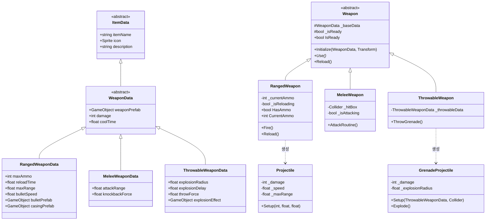
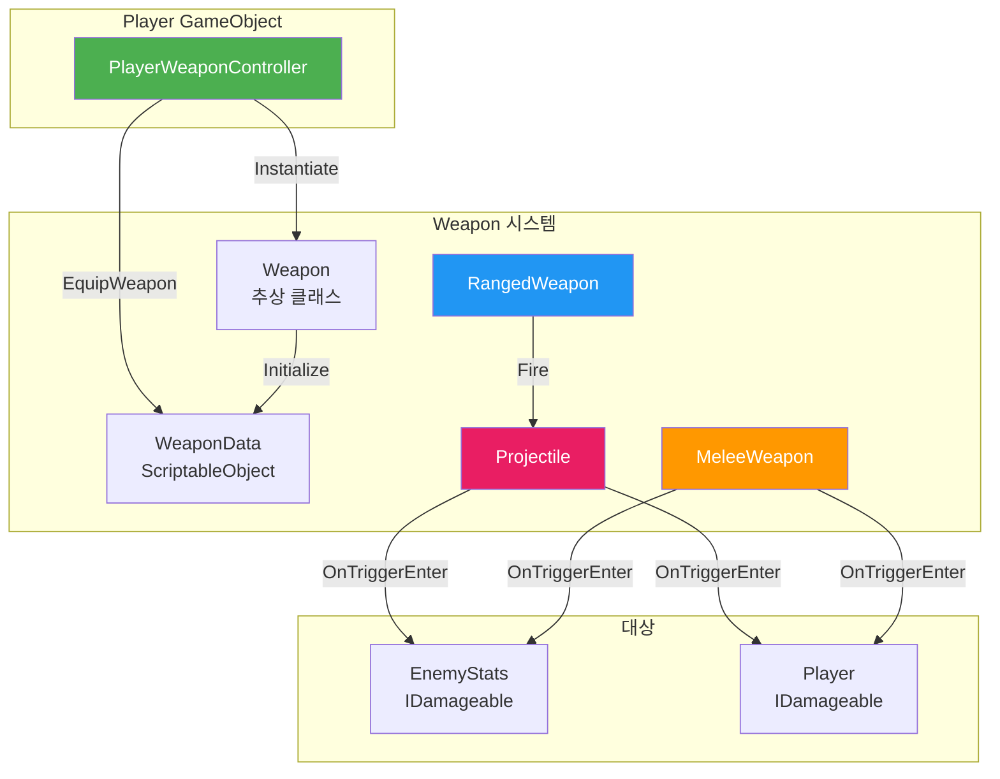
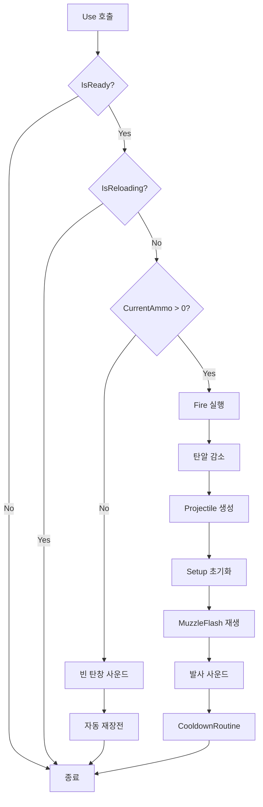
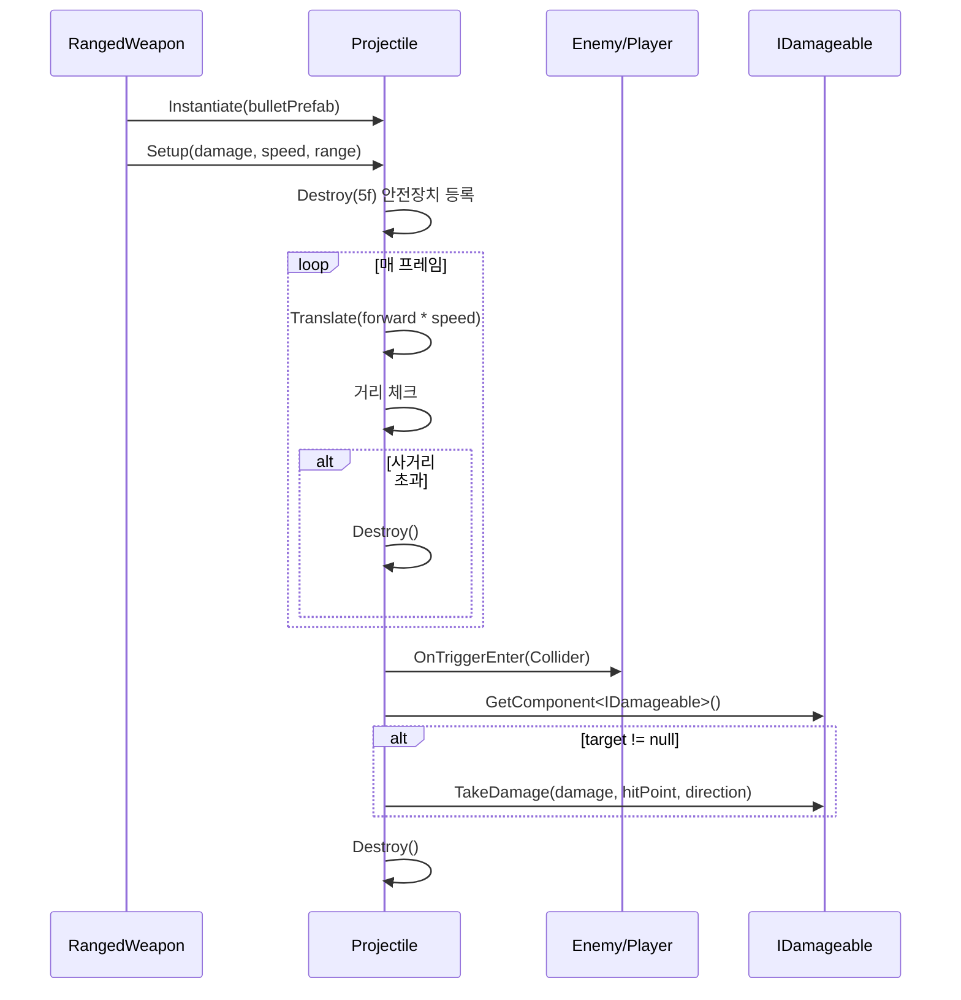
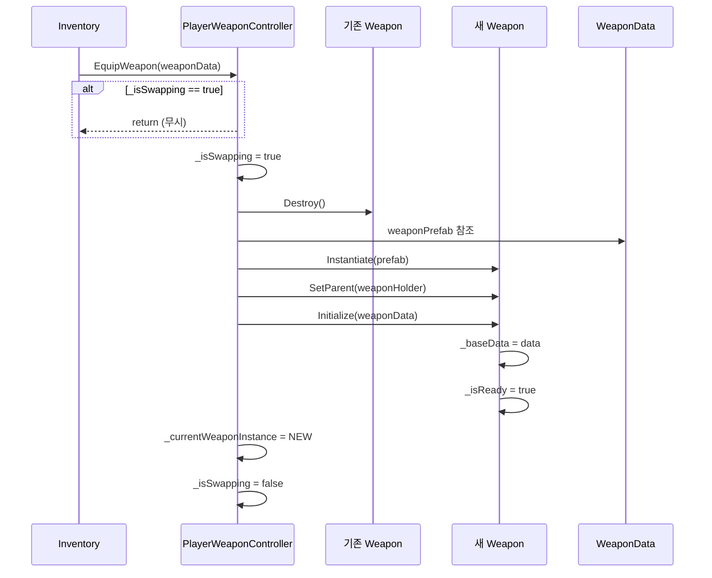
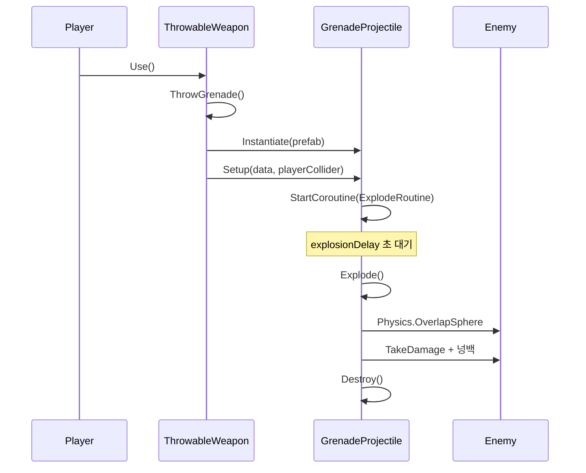

# 🔫 Weapon 시스템 문서 (초보자용)

> **이 문서의 목표**: Weapon 시스템을 이해하고 다른 시스템과 연동하는 방법을 배웁니다
> **대상**: Unity 1개월차 개발자

---

## 📁 파일 한눈에 보기

```
01_Scripts/03_Item/
│
├── 📂 Data/                     ← 무기 설정 (ScriptableObject)
│   ├── 🔵 ItemData.cs           ← 모든 아이템의 기반
│   ├── 🟢 WeaponData.cs         ← 무기 기본 데이터 (추상)
│   ├── 🟢 RangedWeaponData.cs   ← 원거리 무기 데이터
│   └── 🟢 MeleeWeaponData.cs    ← 근접 무기 데이터
│
├── 📂 Weapon/                   ← 무기 동작 코드
│   ├── 🟢 Weapon.cs             ← 무기 기본 클래스 (추상)
│   ├── 🟢 RangedWeapon.cs       ← 총 (발사체 발사)
│   ├── 🟢 MeleeWeapon.cs        ← 검 (히트박스 활성화)
│   └── 🟢 Projectile.cs         ← 총알 (날아가서 hit)
│
└── ItemPickup.cs                ← 아이템 줍기

🟢 = 핵심 파일
🔵 = 부가 파일
```

---

## 🔗 다른 시스템과 어떻게 연결되나요?

```
┌─────────────────────────────────────────────────────────────┐
│                       WEAPON 시스템                          │
│                                                              │
│   ┌──────────────┐           ┌──────────────┐               │
│   │ WeaponData   │  ────▶   │   Weapon     │               │
│   │ (설계도)     │ Initialize │  (실제 무기) │               │
│   │              │           │              │               │
│   │ - 데미지     │           │ - Use()      │               │
│   │ - 쿨타임     │           │ - Reload()   │               │
│   │ - 프리팹     │           │              │               │
│   └──────────────┘           └──────┬───────┘               │
│                                     │                        │
│              ┌──────────────────────┼──────────────────┐    │
│              ▼                      ▼                   ▼    │
│   ┌──────────────┐      ┌──────────────┐    ┌──────────────┐│
│   │ RangedWeapon │      │ MeleeWeapon  │    │ Projectile   ││
│   │    (총)      │──────│    (검)      │    │   (총알)     ││
│   │              │      │              │    │              ││
│   │ Fire() ──────│──────│──────────────│───▶│ OnTriggerEnter│
│   └──────────────┘      └──────────────┘    └──────┬───────┘│
│                                                     │        │
└─────────────────────────────────────────────────────│────────┘
                                                      │
                                                      ▼
                                           ┌──────────────────┐
                                           │  IDamageable     │
                                           │  (Enemy/Player)  │
                                           │                  │
                                           │  TakeDamage()    │
                                           └──────────────────┘
```

### 연결 요약표

| 나는                      | 하고 싶은 것     | 어떻게?                                          |
| ------------------------- | ---------------- | ------------------------------------------------ |
| **Player/Inventory 담당** | 무기 장착        | `playerWeaponController.EquipWeapon(weaponData)` |
| **Enemy 담당**            | 무기로 피격 받기 | `IDamageable` 구현만 하면 자동!                  |
| **UI 담당**               | 탄알 수 표시     | `rangedWeapon.CurrentAmmo`                       |
| **새 무기 추가**          | 새로운 총 만들기 | WeaponData 생성 → 프리팹 만들기                  |

---

## 📊 Mermaid 다이어그램

### 클래스 상속 다이어그램



### 스크립트 연동 다이어그램



### 발사 플로우차트 (RangedWeapon)



### 발사체 라이프사이클



### 근접 무기 공격 타임라인

```mermaid
gantt
    title MeleeWeapon AttackRoutine 타임라인
    dateFormat X
    axisFormat %L ms

    section 공격 사이클
    선딜 대기           :a1, 0, 100
    히트박스 ON         :active, a2, 100, 200
    공격 판정           :a3, 100, 300
    히트박스 OFF        :a4, 300, 300
    후딜 쿨타임         :a5, 300, 500
    다시 Ready          :milestone, a6, 500, 0
```



### 무기 장착 시퀀스



---

## 🏗️ 클래스 상속 구조 (쉽게 이해하기)

### 비유: 레고 블록처럼 쌓아 올리기

```
                    ┌─────────────┐
                    │  ItemData   │   ← 모든 아이템 (이름, 아이콘)
                    │  [추상]     │
                    └──────┬──────┘
                           │
                    ┌──────┴──────┐
                    │ WeaponData  │   ← 무기 전용 (데미지, 쿨타임)
                    │   [추상]    │
                    └──────┬──────┘
                           │
          ┌────────────────┼────────────────┐
          ▼                                  ▼
┌─────────────────┐              ┌─────────────────┐
│ RangedWeaponData│              │ MeleeWeaponData │
│   (총 데이터)    │              │   (검 데이터)   │
│                 │              │                 │
│ + 탄약          │              │ + 공격 범위     │
│ + 재장전 시간   │              │ + 넉백 강도     │
│ + 탄속          │              │                 │
└─────────────────┘              └─────────────────┘
```

**같은 구조로 동작 클래스도**:

```
Weapon (추상) → RangedWeapon, MeleeWeapon
```

---

## 📜 Weapon.cs 완전 분석 (추상 클래스)

### 추상 클래스가 뭐예요?

**비유**: 추상 클래스는 **설계도**입니다.

- 직접 만들 수는 없지만
- "모든 무기는 이런 식으로 만들어야 해" 라고 규칙을 정함

```csharp
public abstract class Weapon : MonoBehaviour
//      ↑
//      "나를 직접 쓰지 마. 상속받아서 써!"
```

### 코드 전체 분석

```csharp
public abstract class Weapon : MonoBehaviour
{
    // ═══════════════════════════════════════════════
    // 변수 (자식 클래스에서 사용)
    // ═══════════════════════════════════════════════

    protected WeaponData _baseData;  // 무기 데이터 (데미지, 쿨타임 등)
    protected bool _isReady = true;  // 공격 가능 상태

    // ═══════════════════════════════════════════════
    // 프로퍼티 (외부에서 읽기 전용)
    // ═══════════════════════════════════════════════

    public bool IsReady => _isReady;       // 쿨타임 끝났나?
    public WeaponData BaseData => _baseData; // 데이터 접근

    // ═══════════════════════════════════════════════
    // 초기화 (PlayerWeaponController에서 호출)
    // ═══════════════════════════════════════════════

    public virtual void Initialize(WeaponData data, Transform ownerFirePoint = null)
    {
        _baseData = data;
    }

    // ═══════════════════════════════════════════════
    // 공격 (자식 클래스에서 반드시 구현)
    // ═══════════════════════════════════════════════

    public abstract void Use();  // ← "나를 상속받는 애들아, 이거 만들어!"

    // ═══════════════════════════════════════════════
    // 재장전 (필요한 무기만 오버라이드)
    // ═══════════════════════════════════════════════

    public virtual void Reload() { }  // 기본은 아무것도 안 함
}
```

### PlayerWeaponController에서 호출하는 함수

| 함수           | 언제 호출?   | 설명        |
| -------------- | ------------ | ----------- |
| `Initialize()` | 무기 장착 시 | 데이터 설정 |
| `Use()`        | Fire1 버튼   | 공격!       |
| `Reload()`     | R 키         | 재장전      |
| `IsReady`      | 매 프레임    | 쿨타임 체크 |

---

## 📜 RangedWeapon.cs 완전 분석 (원거리 무기)

### 이 스크립트의 역할

> 총알을 발사하고, 탄약과 재장전을 관리합니다.

### Inspector에서 설정할 것들

```csharp
[Header("Points - 위치 설정")]
[SerializeField] private Transform _firePoint;      // 총구 (총알 나가는 곳)
[SerializeField] private Transform _ejectionPort;   // 탄피 배출구

[Header("Visual & Audio - 이펙트/사운드")]
[SerializeField] private ParticleSystem _muzzleFlash; // 총구 화염
[SerializeField] private AudioSource _audioSource;    // 오디오
[SerializeField] private AudioClip _fireClip;         // 발사음
[SerializeField] private AudioClip _reloadClip;       // 재장전음
[SerializeField] private AudioClip _emptyClip;        // 탄창 비었을 때
```

### 핵심 프로퍼티 (UI에서 사용)

```csharp
public bool HasAmmo => _currentAmmo > 0;    // 탄알 있나?
public int CurrentAmmo => _currentAmmo;      // 현재 탄알
public int MaxAmmo => _gunData.maxAmmo;     // 최대 탄알
public bool IsReloading => _isReloading;     // 재장전 중?
```

**UI 담당자 사용 예시**:

```csharp
// AmmoUI.cs
void Update()
{
    RangedWeapon weapon = player.GetComponent<PlayerWeaponController>()
                                .CurrentWeapon as RangedWeapon;
    if (weapon != null)
    {
        ammoText.text = $"{weapon.CurrentAmmo} / {weapon.MaxAmmo}";
    }
}
```

### Use() 함수 분석

```csharp
public override void Use()
{
    // 1. 쿨타임 or 재장전 중이면 리턴
    if (!_isReady || _isReloading) return;

    // 2. 탄알 있으면 발사
    if (_currentAmmo > 0)
    {
        Fire();
    }
    // 3. 탄알 없으면 빈 탄창 사운드 + 자동 재장전
    else
    {
        _audioSource.PlayOneShot(_emptyClip);
        StartCoroutine(ReloadRoutine());
    }
}
```

### Fire() 함수 분석

```csharp
private void Fire()
{
    // 1. 탄알 소모
    _currentAmmo--;

    // 2. 총알 생성
    GameObject bullet = Instantiate(
        _gunData.bulletPrefab,  // 총알 프리팹
        _firePoint.position,     // 총구 위치
        _firePoint.rotation      // 총구 방향
    );

    // 3. 총알 초기화
    Projectile proj = bullet.GetComponent<Projectile>();
    proj.Setup(
        _baseData.damage,       // 데미지
        _gunData.bulletSpeed,   // 탄속
        _gunData.maxRange       // 사거리
    );

    // 4. 이펙트 & 사운드
    _muzzleFlash?.Play();
    _audioSource.PlayOneShot(_fireClip);

    // 5. 쿨타임 시작
    StartCoroutine(CooldownRoutine());
}
```

---

## 📜 MeleeWeapon.cs 완전 분석 (근접 무기)

### 이 스크립트의 역할

> 히트박스를 활성화해서 범위 내 적에게 데미지를 줍니다.

### 히트박스가 뭐예요?

**비유**: 히트박스는 **투명한 칼날**입니다.

- 평소에는 꺼져있다가 (안 맞음)
- 휘두를 때만 켜짐 (맞음!)

```
휘두르기 전:    휘두르는 중:

   ╭──╮           ╭──╮
   │검│           │검│═══════╗  ← 히트박스 ON
   ╰──╯           ╰──╯       ║
                              ║
                        (이 영역에 닿으면 데미지)
```

### AttackRoutine 분석

```csharp
private IEnumerator AttackRoutine()
{
    _isAttacking = true;
    _isReady = false;

    // ───────────────────────────────────
    // 1단계: 선딜 (공격 준비 모션)
    // ───────────────────────────────────
    yield return new WaitForSeconds(0.1f);

    // ───────────────────────────────────
    // 2단계: 히트박스 켜기 (데미지 판정 시작)
    // ───────────────────────────────────
    _hitBox.enabled = true;

    // ───────────────────────────────────
    // 3단계: 공격 지속 (0.2초간 판정)
    // ───────────────────────────────────
    yield return new WaitForSeconds(0.2f);

    // ───────────────────────────────────
    // 4단계: 히트박스 끄기 (데미지 판정 종료)
    // ───────────────────────────────────
    _hitBox.enabled = false;

    // ───────────────────────────────────
    // 5단계: 후딜 (쿨타임)
    // ───────────────────────────────────
    float waitTime = _baseData.coolTime - 0.3f;
    if (waitTime > 0) yield return new WaitForSeconds(waitTime);

    _isAttacking = false;
    _isReady = true;  // 다시 공격 가능
}
```

### OnTriggerEnter (충돌 감지)

```csharp
private void OnTriggerEnter(Collider other)
{
    // 공격 중이고, 적 태그면
    if (_isAttacking && other.CompareTag("Enemy"))
    {
        IDamageable target = other.GetComponent<IDamageable>();
        if (target != null)
        {
            Vector3 dir = (other.transform.position - transform.position).normalized;
            target.TakeDamage(_baseData.damage, other.transform.position, dir);
        }
    }
}
```

---

## 📜 Projectile.cs 완전 분석

### 이 스크립트의 역할

> 총알이 날아가다가 적에 맞으면 데미지를 줍니다.

### 코드 전체 분석

```csharp
public class Projectile : MonoBehaviour
{
    // 데이터 (RangedWeapon에서 설정)
    private int _damage;
    private float _speed;
    private float _maxRange;
    private Vector3 _startPos;

    // ═══════════════════════════════════════════════
    // 초기화 (RangedWeapon.Fire()에서 호출)
    // ═══════════════════════════════════════════════
    public void Setup(int damage, float speed, float range)
    {
        _damage = damage;
        _speed = speed;
        _maxRange = range;
        _startPos = transform.position;

        Destroy(gameObject, 5f);  // 5초 후 자동 제거 (안전장치)
    }

    // ═══════════════════════════════════════════════
    // 매 프레임 앞으로 이동
    // ═══════════════════════════════════════════════
    void Update()
    {
        // 앞으로 이동
        transform.Translate(Vector3.forward * _speed * Time.deltaTime);

        // 사거리 초과하면 제거
        if (Vector3.Distance(_startPos, transform.position) >= _maxRange)
        {
            Destroy(gameObject);
        }
    }

    // ═══════════════════════════════════════════════
    // 뭔가에 닿았을 때
    // ═══════════════════════════════════════════════
    void OnTriggerEnter(Collider other)
    {
        if (other.CompareTag("Enemy"))
        {
            // 데미지!
            IDamageable target = other.GetComponent<IDamageable>();
            target?.TakeDamage(_damage, transform.position, transform.forward);

            Destroy(gameObject);  // 총알 제거
        }
        else if (other.CompareTag("Wall"))
        {
            Destroy(gameObject);  // 벽에 맞으면 제거
        }
    }
}
```

---

## 🛠️ 새 무기 만들기 (단계별 가이드)

### Step 1: WeaponData 만들기 (ScriptableObject)

```
1. Project 창에서 우클릭
2. Create → Duckov → Item → Weapon → Ranged (또는 Melee)
3. 이름 지정 (예: "AK47_Data")
4. Inspector에서 설정:
```

| 필드           | 설명                     | 예시 값  |
| -------------- | ------------------------ | -------- |
| `damage`       | 총알 하나당 데미지       | 25       |
| `coolTime`     | 연사 간격 (초)           | 0.1      |
| `maxAmmo`      | 탄창 용량                | 30       |
| `reloadTime`   | 재장전 시간              | 2.5      |
| `bulletSpeed`  | 탄속                     | 50       |
| `maxRange`     | 사거리                   | 100      |
| `weaponPrefab` | 무기 프리팹 (손에 들 것) | (드래그) |
| `bulletPrefab` | 총알 프리팹              | (드래그) |

### Step 2: 무기 프리팹 만들기

```
1. 무기 모델(메쉬) 임포트
2. 빈 GameObject 생성 → 이름: "AK47_Prefab"
3. 모델을 자식으로 넣기
4. RangedWeapon 컴포넌트 추가
5. Inspector 설정:
   - Fire Point: 총구 위치 만들어서 연결
   - Muzzle Flash: 이펙트 연결
   - Audio Source: 추가하고 연결
```

### Step 3: 총알 프리팹 만들기

```
1. 작은 Sphere 또는 Capsule 생성
2. Rigidbody 추가:
   - Is Kinematic: ✅ (체크)
   - Use Gravity: ❌ (해제)
3. Collider 설정:
   - Is Trigger: ✅ (체크)
4. Projectile 스크립트 추가
5. Prefabs 폴더에 드래그해서 저장
```

### Step 4: 테스트

```csharp
// 테스트용 코드
public WeaponData testWeapon;  // Inspector에서 연결

void Start()
{
    PlayerWeaponController pwc = FindObjectOfType<PlayerWeaponController>();
    pwc.EquipWeapon(testWeapon);
}
```

---

## 💣 투척 무기 시스템 (신규)

### 이 시스템의 역할

> **수류탄/화염병** 등 던져서 폭발하는 무기를 관리합니다.

### 클래스 구조

```
Weapon
   │
   ├── RangedWeapon     ← 총 (총알 발사)
   ├── MeleeWeapon      ← 검 (히트박스)
   └── ThrowableWeapon  ← 수류탄 (투척 → 폭발) ★ 신규
```

### ThrowableWeaponData (ScriptableObject)

```csharp
[CreateAssetMenu(menuName = "Duckov/Item/Weapon/Throwable")]
public class ThrowableWeaponData : WeaponData
{
    [Header("Explosion Stats")]
    public float explosionRadius = 5f;  // 폭발 반경
    public float explosionDelay = 3f;   // 폭발 지연 시간
    public float explosionForce = 700f; // 물리력

    [Header("Throw Stats")]
    public float throwForce = 15f;      // 던지는 힘
    public float throwUpwardForce = 2f; // 위로 던지는 힘 (포물선)

    [Header("Effects")]
    public GameObject explosionEffect;  // 폭발 이펙트
    public AudioClip explosionSound;    // 폭발 소리
}
```

### ThrowableWeapon.cs 핵심 로직



### GrenadeProjectile.cs 폭발 로직

```csharp
private void Explode()
{
    if (_hasExploded) return;
    _hasExploded = true;

    // 1. 이펙트 생성
    Instantiate(_explosionEffect, transform.position, Quaternion.identity);

    // 2. 폭발 반경 내 적 찾기
    Collider[] hits = Physics.OverlapSphere(transform.position, _explosionRadius);
    foreach (var hit in hits)
    {
        // 데미지
        if (hit.TryGetComponent(out IDamageable target))
        {
            target.TakeDamage(_damage, hit.transform.position, Vector3.zero);
        }

        // 물리 넝백
        Rigidbody rb = hit.GetComponent<Rigidbody>();
        if (rb != null)
        {
            rb.AddExplosionForce(_explosionForce, transform.position, _explosionRadius);
        }
    }

    Destroy(gameObject);
}
```

### 투척 무기 만들기 가이드

| 단계 | 설명                                            |
| ---- | ----------------------------------------------- |
| 1    | `ThrowableWeaponData` ScriptableObject 생성     |
| 2    | 수류탄 모델 프리팫 생성 (Rigidbody + Collider)  |
| 3    | `GrenadeProjectile` 스크립트 붙이기             |
| 4    | `ThrowableWeapon` 스크립트로 들려있는 무기 생성 |
| 5    | weaponPrefab에 수류탄 연결                      |

---

## ❓ 자주 묻는 질문

### Q: `abstract`가 뭐예요?

**A**: "이 클래스 자체로는 못 쓰고, 상속받아서 써야 해" 라는 뜻입니다.

```csharp
// ❌ 안 됨
Weapon w = new Weapon();

// ✅ 됨 (상속받은 클래스)
RangedWeapon gun = new RangedWeapon();
```

### Q: `virtual`과 `override`가 뭐예요?

**A**: 부모의 함수를 자식이 **다시 정의**할 수 있게 해줍니다.

```csharp
// 부모 클래스
public virtual void Reload() { }  // "자식이 바꿔도 돼"

// 자식 클래스
public override void Reload()     // "내 방식대로 할게"
{
    StartCoroutine(ReloadRoutine());
}
```

### Q: Coroutine이 뭐예요?

**A**: 시간을 두고 천천히 실행되는 함수입니다.

```csharp
// 일반 함수: 한 번에 쭉 실행됨
void NomalFunction()
{
    DoA();
    DoB();  // DoA 직후 바로 실행
}

// 코루틴: 기다릴 수 있음
IEnumerator MyCoroutine()
{
    DoA();
    yield return new WaitForSeconds(1f);  // 1초 대기
    DoB();  // 1초 후 실행
}

// 코루틴 시작 방법
StartCoroutine(MyCoroutine());
```

### Q: 총알이 안 나가요

**A**: 체크리스트:

1. ✅ `bulletPrefab`이 WeaponData에 연결됐나요?
2. ✅ `_firePoint` Transform이 연결됐나요?
3. ✅ Projectile 스크립트가 총알 프리팹에 있나요?
4. ✅ 총알 Collider의 `Is Trigger`가 켜져있나요?

---

> 📖 이전 문서: [PLAYER_SYSTEM.md](./PLAYER_SYSTEM.md), [ENEMY_SYSTEM.md](./ENEMY_SYSTEM.md)
