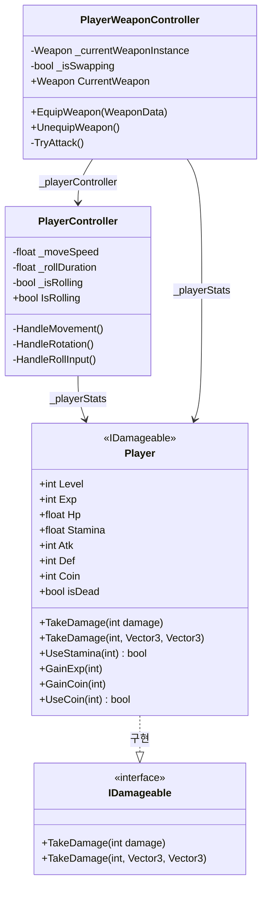
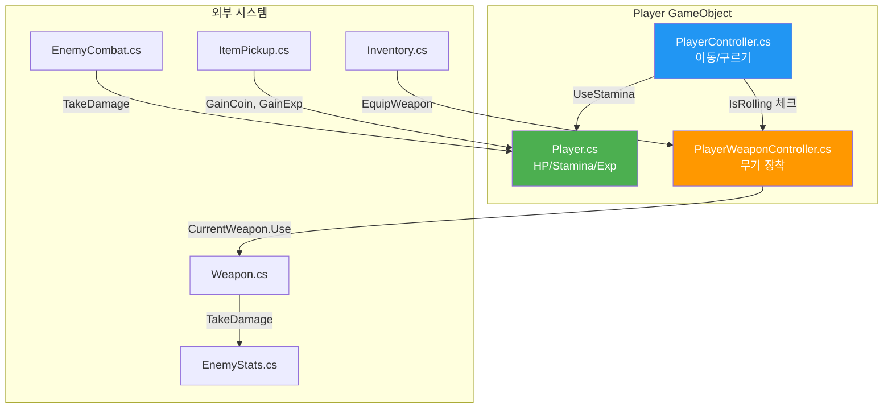
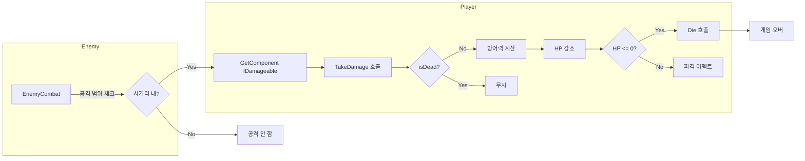
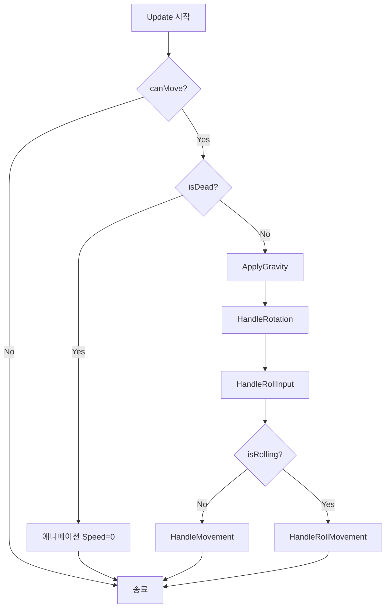
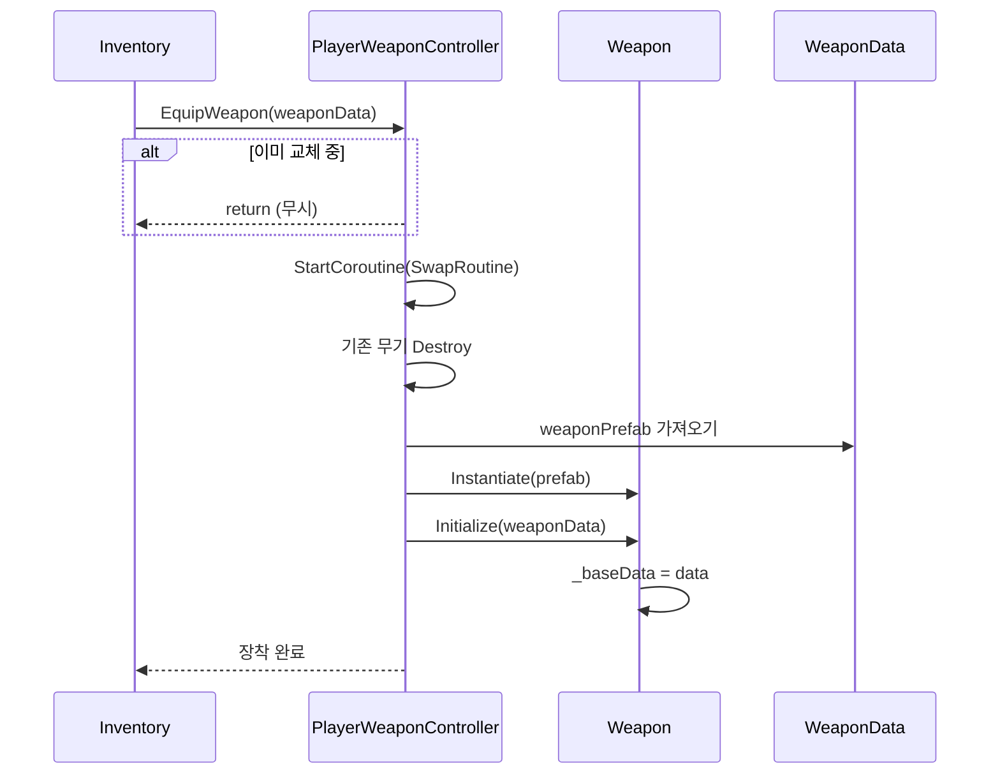

# 🎮 Player 시스템 문서 (초보자용)

> **이 문서의 목표**: Player 시스템을 이해하고 다른 시스템과 연동하는 방법을 배웁니다
> **대상**: Unity 1개월차 개발자

---

## 📁 파일 한눈에 보기

```
01_Scripts/00_Player/
│
├── 🟢 Player.cs              ← HP, 스태미나, 경험치 관리 (가장 중요!)
├── 🟢 PlayerController.cs    ← WASD 이동, 구르기
├── 🟢 PlayerWeaponController.cs ← 무기 장착/발사
├── 🔵 PlayerInteraction.cs   ← E키로 상호작용
├── 🔵 Inventory.cs           ← 인벤토리 관리
├── 🔵 QuickSlotController.cs ← 1~4번 퀵슬롯
└── 🔵 MeleeAttacker.cs       ← 근접 공격

🟢 = 핵심 파일 (꼭 이해해야 함)
🔵 = 부가 파일 (필요할 때 보기)
```

---

## 🔗 다른 시스템과 어떻게 연결되나요?

```
                    ┌─────────────────────┐
                    │      PLAYER         │
                    │                     │
     무기 장착 ──▶  │  ┌──────────────┐  │
     (EquipWeapon)  │  │PlayerWeapon  │  │
                    │  │Controller    │  │
                    │  └───────┬──────┘  │
                    │          │         │
                    │          ▼ 공격    │
                    │  ┌──────────────┐  │
   피격 ──────────▶ │  │   Player     │  │ ◀────── Enemy 공격
   (TakeDamage)     │  │  (HP 관리)   │  │         (TakeDamage)
                    │  └──────────────┘  │
                    │                     │
                    └─────────────────────┘
```

### 연결 요약표

| 나는            | 하고 싶은 것         | 호출할 함수                                         |
| --------------- | -------------------- | --------------------------------------------------- |
| **Weapon 담당** | 플레이어 무기 장착   | `playerWeaponController.EquipWeapon(weaponData)`    |
| **Enemy 담당**  | 플레이어 공격        | `player.GetComponent<IDamageable>().TakeDamage(10)` |
| **Item 담당**   | 플레이어 경험치 증가 | `player.GainExp(25)`                                |
| **Item 담당**   | 플레이어 코인 증가   | `player.GainCoin(100)`                              |
| **UI 담당**     | 플레이어 HP 확인     | `player.Hp` (읽기 전용)                             |

---

## � Mermaid 다이어그램

### 클래스 다이어그램



### 스크립트 연동 다이어그램



### 데이터 흐름도 (피격 시)



### Update 루프 플로우차트 (PlayerController)



### 무기 장착 시퀀스 다이어그램



---

## �📜 Player.cs 완전 분석

### 이 스크립트의 역할

> 플레이어의 **모든 스탯**(HP, 스태미나, 경험치, 코인)을 관리합니다.
> 피격당하면 여기서 HP가 줄어듭니다.

### 클래스 선언 해석

```csharp
public class Player : MonoBehaviour, IDamageable
//                                   ↑
//                                   이 부분이 중요!
```

**`IDamageable`이 붙어있다는 뜻**:

- 이 플레이어는 데미지를 받을 수 있습니다
- `TakeDamage()` 함수가 반드시 있습니다
- Enemy에서 `GetComponent<IDamageable>().TakeDamage(10)` 으로 공격 가능!

---

### 변수(프로퍼티) 설명

#### 레벨/경험치 관련

```csharp
public int Level => level;     // 현재 레벨 (읽기 전용)
public int Exp => exp;         // 현재 경험치
public int MaxExp => maxExp;   // 레벨업에 필요한 경험치
```

📍 **사용 예시**: `if (player.Level >= 10) { /* 10레벨 달성! */ }`

#### HP/스태미나 관련

```csharp
public float MaxHp { get; private set; } = 100f;      // 최대 HP
public float Hp { get; set; }                          // 현재 HP
public float MaxStamina { get; private set; } = 100f; // 최대 스태미나
public float Stamina { get; set; }                     // 현재 스태미나
```

📍 **사용 예시**: `healthBar.fillAmount = player.Hp / player.MaxHp;`

#### 전투 관련

```csharp
public int Atk => atk;   // 공격력
public int Def => def;   // 방어력 (받는 데미지 감소)
public int Shield => shield; // 방패
```

#### 상태 관련

```csharp
public bool isDead { get; }  // 죽었는지 확인
```

📍 **사용 예시**: `if (player.isDead) { ShowGameOverScreen(); }`

#### 재화 관련

```csharp
public int Coin => coin;  // 보유 코인
```

---

### 핵심 함수 설명

#### 1. TakeDamage - 피격 처리 (가장 중요!)

```csharp
// 간단 버전 - 그냥 데미지만 줄 때
public void TakeDamage(int damage)
{
    if (isDead) return;  // 이미 죽었으면 무시

    // 방어력 적용 (최소 1 데미지는 들어감)
    int finalDamage = Mathf.Max(1, damage - Def);

    Hp -= finalDamage;   // HP 감소
}
```

**이 함수가 호출되면 일어나는 일**:

1. 플레이어가 이미 죽었으면 → 아무 일도 안 함
2. 방어력만큼 데미지 감소 (최소 1)
3. HP 감소
4. HP가 0 이하가 되면 → `Die()` 자동 호출

**Enemy 담당자가 사용하는 방법**:

```csharp
// EnemyCombat.cs에서
void AttackPlayer()
{
    IDamageable target = player.GetComponent<IDamageable>();
    target.TakeDamage(10);  // 10 데미지
}
```

---

#### 2. UseStamina - 스태미나 사용

```csharp
public bool UseStamina(int amount)
{
    if (Stamina >= amount)  // 충분하면
    {
        Stamina -= amount;   // 사용
        return true;         // 성공
    }
    return false;            // 부족하면 실패
}
```

**사용 예시**:

```csharp
// 구르기 할 때
if (player.UseStamina(25))  // 25 스태미나 필요
{
    StartRoll();  // 구르기 실행
}
else
{
    Debug.Log("스태미나 부족!");
}
```

---

#### 3. GainExp - 경험치 획득

```csharp
public void GainExp(int amount)
{
    exp += amount;
    while (exp >= maxExp) LevelUp();  // 경험치 초과하면 레벨업
    UpdateUI();
}
```

**Item/Enemy 담당자가 사용하는 방법**:

```csharp
// 적 사망 시
void OnEnemyDeath()
{
    Player player = FindObjectOfType<Player>();
    player.GainExp(25);  // 25 경험치 지급
}
```

---

#### 4. GainCoin / UseCoin - 코인 관리

```csharp
public void GainCoin(int amount)
{
    coin += amount;
    UpdateUI();
}

public bool UseCoin(int amount)
{
    if (coin >= amount)
    {
        coin -= amount;
        UpdateUI();
        return true;   // 구매 성공
    }
    return false;      // 돈 부족
}
```

**사용 예시**:

```csharp
// 상점에서 아이템 구매
if (player.UseCoin(100))
{
    GiveItemToPlayer(item);
}
else
{
    ShowMessage("코인이 부족합니다!");
}
```

---

## 📜 PlayerController.cs 완전 분석

### 이 스크립트의 역할

> WASD 이동, 마우스 방향 회전, 구르기를 담당합니다.

### 핵심 변수 (Inspector 설정)

```csharp
[Header("Movement Settings")]
[SerializeField] private float _moveSpeed = 16f;       // 이동 속도
[SerializeField] private float _dashMultiplier = 1.5f; // 달리기 배율
[SerializeField] private float _rotationSpeed = 720f;  // 회전 속도 (도/초)

[Header("Roll Settings")]
[SerializeField] private KeyCode _rollKey = KeyCode.Space; // 구르기 키
[SerializeField] private float _rollDuration = 0.5f;       // 구르기 시간
[SerializeField] private float _rollDistance = 12f;        // 구르기 거리
[SerializeField] private int _rollStaminaCost = 25;        // 스태미나 소모
```

### 다른 시스템에서 사용하는 프로퍼티

```csharp
public bool IsRolling => _isRolling;  // 구르기 중인지 확인
```

**Weapon에서 사용하는 방법**:

```csharp
// PlayerWeaponController.cs에서
void Update()
{
    // 구르기 중이면 공격 불가
    if (_playerController.IsRolling) return;

    // 공격 처리...
}
```

---

## 📜 PlayerWeaponController.cs 완전 분석

### 이 스크립트의 역할

> 무기 장착, 해제, 공격 입력을 처리합니다.

### 핵심 함수

#### EquipWeapon - 무기 장착 (Inventory에서 호출)

```csharp
public void EquipWeapon(WeaponData newWeaponData)
{
    if (_isSwapping || newWeaponData == null) return;
    StartCoroutine(SwapRoutine(newWeaponData));
}
```

**Inventory 담당자가 사용하는 방법**:

```csharp
// Inventory.cs에서
public void EquipFromSlot(int slotIndex)
{
    WeaponData weapon = slots[slotIndex];

    // PlayerWeaponController 찾아서 장착 요청
    PlayerWeaponController pwc = FindObjectOfType<PlayerWeaponController>();
    pwc.EquipWeapon(weapon);
}
```

---

## 💡 실전 연동 예제

### 예제 1: 적이 플레이어 공격하기

```csharp
// EnemyCombat.cs
public class EnemyCombat : MonoBehaviour
{
    [SerializeField] private int _damage = 10;
    [SerializeField] private float _attackRange = 1.5f;

    private Transform _playerTarget;

    void Start()
    {
        // 플레이어 찾기
        _playerTarget = GameObject.FindGameObjectWithTag("Player").transform;
    }

    public void Attack()
    {
        // 1. 거리 체크
        float distance = Vector3.Distance(transform.position, _playerTarget.position);
        if (distance > _attackRange) return;

        // 2. IDamageable로 데미지 주기
        IDamageable target = _playerTarget.GetComponent<IDamageable>();
        if (target != null)
        {
            target.TakeDamage(_damage);
            Debug.Log($"플레이어에게 {_damage} 데미지!");
        }
    }
}
```

### 예제 2: 아이템 먹으면 코인/경험치 증가

```csharp
// CoinPickup.cs
public class CoinPickup : MonoBehaviour
{
    [SerializeField] private int _coinAmount = 50;
    [SerializeField] private int _expAmount = 10;

    private void OnTriggerEnter(Collider other)
    {
        if (other.CompareTag("Player"))
        {
            Player player = other.GetComponent<Player>();
            if (player != null)
            {
                player.GainCoin(_coinAmount);  // 코인 지급
                player.GainExp(_expAmount);     // 경험치 지급
                Destroy(gameObject);            // 아이템 제거
            }
        }
    }
}
```

---

## ❓ 자주 묻는 질문

### Q: `FindObjectOfType` vs `GetComponent` 뭐가 달라요?

| 함수                    | 찾는 범위       | 사용 상황                      |
| ----------------------- | --------------- | ------------------------------ |
| `GetComponent<T>()`     | 같은 오브젝트만 | 한 오브젝트 안의 다른 스크립트 |
| `FindObjectOfType<T>()` | 씬 전체         | 다른 오브젝트의 스크립트       |

```csharp
// 같은 오브젝트에서 찾기
Player player = GetComponent<Player>();

// 씬 전체에서 찾기 (느림 - Start에서만 사용!)
Player player = FindObjectOfType<Player>();
```

### Q: `=>` 이게 뭐예요?

```csharp
// 이 두 코드는 완전히 같은 의미입니다
public int Coin => coin;           // 한 줄 버전

public int Coin                    // 풀어쓴 버전
{
    get { return coin; }
}
```

### Q: `[SerializeField]`가 뭐예요?

```csharp
[SerializeField] private float _speed = 5f;
```

- **private**: 다른 스크립트에서 접근 불가
- **[SerializeField]**: 하지만 Inspector에서는 보임!
- 결론: **코드에서는 숨기고, Inspector에서만 수정** 가능

---

> 📖 다음 문서: [ENEMY_SYSTEM.md](./ENEMY_SYSTEM.md) - 적 AI 상세 분석
