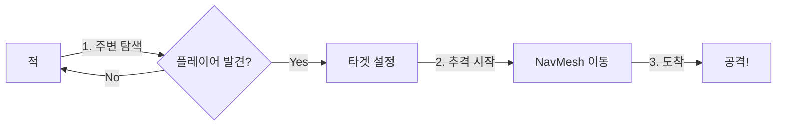
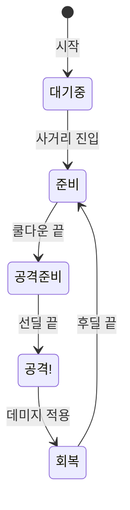

# 🎮 Rabbit-Kov 핵심 시스템 가이드

> **대상**: Unity 1개월차 개발자  
> **목표**: 적 AI가 플레이어를 추적하는 방법, 아이템 데이터 관리, 전투 시스템 이해하기

---

## 📑 목차

1. [NavMesh로 플레이어 따라가기](#1-navmesh로-플레이어-따라가기)
2. [ScriptableObject로 아이템 관리하기](#2-scriptableobject로-아이템-관리하기)
3. [적과 플레이어의 상호작용](#3-적과-플레이어의-상호작용)

---

# 1. NavMesh로 플레이어 따라가기

## 🤔 NavMesh란?

> **비유**: 바닥에 깔린 "걷기 가능한 도로 지도"

- Unity가 미리 계산해둔 **이동 가능 영역**
- 적이 장애물을 피해 플레이어에게 가는 **최단 경로**를 자동으로 찾아줌
- 우리가 직접 경로를 계산할 필요 없음!

```
┌─────────────────────────────┐
│  ■■■■■■                     │  ■ = 벽 (이동 불가)
│  ■■■■■■      🎯 플레이어    │  ░ = NavMesh (이동 가능)
│  ■■■■■■                     │
│  ░░░░░░░░░░░░░░░░░░░░░░░░░ │
│  ░░░░░░░░░░░░░░░░░░░░░░░░░ │  👾 적이 NavMesh를 따라
│  👾 적░░░░░░░░░░░░░░░░░░░░ │     플레이어에게 이동!
└─────────────────────────────┘
```

---

## 🔍 적이 플레이어를 찾는 과정



### 핵심 스크립트 3개

| 스크립트        | 역할          | 비유                          |
| --------------- | ------------- | ----------------------------- |
| `EnemySenses`   | 플레이어 찾기 | 👁️ **눈** - "어디 있지?"      |
| `ChaseState`    | 추격 명령     | 🧠 **뇌** - "저기로 가!"      |
| `EnemyMovement` | 실제 이동     | 🦵 **다리** - "알겠어, 간다!" |

---

## 👁️ 1단계: 플레이어 찾기 (EnemySenses)

### 탐지 조건 3가지

```
1. 거리 체크: 플레이어가 시야 범위 안에 있나?
2. 각도 체크: 내 앞쪽을 보고 있나? (시야각 안에 있나?)
3. 장애물 체크: 벽에 가려져 있지 않나?
```

```csharp
// EnemySenses.cs - 핵심 로직만!
private void DetectPlayer()
{
    // 1. 주변에서 플레이어 찾기
    Collider[] hits = Physics.OverlapSphere(transform.position, _sightRadius);

    foreach (Collider hit in hits)
    {
        if (hit.CompareTag("Player"))  // Player 태그인지 확인
        {
            // 2. 보이는지 체크
            if (CheckTargetVisible(hit.transform))
            {
                _controller.SetTarget(hit.transform);  // 타겟으로 설정!
            }
        }
    }
}
```

> **💡 초보자 팁**: `Physics.OverlapSphere`는 "내 주변 N미터에 뭐가 있어?"를 물어보는 함수!

---

## 🧠 2단계: 추격 명령 (ChaseState)

### 스로틀링이란?

> **문제**: 매 프레임마다 경로 계산하면 컴퓨터가 힘들어요 😵  
> **해결**: 거리에 따라 계산 주기를 다르게!

| 거리              | 갱신 주기 | 이유                 |
| ----------------- | --------- | -------------------- |
| 가까움 (10m 이내) | 0.1초     | 정밀하게 따라가야 함 |
| 중간 (30m 이내)   | 0.3초     | 적당히 따라가면 됨   |
| 멀음 (30m 이상)   | 0.6초     | 대충 따라가도 됨     |

```csharp
// ChaseState.cs - 거리 따라 갱신 주기 결정
public void Execute(EnemyController enemy)
{
    // 거리 계산
    float distance = Vector3.Distance(enemy.transform.position, targetPos);

    // 거리 따라 주기 결정
    float interval;
    if (distance < 10f) interval = 0.1f;       // 가까우면 자주
    else if (distance < 30f) interval = 0.3f;  // 중간이면 보통
    else interval = 0.6f;                      // 멀면 가끔

    // 주기마다 이동 명령
    if (timer >= interval)
    {
        enemy.Movement.MoveTo(targetPos);  // "저기로 가!"
    }
}
```

---

## 🦵 3단계: 실제 이동 (EnemyMovement)

### NavMeshAgent가 알아서 해주는 것

```csharp
// EnemyMovement.cs - 이동 명령
public void MoveTo(Vector3 destination)
{
    // NavMesh 위의 유효한 위치로 보정
    NavMeshHit hit;
    if (NavMesh.SamplePosition(destination, out hit, 2f, NavMesh.AllAreas))
    {
        destination = hit.position;
    }

    // NavMeshAgent에게 "저기로 가!" 명령
    _agent.SetDestination(destination);
}
```

> **💡 핵심**: `SetDestination()`만 호출하면 NavMesh가 알아서 길을 찾아줌!

---

# 2. ScriptableObject로 아이템 관리하기

## 🤔 ScriptableObject(SO)란?

> **비유**: 엑셀 표처럼 데이터만 저장하는 파일

### 왜 SO를 쓸까?

| 문제                                        | SO 해결책                    |
| ------------------------------------------- | ---------------------------- |
| 코드에 숫자 하드코딩하면 수정이 어려움      | Inspector에서 바로 수정 가능 |
| 같은 아이템인데 100개 프리팹에 같은 데이터? | 하나의 SO를 공유하면 됨      |
| 기획자가 코드 못 고침                       | SO는 기획자도 수정 가능!     |

---

## 📊 아이템 SO 구조

```
ItemData (기본 아이템)
    ├── WeaponData (무기 - 추상)
    │       ├── RangedWeaponData (총)
    │       └── MeleeWeaponData (칼)
    └── ConsumableData (소모품)
```

### 기본 아이템 (ItemData.cs)

```csharp
// 모든 아이템이 가지는 공통 정보
[CreateAssetMenu(fileName = "New Item", menuName = "Duckov/Item/BaseItem")]
public class ItemData : ScriptableObject
{
    public string itemName;     // 이름
    public Sprite icon;         // 아이콘
    public float weight;        // 무게
    public int price;           // 가격
}
```

### 총 데이터 (RangedWeaponData.cs)

```csharp
// WeaponData를 상속받아 총만의 추가 정보
[CreateAssetMenu(fileName = "New Gun", menuName = "Duckov/Item/Weapon/Ranged")]
public class RangedWeaponData : WeaponData
{
    public int maxAmmo;         // 탄창 크기
    public float reloadTime;    // 재장전 시간
    public float bulletSpeed;   // 탄속
    public GameObject bulletPrefab;  // 총알 프리팹
}
```

---

## 🛠️ SO 만들고 사용하기

### 1. SO 파일 생성

```
Project 창 우클릭 → Create → Duckov → Item → Weapon → Ranged
```

### 2. Inspector에서 값 설정

```
AK47.asset
├── itemName: "AK47"
├── damage: 24
├── maxAmmo: 30
├── reloadTime: 2.5
└── bulletPrefab: 🔗 Bullet_7.62mm
```

### 3. 스크립트에서 사용

```csharp
public class RangedWeapon : MonoBehaviour
{
    [SerializeField] private RangedWeaponData _data;  // Inspector에서 연결

    void Attack()
    {
        // SO에서 데이터 읽어서 사용
        int damage = _data.damage;
        GameObject bullet = Instantiate(_data.bulletPrefab);
    }
}
```

> **💡 장점**: `_data.damage` 값을 바꾸고 싶으면 코드 수정 없이 SO 파일만 수정!

---

# 3. 적과 플레이어의 상호작용

## 🤔 인터페이스란?

> **비유**: "이 기능은 반드시 있어야 해!"라는 **약속**

```csharp
// "데미지를 받을 수 있다"는 약속
public interface IDamageable
{
    void TakeDamage(int damage);
}
```

### 왜 인터페이스를 쓸까?

```csharp
// ❌ 인터페이스 없으면: 타입마다 다르게 처리해야 함
void Attack(GameObject target)
{
    if (target.GetComponent<Player>() != null)
        target.GetComponent<Player>().TakeDamage(10);
    else if (target.GetComponent<Enemy>() != null)
        target.GetComponent<Enemy>().TakeDamage(10);
    // 새 적 타입 추가할 때마다 여기 수정 필요...
}

// ✅ 인터페이스 쓰면: 하나의 코드로 다 처리!
void Attack(GameObject target)
{
    if (target.TryGetComponent(out IDamageable damageable))
    {
        damageable.TakeDamage(10);  // Player든 Enemy든 상관없음!
    }
}
```

---

## ⚔️ 적의 공격 시스템

### 전투 상태 흐름



| 상태         | 하는 일                   |
| ------------ | ------------------------- |
| **대기중**   | 사거리 밖, 아무것도 안 함 |
| **준비**     | 사거리 안, 쿨다운 기다림  |
| **공격준비** | 팔 들어올리는 중 (선딜)   |
| **공격!**    | 때리기! (데미지 적용)     |
| **회복**     | 팔 내리는 중 (후딜)       |

---

### 데미지 적용 코드

```csharp
// EnemyCombat.cs - 공격 실행
public void ExecuteDamage()
{
    Transform target = _controller.CurrentTarget;  // 타겟 가져오기

    // IDamageable 인터페이스로 데미지 전달
    if (target.TryGetComponent(out IDamageable damageable))
    {
        damageable.TakeDamage(_attackData.damage);  // 뎀지!
    }
}
```

### 플레이어가 데미지 받는 코드

```csharp
// Player.cs - IDamageable 구현
public class Player : MonoBehaviour, IDamageable
{
    public void TakeDamage(int damage)
    {
        int finalDamage = damage - _def;  // 방어력 적용
        Hp -= finalDamage;                // HP 감소

        if (Hp <= 0) Die();               // 죽으면 사망 처리
    }
}
```

---

## 🎒 아이템 줍기 (IInteractable)

### 상호작용 인터페이스

```csharp
public interface IInteractable
{
    void Interact(GameObject player);  // 상호작용 실행
    string GetTooltip();               // "F키로 줍기" 같은 텍스트
}
```

### 아이템 픽업 예시

```csharp
public class ItemPickup : MonoBehaviour, IInteractable
{
    [SerializeField] private ItemData _itemData;

    public void Interact(GameObject player)
    {
        // 인벤토리에 추가하고 아이템 제거
        player.GetComponent<Inventory>().AddItem(_itemData);
        Destroy(gameObject);
    }

    public string GetTooltip() => $"[F] {_itemData.itemName} 줍기";
}
```

---

## � 핵심 정리

| 시스템           | 핵심 개념                              | 한 줄 요약                                 |
| ---------------- | -------------------------------------- | ------------------------------------------ |
| **NavMesh 추적** | NavMeshAgent + 동적 스로틀링           | `SetDestination()`만 호출하면 알아서 간다! |
| **아이템 SO**    | ScriptableObject 상속                  | 데이터는 SO에, 로직은 코드에!              |
| **상호작용**     | Interface (IDamageable, IInteractable) | 약속을 정하면 누구든 같은 방식으로!        |

---

## 🔗 관련 파일

| 시스템   | 파일                                                  |
| -------- | ----------------------------------------------------- |
| NavMesh  | `EnemyMovement.cs`, `EnemySenses.cs`, `ChaseState.cs` |
| 아이템   | `ItemData.cs`, `WeaponData.cs`, `RangedWeaponData.cs` |
| 상호작용 | `EnemyCombat.cs`, `Player.cs`, `IDamageable.cs`       |
