# 🔨 적 시스템 개선 + 메가봉크 보스 구현 계획서

## 📋 개요

**목표**: 기존 Enemy AI를 **병렬 FSM 구조**로 리팩토링하고, 이를 기반으로 메가봉크 보스를 구현합니다.

**핵심 변경사항**:

- 단일 FSM → **이동 FSM + 전투 FSM** 병렬 실행
- `IdleState` → `StoppedState` (정지 공격용)
- 시작 상태: `Patrol` (항상 움직임)
- 공격 패턴 시스템 도입

---

## 🔀 Phase 0: 병렬 FSM 구조 (핵심 리팩토링)

### 새로운 아키텍처

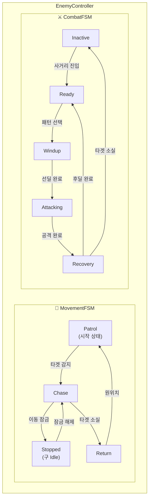

### 상태 조합 매트릭스

| Movement ↓ \ Combat → | Inactive |  Ready  |   Windup    |  Attacking  | Recovery |
| :-------------------: | :------: | :-----: | :---------: | :---------: | :------: |
|      **Patrol**       | ✅ 정찰  |   ❌    |     ❌      |     ❌      |    ❌    |
|       **Chase**       | ✅ 접근  | ✅ 대기 |     ⚠️      | ✅ 이동공격 |    ✅    |
|      **Stopped**      |    ❌    |   ❌    | ✅ 정지공격 | ✅ 정지공격 |    ✅    |
|      **Return**       | ✅ 복귀  |   ❌    |     ❌      |     ❌      |    ❌    |

### FSM 간 통신

```csharp
// 전투 FSM이 이동 잠금 요청 (정지 공격 시)
enemy.LockMovement();   // Movement → Stopped
enemy.UnlockMovement(); // Movement → Chase 재개
```

---

## 🎯 검토 완료 사항

> [!NOTE]
>
> - ✅ 병렬 FSM 구조 확정
> - ✅ IdleState → StoppedState 변경
> - ✅ 시작 상태 = Patrol

> [!IMPORTANT] > **보스 관련 추가 확인 필요:**
>
> 1. 보스 외형/에셋
> 2. 특수 공격 기믹
> 3. 보스 아레나 유무

---

## 🏗️ 아키텍처 설계

### 클래스 다이어그램

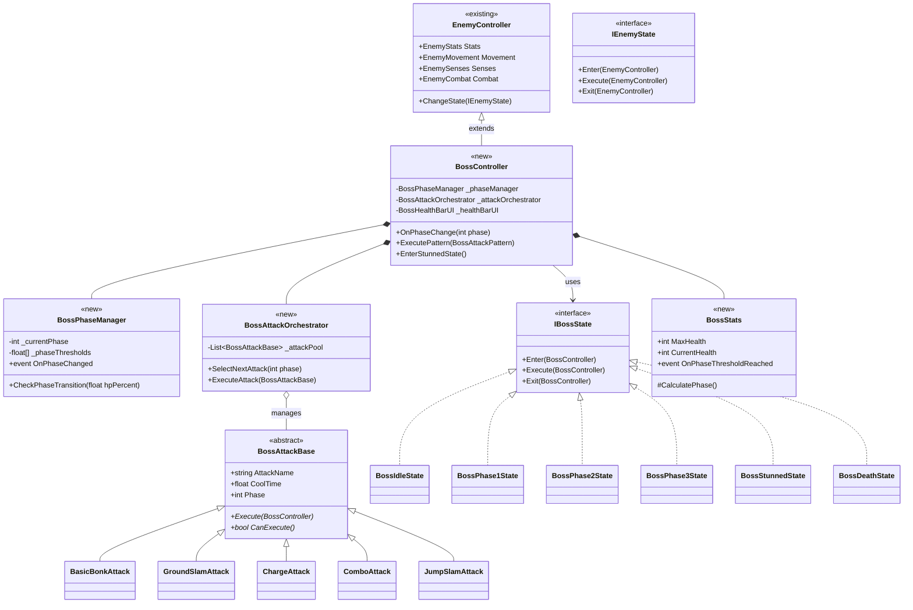

### 상태 머신 (FSM) 다이어그램

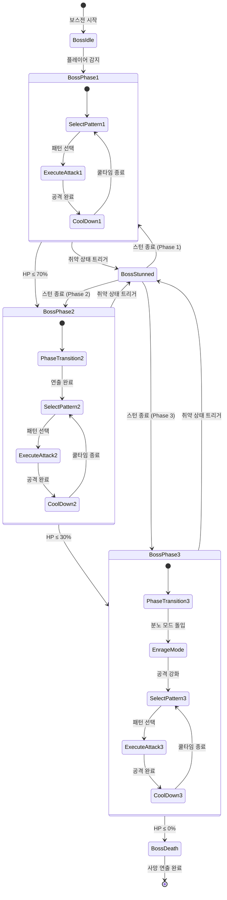

---

## ⚔️ 공격 패턴 상세

### 페이즈별 공격 패턴 매핑

| 패턴              | Phase 1 | Phase 2 | Phase 3 | 설명                   |
| ----------------- | :-----: | :-----: | :-----: | ---------------------- |
| **Basic Bonk**    |   ✅    |   ✅    |   ✅    | 기본 단일 타격         |
| **Ground Slam**   |   ✅    |   ✅    |   ✅    | 지면 강타, 범위 충격파 |
| **Charge Attack** |   ❌    |   ✅    |   ✅    | 돌진 후 강타           |
| **Combo Attack**  |   ❌    |   ✅    |   ✅    | 3연속 타격             |
| **Jump Slam**     |   ❌    |   ❌    |   ✅    | 점프 후 광역 착지      |

### 공격 패턴 플로우차트

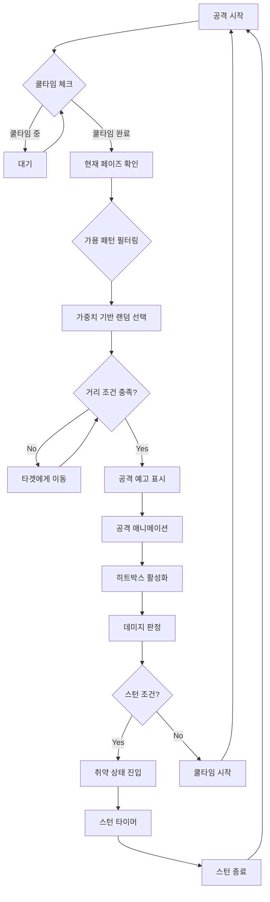

---

## 📁 파일 구조

```
Assets/Game/01_Scripts/02_Monster/Boss/
├── BossController.cs              [NEW] 보스 메인 컨트롤러
├── BossStats.cs                   [NEW] 보스 체력 + 페이즈 관리
├── BossPhaseManager.cs            [NEW] 페이즈 전환 로직
├── BossMovement.cs                [NEW] 보스 전용 이동 (돌진, 점프 등)
│
├── Data/
│   └── BossStatsSO.cs             [NEW] ScriptableObject 데이터
│
├── Attack/
│   ├── BossAttackOrchestrator.cs  [NEW] 공격 패턴 관리자
│   ├── BossAttackBase.cs          [NEW] 공격 패턴 기본 클래스
│   ├── BasicBonkAttack.cs         [NEW] 기본 봉크
│   ├── GroundSlamAttack.cs        [NEW] 지면 강타
│   ├── ChargeAttack.cs            [NEW] 돌진 공격
│   ├── ComboAttack.cs             [NEW] 연속타
│   └── JumpSlamAttack.cs          [NEW] 점프 슬램
│
├── States/
│   ├── IBossState.cs              [NEW] 보스 상태 인터페이스
│   ├── BossIdleState.cs           [NEW] 대기 상태
│   ├── BossPhase1State.cs         [NEW] 페이즈 1
│   ├── BossPhase2State.cs         [NEW] 페이즈 2
│   ├── BossPhase3State.cs         [NEW] 페이즈 3
│   ├── BossStunnedState.cs        [NEW] 스턴 상태
│   └── BossDeathState.cs          [NEW] 사망 상태
│
└── UI/
    └── BossHealthBarUI.cs         [NEW] 보스 체력바 UI
```

---

## 🔧 상세 구현 계획

### 1단계: 기반 구조 (추정 시간: 2-3시간)

#### [NEW] [BossController.cs](file:///c:/Users/leeja/Documents/Rabbit-Kov/Assets/Game/01_Scripts/02_Monster/Boss/BossController.cs)

`EnemyController`를 상속받아 보스 전용 기능 추가:

- 페이즈 매니저 연동
- 보스 전용 상태 객체들 관리
- 공격 오케스트레이터 연동

```csharp
// 예시 구조
public class BossController : EnemyController
{
    [Header("Boss Settings")]
    [SerializeField] private BossStatsSO _bossData;

    private BossPhaseManager _phaseManager;
    private BossAttackOrchestrator _attackOrchestrator;

    // 보스 전용 상태 객체
    private BossIdleState _bossIdleState;
    private BossPhase1State _phase1State;
    // ... 나머지 상태들

    protected override void CacheComponents()
    {
        base.CacheComponents();
        // 보스 전용 컴포넌트 초기화
    }
}
```

#### [NEW] [IBossState.cs](file:///c:/Users/leeja/Documents/Rabbit-Kov/Assets/Game/01_Scripts/02_Monster/Boss/States/IBossState.cs)

보스 전용 상태 인터페이스 (BossController 참조):

```csharp
public interface IBossState
{
    void Enter(BossController boss);
    void Execute(BossController boss);
    void Exit(BossController boss);
}
```

---

### 2단계: 페이즈 시스템 (추정 시간: 1-2시간)

#### [NEW] [BossPhaseManager.cs](file:///c:/Users/leeja/Documents/Rabbit-Kov/Assets/Game/01_Scripts/02_Monster/Boss/BossPhaseManager.cs)

체력 비율에 따른 페이즈 전환 관리:

```csharp
public class BossPhaseManager : MonoBehaviour
{
    [Header("Phase Thresholds")]
    [Tooltip("페이즈 전환 체력 비율 (0.7 = 70%)")]
    [SerializeField] private float[] _phaseThresholds = { 1.0f, 0.7f, 0.3f };

    public event Action<int> OnPhaseChanged;

    private int _currentPhase = 1;

    public void CheckPhaseTransition(float hpPercent)
    {
        int newPhase = CalculatePhase(hpPercent);
        if (newPhase != _currentPhase)
        {
            _currentPhase = newPhase;
            OnPhaseChanged?.Invoke(_currentPhase);
        }
    }

    private int CalculatePhase(float hpPercent)
    {
        if (hpPercent > _phaseThresholds[1]) return 1;
        if (hpPercent > _phaseThresholds[2]) return 2;
        return 3;
    }
}
```

---

### 3단계: 공격 시스템 (추정 시간: 3-4시간)

#### [NEW] [BossAttackBase.cs](file:///c:/Users/leeja/Documents/Rabbit-Kov/Assets/Game/01_Scripts/02_Monster/Boss/Attack/BossAttackBase.cs)

모든 공격 패턴의 기본 클래스:

```csharp
public abstract class BossAttackBase : MonoBehaviour
{
    [Header("Attack Settings")]
    [SerializeField] protected string _attackName = "Unknown Attack";
    [SerializeField] protected float _coolTime = 3f;
    [SerializeField] protected int _damage = 20;
    [SerializeField] protected float _range = 3f;
    [SerializeField] protected int _minPhase = 1;  // 이 페이즈부터 사용 가능

    [Header("Weight")]
    [Tooltip("선택 가중치 (높을수록 자주 선택됨)")]
    [SerializeField] protected float _selectionWeight = 1f;

    protected float _lastUseTime;
    protected BossController _boss;

    public string AttackName => _attackName;
    public float CoolTime => _coolTime;
    public int MinPhase => _minPhase;
    public float SelectionWeight => _selectionWeight;

    public bool IsReady => Time.time >= _lastUseTime + _coolTime;

    public virtual bool CanExecute(BossController boss) => IsReady && boss != null;

    public abstract IEnumerator Execute(BossController boss);
}
```

#### [NEW] [GroundSlamAttack.cs](file:///c:/Users/leeja/Documents/Rabbit-Kov/Assets/Game/01_Scripts/02_Monster/Boss/Attack/GroundSlamAttack.cs) - 예시

지면 강타 공격 구현 예시:

```csharp
public class GroundSlamAttack : BossAttackBase
{
    [Header("Ground Slam Settings")]
    [SerializeField] private float _slamRadius = 5f;
    [SerializeField] private float _warningDuration = 1f;  // 공격 예고 시간
    [SerializeField] private GameObject _warningVFX;
    [SerializeField] private GameObject _impactVFX;

    public override IEnumerator Execute(BossController boss)
    {
        _lastUseTime = Time.time;

        // 1. 공격 예고 (플레이어에게 회피 시간 제공)
        ShowWarning();
        yield return new WaitForSeconds(_warningDuration);

        // 2. 공격 실행
        PerformSlam(boss);

        // 3. 후딜레이 (취약 상태 가능)
        yield return new WaitForSeconds(0.5f);
    }

    private void ShowWarning()
    {
        // 바닥에 범위 표시
        if (_warningVFX != null)
            Instantiate(_warningVFX, transform.position, Quaternion.identity);
    }

    private void PerformSlam(BossController boss)
    {
        // 범위 내 플레이어 탐색 및 데미지
        Collider[] hits = Physics.OverlapSphere(transform.position, _slamRadius);
        foreach (var hit in hits)
        {
            if (hit.TryGetComponent<IDamageable>(out var target))
            {
                Vector3 dir = (hit.transform.position - transform.position).normalized;
                target.TakeDamage(_damage, hit.transform.position, dir);
            }
        }

        // 충격 VFX
        if (_impactVFX != null)
            Instantiate(_impactVFX, transform.position, Quaternion.identity);
    }
}
```

---

### 4단계: 상태 구현 (추정 시간: 2-3시간)

#### [NEW] [BossPhase1State.cs](file:///c:/Users/leeja/Documents/Rabbit-Kov/Assets/Game/01_Scripts/02_Monster/Boss/States/BossPhase1State.cs)

페이즈 1 상태 예시:

```csharp
public class BossPhase1State : IBossState
{
    private float _attackCooldown = 2f;
    private float _lastAttackTime;

    public void Enter(BossController boss)
    {
        Debug.Log("[Boss] Phase 1 시작!");
        // TODO: Phase 1 BGM 재생
    }

    public void Execute(BossController boss)
    {
        // 타겟 체크
        if (boss.CurrentTarget == null)
        {
            boss.ChangeToBossIdle();
            return;
        }

        // 타겟 방향 회전
        boss.Movement?.FaceTarget(boss.CurrentTarget);

        // 공격 쿨타임 체크
        if (Time.time >= _lastAttackTime + _attackCooldown)
        {
            // 공격 패턴 선택 및 실행
            var attack = boss.AttackOrchestrator.SelectNextAttack(phase: 1);
            if (attack != null && attack.CanExecute(boss))
            {
                boss.StartCoroutine(attack.Execute(boss));
                _lastAttackTime = Time.time;
            }
        }
    }

    public void Exit(BossController boss)
    {
        Debug.Log("[Boss] Phase 1 종료");
    }
}
```

---

### 5단계: UI 구현 (추정 시간: 1-2시간)

#### [NEW] [BossHealthBarUI.cs](file:///c:/Users/leeja/Documents/Rabbit-Kov/Assets/Game/01_Scripts/02_Monster/Boss/UI/BossHealthBarUI.cs)

화면 상단 고정 보스 체력바:

```csharp
public class BossHealthBarUI : MonoBehaviour
{
    [Header("UI References")]
    [SerializeField] private Image _healthFillImage;
    [SerializeField] private Image _damageFillImage;  // 데미지 딜레이 효과
    [SerializeField] private TextMeshProUGUI _bossNameText;
    [SerializeField] private TextMeshProUGUI _phaseText;

    [Header("Animation")]
    [SerializeField] private float _damageAnimDuration = 0.5f;

    private BossStats _bossStats;

    public void Initialize(BossStats stats, string bossName)
    {
        _bossStats = stats;
        _bossNameText.text = bossName;

        stats.OnHealthChanged += UpdateHealthBar;
        // TODO: 페이즈 변경 이벤트 구독
    }

    private void UpdateHealthBar()
    {
        float percent = (float)_bossStats.CurrentHealth / _bossStats.MaxHealth;
        _healthFillImage.fillAmount = percent;

        // 데미지 딜레이 애니메이션 (빨간 바가 천천히 줄어듦)
        StartCoroutine(AnimateDamageBar(percent));
    }
}
```

---

## 🧪 검증 계획

### 자동화 테스트

```bash
# Unity Test Runner 실행
# 예상 테스트 케이스:
- BossPhaseManager_PhaseTransition_Test
- BossAttackOrchestrator_PatternSelection_Test
- BossStats_DamageCalculation_Test
```

### 수동 검증

| 테스트 항목 | 검증 방법              | 기대 결과                       |
| ----------- | ---------------------- | ------------------------------- |
| 페이즈 전환 | 보스에게 데미지 입히기 | 70%, 30%에서 페이즈 전환 연출   |
| 공격 패턴   | 각 페이즈에서 관찰     | 페이즈별 허용된 패턴만 사용     |
| 스턴 시스템 | 특정 조건 트리거       | 보스가 경직 상태로 전환         |
| 체력바 UI   | 데미지 입히기          | 체력바 감소 + 딜레이 애니메이션 |
| 사망 연출   | HP 0으로 만들기        | 사망 애니메이션 + 오브젝트 파괴 |

---

## 📅 구현 순서 (권장)

```mermaid
gantt
    title 메가봉크 보스 구현 일정
    dateFormat  X
    axisFormat %s

    section 1단계: 기반
    IBossState 인터페이스    :a1, 0, 1
    BossController 기본 구조 :a2, 1, 2
    BossStats 확장          :a3, 2, 3

    section 2단계: 페이즈
    BossPhaseManager        :b1, 3, 4
    페이즈 전환 테스트       :b2, 4, 5

    section 3단계: 공격
    BossAttackBase          :c1, 5, 6
    BossAttackOrchestrator  :c2, 6, 7
    BasicBonkAttack         :c3, 7, 8
    GroundSlamAttack        :c4, 8, 9
    ChargeAttack            :c5, 9, 10
    ComboAttack             :c6, 10, 11
    JumpSlamAttack          :c7, 11, 12

    section 4단계: 상태
    BossIdleState           :d1, 12, 13
    BossPhase1/2/3State     :d2, 13, 15
    BossStunnedState        :d3, 15, 16
    BossDeathState          :d4, 16, 17

    section 5단계: UI
    BossHealthBarUI         :e1, 17, 18

    section 6단계: 테스트
    통합 테스트 및 밸런싱    :f1, 18, 20
```

---

## 💡 추가 고려사항 (놓치기 쉬운 부분)

### 1. 애니메이션 연동

- [ ] Animator Controller 필요 (각 공격/상태별 애니메이션)
- [ ] Animation Event로 히트박스 타이밍 제어

### 2. 오디오

- [ ] 보스 등장 BGM
- [ ] 페이즈 전환 효과음
- [ ] 각 공격 패턴별 효과음

### 3. VFX

- [ ] 공격 예고 마커 (범위 표시)
- [ ] 충격파 이펙트
- [ ] 페이즈 전환 연출

### 4. 카메라

- [ ] 보스전 시작 시 카메라 줌아웃
- [ ] 페이즈 전환 시 카메라 흔들림

### 5. 밸런싱

- [ ] ScriptableObject로 모든 수치 분리
- [ ] 난이도별 스탯 조절 가능하도록

### 6. 취약 상태 시스템

- [ ] 특정 공격 패턴 후 스턴 상태 진입 조건
- [ ] 스턴 중 플레이어 추가 데미지 보너스

---

## 🔗 참고: 기존 시스템 파일

기존 Enemy AI 시스템 (참고용):

- [EnemyController.cs](file:///c:/Users/leeja/Documents/Rabbit-Kov/Assets/Game/01_Scripts/02_Monster/EnemyController.cs)
- [EnemyStateMachine.cs](file:///c:/Users/leeja/Documents/Rabbit-Kov/Assets/Game/01_Scripts/02_Monster/EnemyStateMachine.cs)
- [IEnemyState.cs](file:///c:/Users/leeja/Documents/Rabbit-Kov/Assets/Game/01_Scripts/02_Monster/States/IEnemyState.cs)
- [EnemyStats.cs](file:///c:/Users/leeja/Documents/Rabbit-Kov/Assets/Game/01_Scripts/02_Monster/EnemyStats.cs)

---

# 🔄 기존 적 시스템 개선안

## 📋 개선 목표

현재 일반 적(Enemy)은 단일 공격(`TryAttack`)만 가능합니다. 보스와 동일한 **공격 패턴 시스템**을 도입하여:

1. 모든 적이 다양한 공격 패턴을 가질 수 있게 함
2. 보스와 일반 적이 **동일한 아키텍처**를 공유
3. **ScriptableObject** 기반으로 적 종류별 데이터 분리
4. **티어 시스템** (Normal → Elite → Boss) 도입

---

## 🏗️ 개선된 아키텍처 (통합 시스템)

### 클래스 다이어그램 - 통합 버전

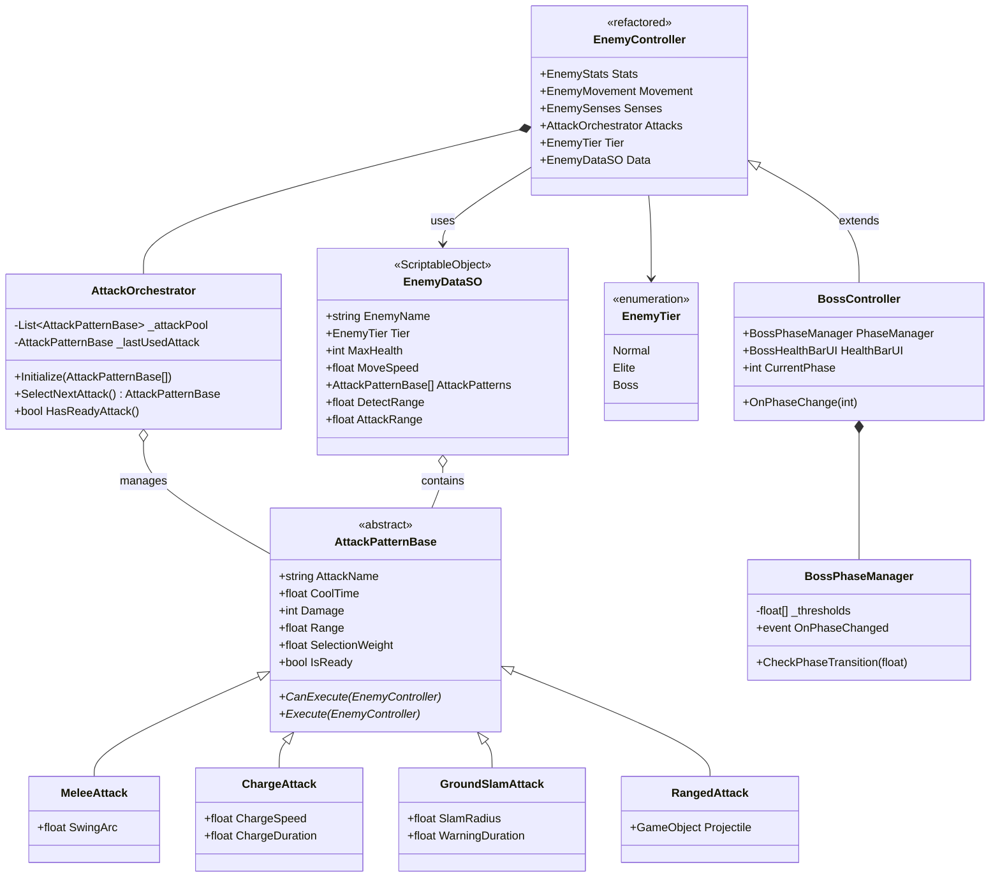

---

## ⚔️ 적 티어 시스템

### 티어별 특성 비교

| 특성             |    🟢 Normal    |    🟡 Elite     |      🔴 Boss       |
| ---------------- | :-------------: | :-------------: | :----------------: |
| **체력**         |  낮음 (50~100)  | 중간 (200~500)  |    높음 (1000+)    |
| **공격 패턴 수** |      1~2개      |      3~4개      |       5~7개        |
| **페이즈**       |       ❌        | ⚠️ 미니 (2단계) |   ✅ 풀 (3단계)    |
| **체력바 UI**    | 머리 위 작은 바 |  머리 위 큰 바  |   화면 상단 고정   |
| **스턴 가능**    |       ❌        |    ✅ 간헐적    |     ✅ 패턴 후     |
| **처치 보상**    |      소량       |      중급       | 대량 + 특수 아이템 |

### 티어별 FSM 비교

````carousel
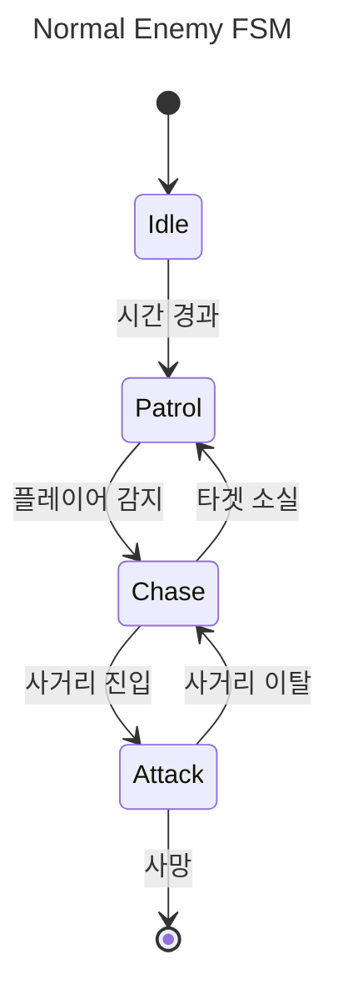
<!-- slide -->
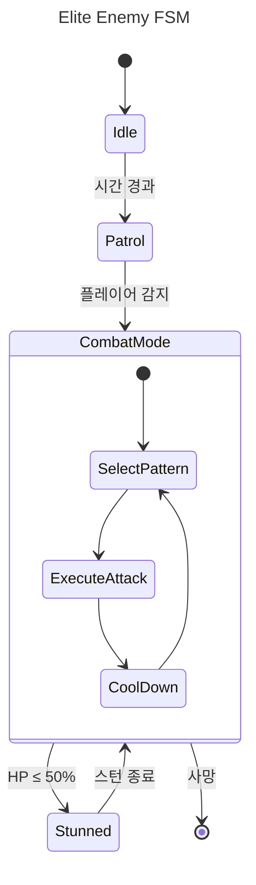
<!-- slide -->
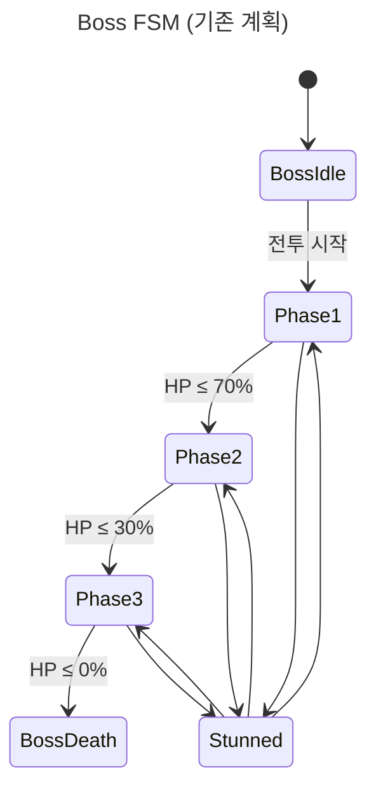
````

---

## 📁 개선된 파일 구조

```
Assets/Game/01_Scripts/02_Monster/
│
├── Core/                              [NEW FOLDER]
│   ├── EnemyController.cs             [MODIFY] 공용 기반 컨트롤러
│   ├── EnemyTier.cs                   [NEW] 티어 열거형
│   └── EnemyStateMachine.cs           [KEEP] 기존 유지
│
├── Data/                              [NEW FOLDER]
│   ├── EnemyDataSO.cs                 [NEW] 적 데이터 ScriptableObject
│   └── SO/                            [NEW] 실제 SO 에셋들
│       ├── NormalSlime.asset
│       ├── EliteSkeleton.asset
│       └── BossMegaBonk.asset
│
├── Attack/                            [NEW FOLDER - 공용]
│   ├── AttackPatternBase.cs           [NEW] 공격 패턴 기본 클래스
│   ├── AttackOrchestrator.cs          [NEW] 공격 선택/실행 관리
│   ├── Patterns/                      [NEW] 구체적인 공격 패턴들
│   │   ├── MeleeAttack.cs             [NEW] 근접 공격
│   │   ├── ChargeAttack.cs            [NEW] 돌진 공격
│   │   ├── GroundSlamAttack.cs        [NEW] 지면 강타
│   │   ├── ComboAttack.cs             [NEW] 연속타
│   │   ├── JumpSlamAttack.cs          [NEW] 점프 슬램
│   │   └── RangedAttack.cs            [NEW] 원거리 공격
│   └── deprecated/
│       └── EnemyCombat.cs             [DEPRECATED] 기존 전투 시스템
│
├── States/                            [KEEP] 기존 폴더
│   ├── IEnemyState.cs
│   ├── IdleState.cs
│   ├── PatrolState.cs
│   ├── ChaseState.cs
│   ├── AttackState.cs                 [MODIFY] AttackOrchestrator 사용
│   └── RushState.cs
│
├── Boss/                              [NEW FOLDER - 보스 전용]
│   ├── BossController.cs
│   ├── BossPhaseManager.cs
│   ├── States/
│   │   ├── IBossState.cs
│   │   ├── BossPhase1State.cs
│   │   ├── BossPhase2State.cs
│   │   ├── BossPhase3State.cs
│   │   ├── BossStunnedState.cs
│   │   └── BossDeathState.cs
│   └── UI/
│       └── BossHealthBarUI.cs
│
└── Elite/                             [NEW FOLDER - 엘리트 전용]
    ├── EliteController.cs             [NEW] 엘리트 확장
    └── EliteStunnedState.cs           [NEW] 엘리트 스턴
```

---

## 🔧 상세 개선 계획

### Phase 0: 공용 공격 시스템 구축 (보스/기존 적 공통)

#### [NEW] [AttackPatternBase.cs](file:///c:/Users/leeja/Documents/Rabbit-Kov/Assets/Game/01_Scripts/02_Monster/Attack/AttackPatternBase.cs)

모든 공격 패턴의 추상 기본 클래스:

```csharp
using UnityEngine;
using System.Collections;

// [역할] 모든 공격 패턴의 기반 클래스 (보스/엘리트/일반 공용)
public abstract class AttackPatternBase : MonoBehaviour
{
    [Header("기본 설정")]
    [Tooltip("공격 이름 (디버깅/UI용)")]
    [SerializeField] protected string _attackName = "Unknown Attack";

    [Tooltip("공격 쿨타임 (초)")]
    [SerializeField] protected float _coolTime = 2f;

    [Tooltip("공격력")]
    [SerializeField] protected int _damage = 10;

    [Tooltip("공격 사거리")]
    [SerializeField] protected float _range = 2f;

    [Header("선택 가중치")]
    [Tooltip("AI가 이 패턴을 선택할 확률 가중치")]
    [Range(0f, 10f)]
    [SerializeField] protected float _selectionWeight = 1f;

    // 내부 상태
    protected float _lastUseTime = -999f;

    // 프로퍼티
    public string AttackName => _attackName;
    public float CoolTime => _coolTime;
    public int Damage => _damage;
    public float Range => _range;
    public float SelectionWeight => _selectionWeight;
    public bool IsReady => Time.time >= _lastUseTime + _coolTime;

    /// <summary>
    /// 이 공격을 지금 실행할 수 있는가? (쿨타임 + 추가 조건)
    /// </summary>
    public virtual bool CanExecute(EnemyController enemy)
    {
        if (!IsReady) return false;
        if (enemy == null || enemy.CurrentTarget == null) return false;

        // 거리 조건 체크
        float dist = Vector3.Distance(enemy.transform.position,
                                      enemy.CurrentTarget.position);
        return dist <= _range;
    }

    /// <summary>
    /// 공격 실행 (코루틴)
    /// </summary>
    public abstract IEnumerator Execute(EnemyController enemy);

    /// <summary>
    /// 쿨타임 타이머 갱신 (Execute 성공 후 호출)
    /// </summary>
    protected void MarkUsed() => _lastUseTime = Time.time;
}
```

#### [NEW] [AttackOrchestrator.cs](file:///c:/Users/leeja/Documents/Rabbit-Kov/Assets/Game/01_Scripts/02_Monster/Attack/AttackOrchestrator.cs)

공격 패턴 선택 및 실행 관리:

```csharp
using UnityEngine;
using System.Collections.Generic;
using System.Linq;

// [역할] 공격 패턴 풀을 관리하고 가중치 기반으로 다음 공격 선택
public class AttackOrchestrator : MonoBehaviour
{
    [Header("공격 패턴 풀")]
    [Tooltip("이 적이 사용할 수 있는 모든 공격 패턴")]
    [SerializeField] private AttackPatternBase[] _attackPatterns;

    private EnemyController _controller;
    private AttackPatternBase _lastUsedAttack;
    private Coroutine _currentAttackCoroutine;

    // 프로퍼티
    public bool IsAttacking => _currentAttackCoroutine != null;
    public AttackPatternBase LastUsedAttack => _lastUsedAttack;

    private void Awake()
    {
        _controller = GetComponent<EnemyController>();

        // 자식 오브젝트에서 패턴 자동 수집 (Inspector에서 비어있을 경우)
        if (_attackPatterns == null || _attackPatterns.Length == 0)
        {
            _attackPatterns = GetComponentsInChildren<AttackPatternBase>();
        }
    }

    /// <summary>
    /// 사용 가능한 패턴 중 가중치 기반으로 하나 선택
    /// </summary>
    public AttackPatternBase SelectNextAttack()
    {
        // 1. 실행 가능한 패턴만 필터링
        var available = _attackPatterns
            .Where(p => p.CanExecute(_controller))
            .ToList();

        if (available.Count == 0) return null;

        // 2. 같은 패턴 연속 사용 방지 (옵션)
        if (available.Count > 1 && _lastUsedAttack != null)
        {
            available.RemoveAll(p => p == _lastUsedAttack);
        }

        // 3. 가중치 기반 랜덤 선택
        float totalWeight = available.Sum(p => p.SelectionWeight);
        float random = Random.Range(0f, totalWeight);

        float cumulative = 0f;
        foreach (var pattern in available)
        {
            cumulative += pattern.SelectionWeight;
            if (random <= cumulative)
            {
                _lastUsedAttack = pattern;
                return pattern;
            }
        }

        return available[0]; // fallback
    }

    /// <summary>
    /// 선택된 패턴 실행
    /// </summary>
    public void ExecuteAttack(AttackPatternBase pattern)
    {
        if (pattern == null || IsAttacking) return;
        _currentAttackCoroutine = StartCoroutine(AttackRoutine(pattern));
    }

    private IEnumerator AttackRoutine(AttackPatternBase pattern)
    {
        yield return pattern.Execute(_controller);
        _currentAttackCoroutine = null;
    }

    /// <summary>
    /// 사용 가능한 공격이 있는가?
    /// </summary>
    public bool HasReadyAttack()
    {
        return _attackPatterns.Any(p => p.CanExecute(_controller));
    }

    /// <summary>
    /// 현재 실행 중인 공격 취소
    /// </summary>
    public void CancelCurrentAttack()
    {
        if (_currentAttackCoroutine != null)
        {
            StopCoroutine(_currentAttackCoroutine);
            _currentAttackCoroutine = null;
        }
    }
}
```

---

### Phase 1: EnemyDataSO (ScriptableObject 데이터)

#### [NEW] [EnemyDataSO.cs](file:///c:/Users/leeja/Documents/Rabbit-Kov/Assets/Game/01_Scripts/02_Monster/Data/EnemyDataSO.cs)

```csharp
using UnityEngine;

// [역할] 적 유형별 스탯/행동 데이터 (Inspector에서 쉽게 조절)
[CreateAssetMenu(fileName = "NewEnemyData", menuName = "Duckorov/Enemy Data")]
public class EnemyDataSO : ScriptableObject
{
    [Header("기본 정보")]
    public string EnemyName = "Unknown Enemy";
    public EnemyTier Tier = EnemyTier.Normal;

    [Header("스탯")]
    [Range(10, 10000)]
    public int MaxHealth = 100;

    [Range(1f, 20f)]
    public float MoveSpeed = 3.5f;

    [Range(1f, 30f)]
    public float DetectRange = 10f;

    [Range(1f, 10f)]
    public float AttackRange = 2f;

    [Header("공격 패턴 프리팹")]
    [Tooltip("이 적이 사용할 공격 패턴 프리팹들")]
    public AttackPatternBase[] AttackPatternPrefabs;

    [Header("페이즈 설정 (Elite/Boss 전용)")]
    [Tooltip("체력 비율 임계값 (예: 0.5 = HP 50%에서 페이즈 2)")]
    public float[] PhaseThresholds;

    [Header("VFX/SFX")]
    public GameObject SpawnVFX;
    public GameObject DeathVFX;
    public AudioClip[] AttackSounds;
    public AudioClip[] HitSounds;
}
```

#### [NEW] [EnemyTier.cs](file:///c:/Users/leeja/Documents/Rabbit-Kov/Assets/Game/01_Scripts/02_Monster/Core/EnemyTier.cs)

```csharp
// [역할] 적 티어 분류
public enum EnemyTier
{
    Normal,  // 일반 적: 1~2 패턴, 페이즈 없음
    Elite,   // 엘리트: 3~4 패턴, 미니 페이즈
    Boss     // 보스: 5~7 패턴, 풀 페이즈
}
```

---

### Phase 2: EnemyController 리팩토링

#### [MODIFY] [EnemyController.cs](file:///c:/Users/leeja/Documents/Rabbit-Kov/Assets/Game/01_Scripts/02_Monster/EnemyController.cs)

기존 `EnemyCombat` 대신 `AttackOrchestrator` 사용:

```csharp
// 변경 전
private EnemyCombat _combat;
public EnemyCombat Combat => _combat;

// 변경 후
[Header("데이터")]
[SerializeField] private EnemyDataSO _enemyData;

private AttackOrchestrator _attacks;

public AttackOrchestrator Attacks => _attacks;
public EnemyDataSO Data => _enemyData;
public EnemyTier Tier => _enemyData?.Tier ?? EnemyTier.Normal;

protected override void CacheComponents()
{
    base.CacheComponents();
    _attacks = GetComponent<AttackOrchestrator>();

    // EnemyDataSO에서 스탯 적용
    if (_enemyData != null)
    {
        // Stats에 최대 체력 설정
        // Movement에 이동속도 설정
        // Senses에 감지 범위 설정
    }
}
```

---

### Phase 3: AttackState 수정

#### [MODIFY] [AttackState.cs](file:///c:/Users/leeja/Documents/Rabbit-Kov/Assets/Game/01_Scripts/02_Monster/States/AttackState.cs)

```csharp
// 변경 전
enemy.Combat?.TryAttack();

// 변경 후
public void Execute(EnemyController enemy)
{
    // ... 기존 체크 로직 유지 ...

    // 새로운 공격 시스템 사용
    if (enemy.Attacks != null && !enemy.Attacks.IsAttacking)
    {
        var pattern = enemy.Attacks.SelectNextAttack();
        if (pattern != null)
        {
            enemy.Attacks.ExecuteAttack(pattern);
        }
    }
}
```

---

## 📊 마이그레이션 체크리스트

### 단계별 마이그레이션

- [ ] **마일스톤 0**: 공용 공격 시스템 구축

  - [ ] `AttackPatternBase.cs` 생성
  - [ ] `AttackOrchestrator.cs` 생성
  - [ ] `MeleeAttack.cs` (기본 근접 공격) 생성

- [ ] **마일스톤 1**: 데이터 분리

  - [ ] `EnemyDataSO.cs` 생성
  - [ ] `EnemyTier.cs` 생성
  - [ ] 테스트용 `TestSlime.asset` SO 생성

- [ ] **마일스톤 2**: EnemyController 리팩토링

  - [ ] `AttackOrchestrator` 연동
  - [ ] `EnemyDataSO` 참조 추가
  - [ ] 기존 `EnemyCombat` 호출부 제거

- [ ] **마일스톤 3**: AttackState 수정

  - [ ] 새 공격 시스템으로 교체
  - [ ] 테스트 (일반 적)

- [ ] **마일스톤 4**: 메가봉크 보스 구현

  - [ ] (기존 보스 계획대로)

- [ ] **마일스톤 5**: 기존 `EnemyCombat.cs` 제거
  - [ ] deprecated 폴더로 이동
  - [ ] 참조 제거 확인

---

## 📈 개선 효과 비교

### Before (현재)

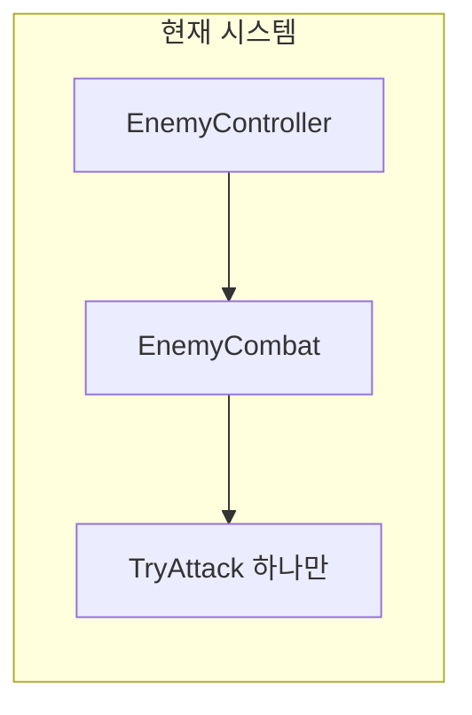

### After (개선 후)

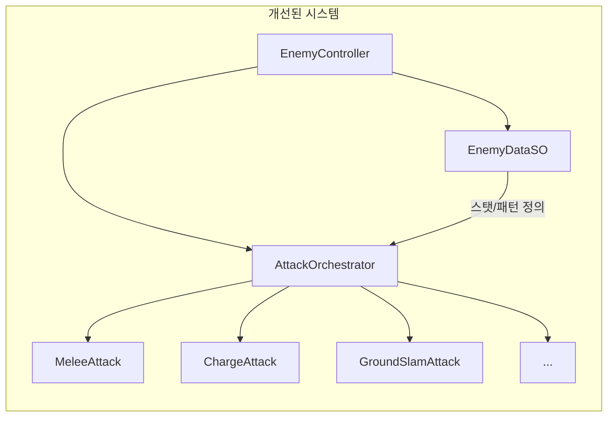

---

## 🎮 사용 예시

### 일반 적 설정 예시 (Inspector)

```
[EnemyController]
├── Enemy Data: NormalSlime.asset
│   ├── Tier: Normal
│   ├── MaxHealth: 50
│   ├── MoveSpeed: 2.5
│   └── Attack Patterns:
│       └── MeleeAttack (프리팹)
│
└── [AttackOrchestrator]
    └── (자동으로 자식에서 수집)
        └── [MeleeAttack]
            ├── Damage: 5
            ├── Range: 1.5
            └── CoolTime: 1.5
```

### 엘리트 적 설정 예시

```
[EnemyController]
├── Enemy Data: EliteSkeleton.asset
│   ├── Tier: Elite
│   ├── MaxHealth: 300
│   └── Attack Patterns:
│       ├── MeleeAttack
│       ├── ChargeAttack
│       └── GroundSlamAttack
│
└── [AttackOrchestrator]
    └── Pattern Pool: 3개
```

> [!TIP] > **핵심 이점**: 같은 `EnemyController` 프리팹에 다른 `EnemyDataSO`만 넣으면 완전히 다른 행동의 적이 됩니다!

---

# ✅ 구현 완료 현황 (2024-12-17)

## 📁 최종 폴더 구조

폴더 구조가 다음과 같이 통합되었습니다:

```
Assets/Game/01_Scripts/
└── 02_Enemy/
    ├── Boss/                      ← 보스 시스템
    │   ├── BossController.cs     (EnemyController 상속)
    │   ├── BossPhaseManager.cs   (페이즈 전환)
    │   ├── Attacks/
    │   │   ├── IBossAttack.cs    (공격 인터페이스)
    │   │   ├── AirborneAttack.cs (1페이즈: 에어본)
    │   │   ├── GroundSpikeAttack.cs (2페이즈: 3갈래 스파이크)
    │   │   └── RotatingLaserAttack.cs (3페이즈: 회전 레이저)
    │   └── UI/
    │       └── BossHealthBar.cs  (체력바 + 페이즈 표시)
    │
    ├── Data/                      ← 모든 DataSO 통합
    │   ├── Normal/               (일반 적 데이터)
    │   │   ├── EnemyDataSO.cs
    │   │   └── EnemyAttackDataSO.cs
    │   ├── Boss/                 (보스 데이터)
    │   │   └── BossDataSO.cs
    │   └── Common/
    │       └── EnemyTier.cs      (Enum: Normal, Epic, Boss)
    │
    ├── Normal/                    ← 일반 적 시스템
    │   ├── EnemyController.cs
    │   ├── EnemyStats.cs
    │   ├── EnemySenses.cs
    │   ├── EnemyMovement.cs
    │   ├── EnemyCombat.cs
    │   ├── EnemySpawner.cs
    │   ├── EnemyZoneTrigger.cs
    │   └── States/
    │       ├── Movement/         (PatrolState, ChaseState, etc.)
    │       └── Combat/           (CombatStates)
    │
    └── StateMachine/              ← FSM 인프라
        ├── IMovementState.cs
        ├── ICombatState.cs
        ├── MovementFSM.cs
        └── CombatFSM.cs
```

## 🎯 메가봉크 보스 공격 패턴

| 페이즈 | 공격 이름           | 설명                             |
| ------ | ------------------- | -------------------------------- |
| **1**  | AirborneAttack      | 플레이어를 공중으로 띄움         |
| **2**  | GroundSpikeAttack   | 3갈래로 뻗어나가는 바닥 스파이크 |
| **3**  | RotatingLaserAttack | 4갈래 레이저가 360° 회전         |

## 📋 남은 작업 (Unity 에디터)

- [ ] 보스 프리팹 생성 (BossController 컴포넌트 추가)
- [ ] BossDataSO 에셋 생성 (Create → Rabbit-Kov → Boss)
- [ ] 공격 프리팹 생성 (각 공격 스크립트 연결)
- [ ] 이펙트/파티클 에셋 연결
- [ ] 플레이어 데미지 연동 (PlayerHealth)
- [ ] 보스 Zone 트리거 구현
- [ ] 테스트 및 밸런싱
