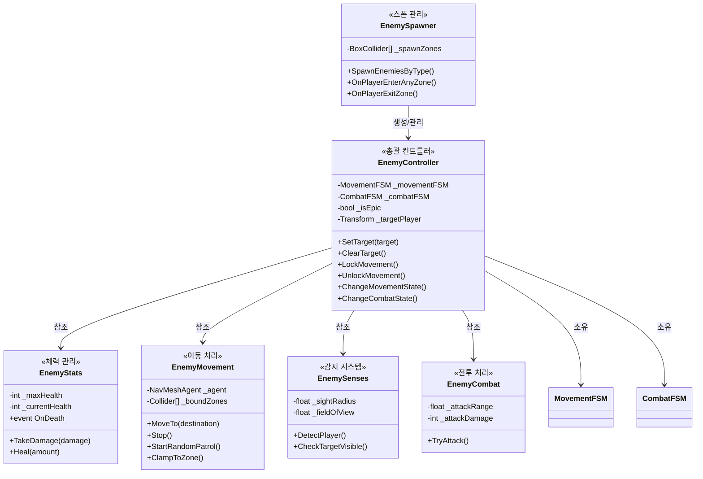
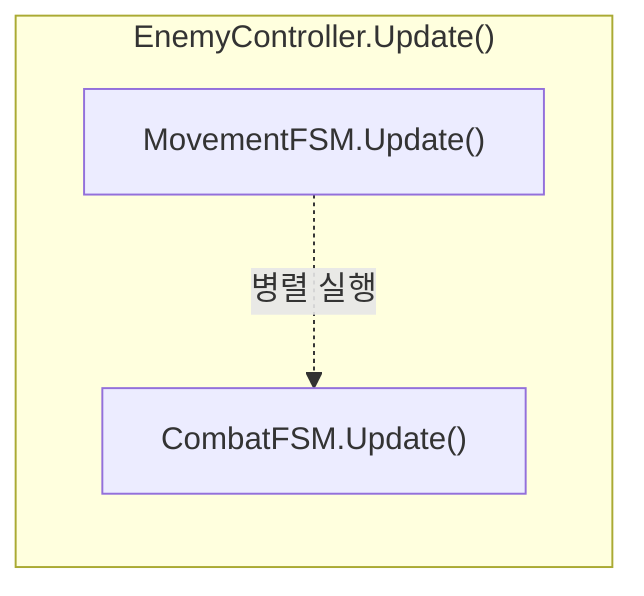
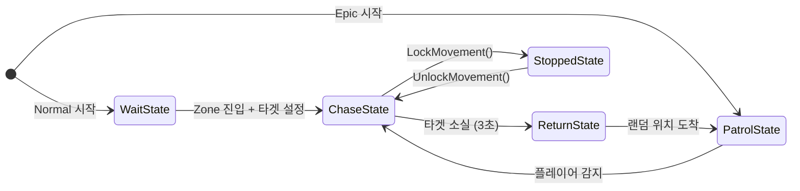
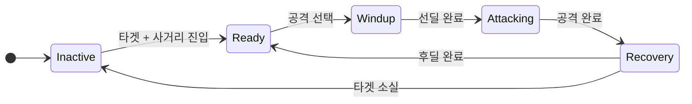
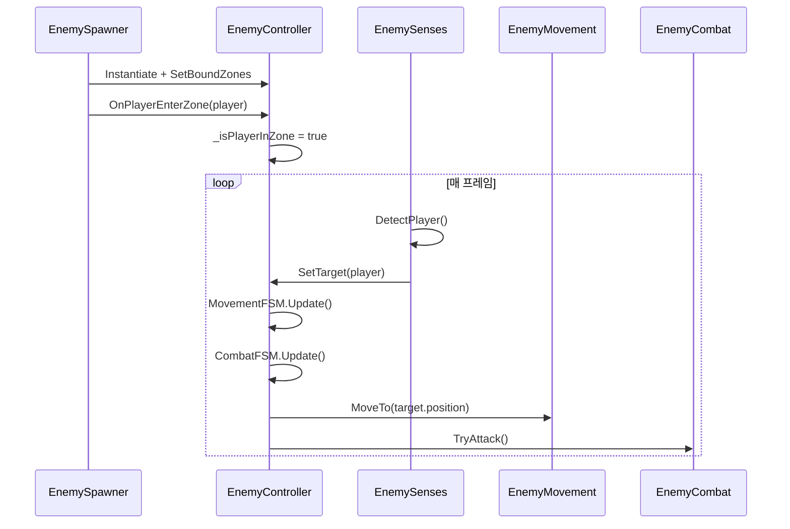

# 🎮 Enemy AI 시스템 분석 보고서

## 📊 시스템 개요

**아키텍처**: 병렬 FSM (MovementFSM + CombatFSM)
**핵심 컨트롤러**: `EnemyController` - 모든 컴포넌트 통합 관리
**몬스터 유형**: Epic (순찰형), Normal (돌진형)

---

## 🗂️ 클래스 다이어그램



---

## 🔄 병렬 FSM 구조



### MovementFSM 상태 전이



### CombatFSM 상태 전이



---

## 👾 Epic vs Normal 비교

| 구분          | Epic 몬스터             | Normal 몬스터        |
| ------------- | ----------------------- | -------------------- |
| **시작 상태** | PatrolState             | WaitState            |
| **감지 방식** | FOV + 거리 체크         | 360도 (Zone 진입 시) |
| **추적 종료** | 거리 초과 → ReturnState | **없음** (끝까지)    |
| **이동 제한** | BoundZones (Zone 내)    | 없음 (자유 이동)     |
| **타겟 설정** | EnemySenses 감지        | Zone 진입 즉시       |

---

## 📁 파일 구조

```
02_Monster/
├── EnemyController.cs     # 총괄 컨트롤러
├── EnemyStats.cs          # 체력 관리 (IDamageable)
├── EnemyMovement.cs       # NavMesh 이동
├── EnemySenses.cs         # 플레이어 감지
├── EnemyCombat.cs         # 공격 처리
├── EnemySpawner.cs        # 스폰 관리
├── EnemyZoneTrigger.cs    # Zone 진입/퇴장 감지
│
├── FSM/
│   ├── IMovementState.cs  # 이동 상태 인터페이스
│   ├── ICombatState.cs    # 전투 상태 인터페이스
│   ├── MovementFSM.cs     # 이동 FSM
│   └── CombatFSM.cs       # 전투 FSM
│
└── States/
    ├── Movement/
    │   ├── PatrolState.cs     # 순찰 (Epic)
    │   ├── WaitState.cs       # 대기 (Normal)
    │   ├── ChaseState.cs      # 추적
    │   ├── ReturnState.cs     # 복귀 (Epic)
    │   └── StoppedState.cs    # 정지 (공격 중)
    │
    └── Combat/
        ├── CombatInactiveState.cs  # 비활성
        ├── CombatReadyState.cs     # 대기
        ├── CombatWindupState.cs    # 선딜
        ├── CombatAttackingState.cs # 공격
        └── CombatRecoveryState.cs  # 후딜
```

---

## 🔗 데이터 흐름



---

## ⚙️ 핵심 메서드

### EnemyController

| 메서드                | 역할                           |
| --------------------- | ------------------------------ |
| `SetTarget(player)`   | 타겟 설정                      |
| `ClearTarget()`       | 타겟 해제 + CombatFSM 리셋     |
| `LockMovement()`      | MovementFSM → StoppedState     |
| `UnlockMovement()`    | 이전 상태로 복귀               |
| `OnPlayerEnterZone()` | Zone 플래그 + Normal 추격 시작 |

### EnemyMovement

| 메서드                | 역할                       |
| --------------------- | -------------------------- |
| `MoveTo(dest)`        | NavMesh 이동 + Zone 클램프 |
| `StartRandomPatrol()` | 랜덤 정찰 위치 탐색        |
| `ClampToZone(pos)`    | Zone 경계 내로 위치 제한   |
| `Stop()`              | 이동 정지                  |

### EnemySenses

| 메서드                 | 역할                           |
| ---------------------- | ------------------------------ |
| `DetectPlayer()`       | 플레이어 탐지 (Zone 체크 포함) |
| `CheckTargetVisible()` | FOV + 거리 + 장애물 체크       |

---

## 🎯 다음 단계: Phase 1

**공용 공격 시스템** 구축:

1. `AttackDataSO` - 공격 설정 ScriptableObject
2. `AttackState` 리팩토링 - 데이터 기반
3. `EnemyCombat` 개선 - AttackDataSO 사용
