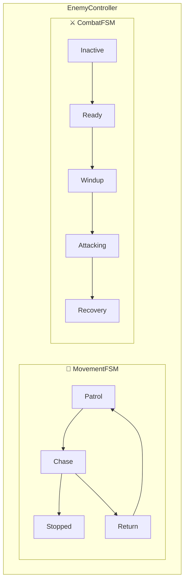
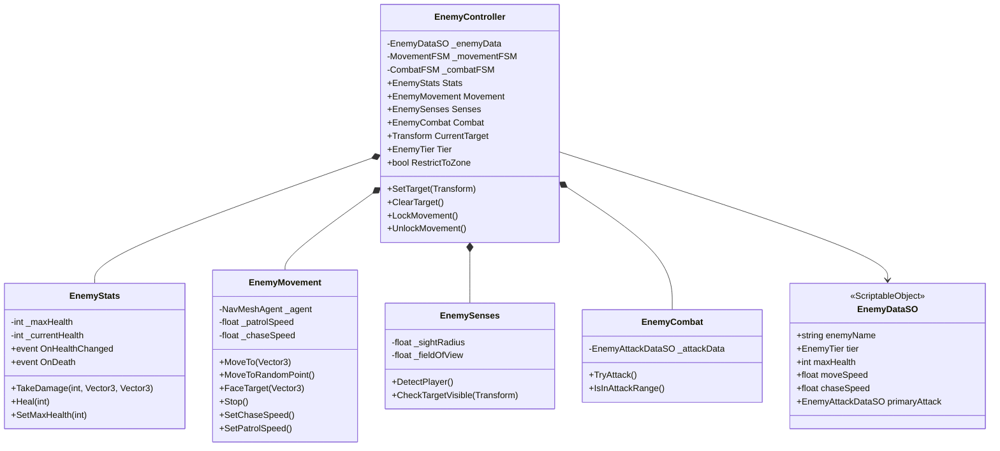
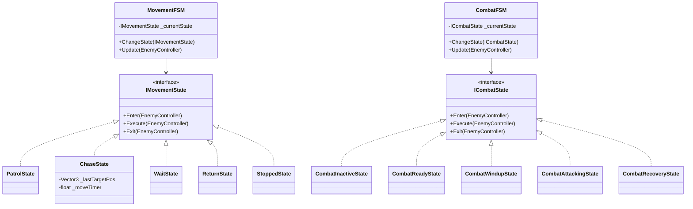
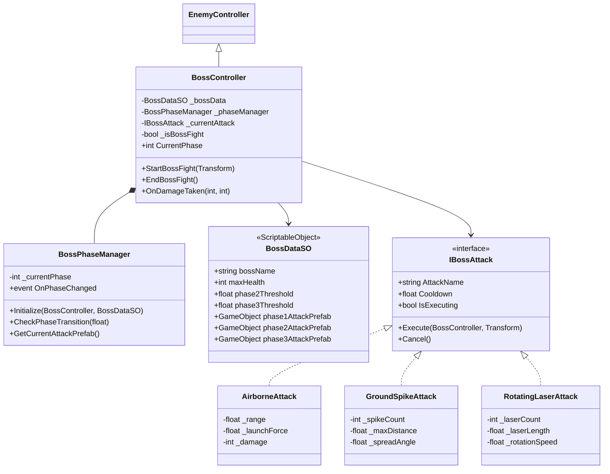
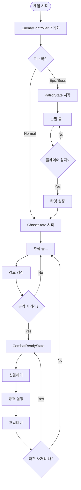
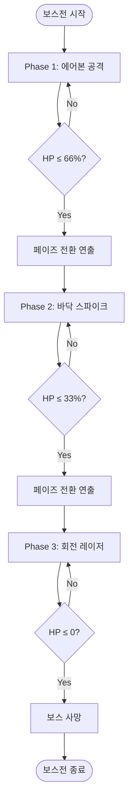
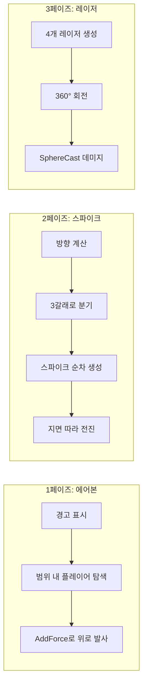
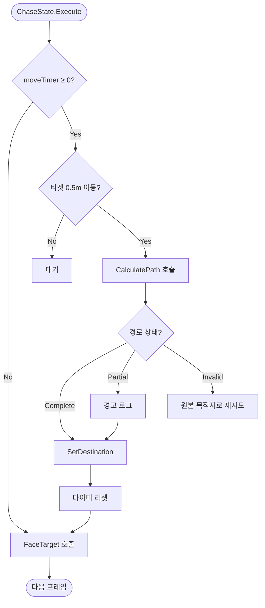

# 🐰 적 시스템 개선 + 메가봉크 보스 구현 보고서

**작성일**: 2024-12-17  
**프로젝트**: Rabbit-Kov (Rabbit Protocol)

---

## 📋 프로젝트 개요

### 목표

- 기존 Enemy AI를 **병렬 FSM 구조**로 리팩토링
- **메가봉크 보스** 3페이즈 시스템 구현
- 폴더 구조 통합 및 정리

### 결과 요약

| Phase               | 완료 상태                                |
| ------------------- | ---------------------------------------- |
| Phase 0~3           | ✅ 완료                                  |
| Phase 4 (보스)      | 🔄 70% (스크립트 완료, 프리팹/에셋 필요) |
| Phase 5 (폴더 통합) | ✅ 완료                                  |

---

## 🏗️ Phase 0~3: 적 시스템 리팩토링

### 병렬 FSM 아키텍처



### 구현 항목

- **MovementFSM**: `PatrolState`, `ChaseState`, `StoppedState`, `ReturnState`, `WaitState`
- **CombatFSM**: `CombatInactiveState`, `CombatReadyState`, `CombatWindupState`, `CombatAttackingState`, `CombatRecoveryState`
- **데이터 분리**: `EnemyDataSO`, `EnemyAttackDataSO`로 ScriptableObject 기반 설정
- **NavMesh 최적화**: `pathfindingIterationsPerFrame` 설정 (100~1000)

---

## 🐰 Phase 4: 메가봉크 보스

### 페이즈 시스템

| 페이즈 | 체력 구간  | 공격 패턴                 |
| ------ | ---------- | ------------------------- |
| **1**  | 100% ~ 66% | 에어본 (플레이어 띄우기)  |
| **2**  | 66% ~ 33%  | 바닥 스파이크 (3갈래)     |
| **3**  | 33% ~ 0%   | 회전 레이저 (4갈래, 360°) |

### 생성된 스크립트

| 파일                                                                                                                                      | 역할                                 |
| ----------------------------------------------------------------------------------------------------------------------------------------- | ------------------------------------ |
| [BossController.cs](file:///c:/Users/leeja/Documents/Rabbit-Kov/Assets/Game/01_Scripts/02_Enemy/Boss/BossController.cs)                   | 보스 컨트롤러 (EnemyController 상속) |
| [BossPhaseManager.cs](file:///c:/Users/leeja/Documents/Rabbit-Kov/Assets/Game/01_Scripts/02_Enemy/Boss/BossPhaseManager.cs)               | 페이즈 전환 관리                     |
| [BossDataSO.cs](file:///c:/Users/leeja/Documents/Rabbit-Kov/Assets/Game/01_Scripts/02_Enemy/Data/Boss/BossDataSO.cs)                      | 보스 설정 ScriptableObject           |
| [IBossAttack.cs](file:///c:/Users/leeja/Documents/Rabbit-Kov/Assets/Game/01_Scripts/02_Enemy/Boss/Attacks/IBossAttack.cs)                 | 공격 인터페이스                      |
| [AirborneAttack.cs](file:///c:/Users/leeja/Documents/Rabbit-Kov/Assets/Game/01_Scripts/02_Enemy/Boss/Attacks/AirborneAttack.cs)           | 1페이즈: 에어본                      |
| [GroundSpikeAttack.cs](file:///c:/Users/leeja/Documents/Rabbit-Kov/Assets/Game/01_Scripts/02_Enemy/Boss/Attacks/GroundSpikeAttack.cs)     | 2페이즈: 3갈래 스파이크              |
| [RotatingLaserAttack.cs](file:///c:/Users/leeja/Documents/Rabbit-Kov/Assets/Game/01_Scripts/02_Enemy/Boss/Attacks/RotatingLaserAttack.cs) | 3페이즈: 회전 레이저                 |
| [BossHealthBar.cs](file:///c:/Users/leeja/Documents/Rabbit-Kov/Assets/Game/01_Scripts/02_Enemy/Boss/UI/BossHealthBar.cs)                  | 체력바 UI                            |

---

## 📁 Phase 5: 폴더 구조 통합

### 최종 폴더 구조

```
Assets/Game/01_Scripts/
└── 02_Enemy/
    ├── Boss/                      ← 보스 시스템
    │   ├── BossController.cs
    │   ├── BossPhaseManager.cs
    │   ├── Attacks/              (IBossAttack, 공격 패턴들)
    │   └── UI/                   (BossHealthBar)
    │
    ├── Data/                      ← 모든 DataSO 통합
    │   ├── Normal/               (EnemyDataSO, EnemyAttackDataSO)
    │   ├── Boss/                 (BossDataSO)
    │   └── Common/               (EnemyTier)
    │
    ├── Normal/                    ← 일반 적 시스템
    │   ├── EnemyController.cs
    │   ├── EnemyStats.cs
    │   ├── EnemySenses.cs
    │   ├── EnemyMovement.cs
    │   ├── EnemyCombat.cs
    │   ├── EnemySpawner.cs
    │   └── States/               (Movement/, Combat/)
    │
    └── StateMachine/              ← FSM 인프라
        ├── IMovementState.cs
        ├── ICombatState.cs
        ├── MovementFSM.cs
        └── CombatFSM.cs
```

### 변경 사항

| 기존             | 신규                     |
| ---------------- | ------------------------ |
| `02_Monster/`    | `02_Enemy/Normal/`       |
| `03_Boss/`       | `02_Enemy/Boss/`         |
| 분산된 Data 폴더 | `02_Enemy/Data/` 통합    |
| 없음             | `02_Enemy/StateMachine/` |

---

## 🔧 추가 수정 사항

### 버그 수정

- **EnemyStats.SetMaxHealth()** 메서드 추가 (BossController에서 필요)

### NavMesh 최적화

- `pathfindingIterationsPerFrame`: 100~1000 범위 설정 가능
- 경로 갱신 주기: 매 프레임 (0초)

---

## 📋 남은 작업 (Unity 에디터)

- [ ] 보스 프리팹 생성
- [ ] BossDataSO 에셋 생성
- [ ] 공격 프리팹 생성 (각 공격에 스크립트 연결)
- [ ] 이펙트/파티클 에셋 연결
- [ ] 플레이어 데미지 연동 (PlayerHealth)
- [ ] 보스 Zone 트리거 구현
- [ ] 테스트 및 밸런싱

---

## ✅ 검증 결과

- Unity 컴파일: **성공** ✅
- 폴더 구조 이동: **완료** ✅
- 경고: 미사용 변수 관련 (무시 가능)

---

## 📊 상세 클래스 다이어그램

### 일반 적 시스템 (EnemyController)



### FSM 시스템 (MovementFSM / CombatFSM)



### 보스 시스템 (BossController)



---

## 🔄 플로우차트

### 일반 적 AI 플로우



### 보스 페이즈 전환 플로우



### 보스 공격 패턴 플로우



### NavMesh 경로 갱신 플로우


